# HIVE — Hierarchical Intelligent Virtual Ensemble

**Sistema Multi-Agente para o Multi-Agent Programming Contest 2022 (Agents Assemble III)**

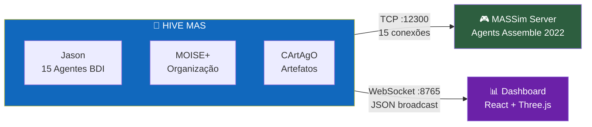

---

## Informações Acadêmicas

| | |
|---|---|
| **Disciplina** | PCS 5703 — Sistemas Multi-Agentes |
| **Instituição** | Escola Politécnica da Universidade de São Paulo (EPUSP) |
| **Departamento** | Engenharia de Computação e Sistemas Digitais |
| **Período** | 1º Quadrimestre de 2026 |
| **Exercício** | 2º Exercício Prático — Aplicação de programação orientada a multi-agentes no MAPC |
| **Entrega** | 02/06/2026 |
| **Enunciado** | [`doc/5703_ex02_26.pdf`](doc/5703_ex02_26.pdf) |

---

## Visão Geral

O **HIVE** é um sistema multi-agente com arquitetura de enxame hierárquico desenvolvido para competir no cenário **Agents Assemble** do Multi-Agent Programming Contest (MAPC) 2022. Utiliza o arcabouço **JaCaMo** (Jason + CArtAgO + MOISE+) com 15 agentes BDI organizados em 3 esquadrões autônomos + pool de soloists.

### Características Principais

- **15 agentes BDI** com 4 roles especializados (squad_leader, collector, assembler, sentinel)
- **3 esquadrões autônomos** de 4 membros + 3 sentinelas no pool de soloists
- **Leilão distribuído** via artefato `TaskBoard` para alocação ótima de tarefas
- **Pool de soloists universal** — qualquer agente livre executa tasks simples
- **Mapa compartilhado** com A* e exploração por fronteira em grid toroidal 40×40
- **Connect sincronizado** para tasks multi-block com protocolo de comunicação
- **Re-submissão automática** de tarefas para multiplicação de pontos
- **Dashboard React em tempo real** com visualização 2D/3D via WebSocket
- **Resiliência multi-nível** com retry, timeout, stuck detection e energy conservation

---

## Arquitetura do Sistema

### Diagrama de Contexto (C4 Nível 1)

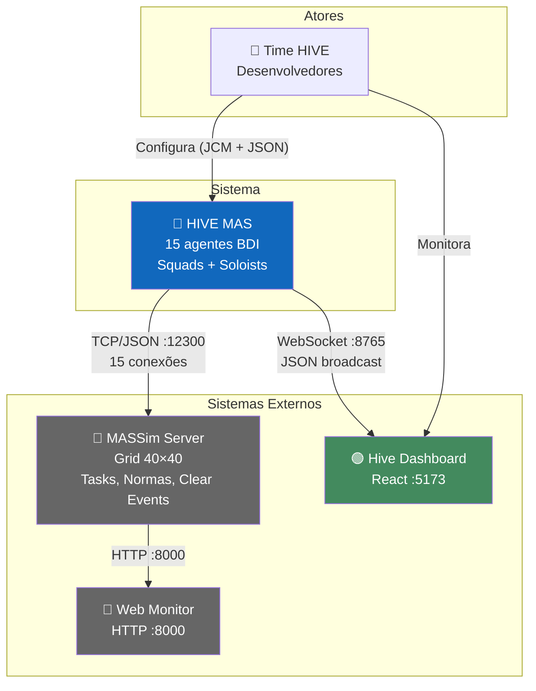

### Diagrama de Containers (C4 Nível 2)

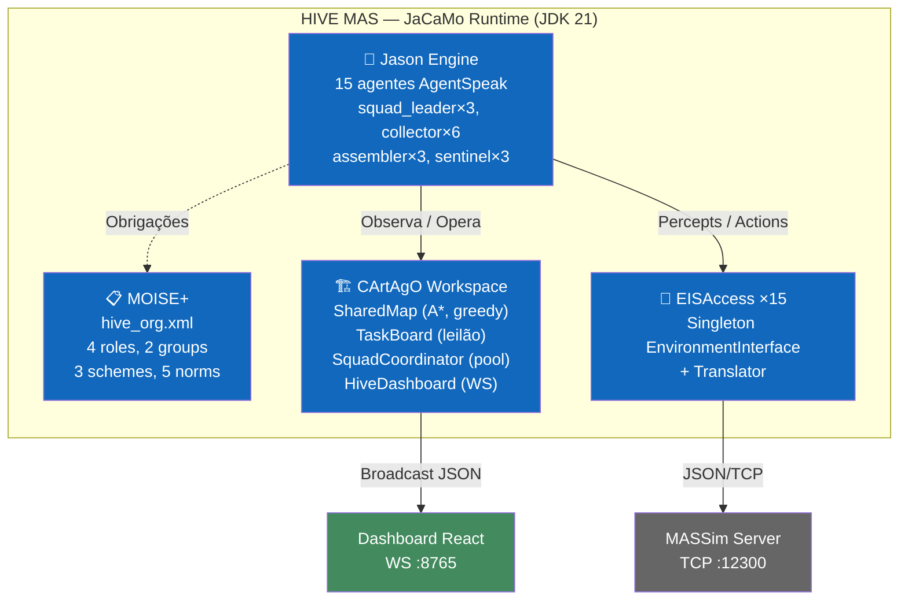

### Diagrama de Componentes (C4 Nível 3)

```mermaid
graph TB
    subgraph Agents["Jason — 15 Agentes BDI"]
        SL["squad_leader ×3<br/>Leilão + Delegação"]
        CO["collector ×6<br/>Coleta + Meeting Point"]
        AS["assembler ×3<br/>Connect + Submit"]
        SE["sentinel ×3<br/>Solo Tasks + Patrulha"]
        
        subgraph Common["common/ — Módulos Compartilhados"]
            CP["connect_protocol<br/>(PRIORIDADE MÁX)"]
            CL["collection<br/>(Request/Attach)"]
            NV["navigation<br/>(Greedy/Frontier)"]
            PR["perception<br/>(Percepts)"]
            DH["dashboard_hooks<br/>(WS Report)"]
            CM["communication<br/>(Sync Connect)"]
        end
    end
    
    subgraph Artifacts["CArtAgO — Artefatos Java"]
        SM["SharedMap<br/>ConcurrentHashMap<br/>A* (2000 iter)<br/>Greedy fallback"]
        TB["TaskBoard<br/>Bids + Auction<br/>resolve_auction()"]
        SC["SquadCoordinator<br/>find_free_soloist()<br/>signal_ready()"]
        HD["HiveDashboard<br/>WebSocket :8765<br/>broadcast()"]
    end
    
    subgraph IA["Internal Actions (hive.*)"]
        AD["AdjacentDirection<br/>Toroidal 40×40"]
        CC["ConnectCalculator<br/>RelX, RelY"]
        DC["DirectionCalculator<br/>Greedy n/s/e/w"]
        PF["PathFinder<br/>A* backup"]
        PM["PatternMatcher<br/>Block pattern"]
    end

    SL & CO & AS & SE --> CP & CL & NV & PR & DH
    SL & CO & AS & SE --> SM & TB & SC & HD
    SL & CO & AS & SE --> AD & CC & DC & PF & PM
```

---

## Organização MOISE+

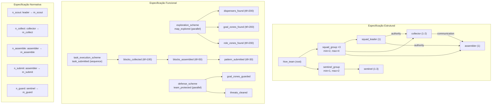

---

## Composição dos Esquadrões

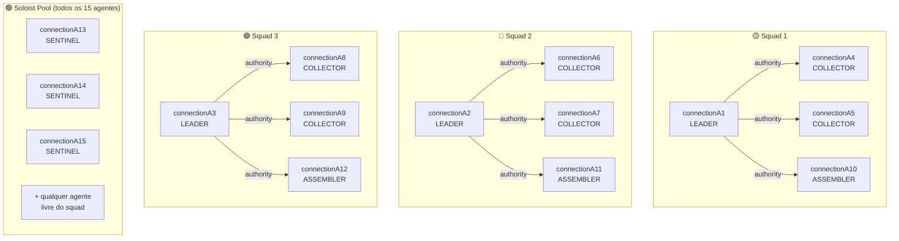

---

## Pipeline de Decisão por Step

```mermaid
flowchart TD
    START(["📡 +step(N) — Percepts do MASSim"]) --> D1{am_deactivated?}

    D1 -->|Sim| SKIP1["⏸️ action(skip)"]
    D1 -->|Não| D2{energy < 5?}

    D2 -->|Sim| SKIP2["⚡ action(skip) conservar"]
    D2 -->|Não| D3{pending_submit<br/>+ goalZone(0,0)?}

    D3 -->|Sim| SUBMIT["✅ action(submit(Task))"]
    D3 -->|Não| D4{ready_to_connect?}

    D4 -->|Sim| CONNECT["🔗 action(connect(...))"]
    D4 -->|Não| D5{collecting + adjacent?}

    D5 -->|Sim| REQUEST["📦 action(request(Dir))"]
    D5 -->|Não| D6{collecting?}

    D6 -->|Sim| MOVE_DISP["🚶 action(move(Dir)) → dispenser"]
    D6 -->|Não| D7{has_destination?}

    D7 -->|Sim| MOVE_DEST["🚶 action(move(Dir)) → destino"]
    D7 -->|Não| EXPLORE["🔍 get_nearest_frontier<br/>→ action(move(Dir))"]

    style SKIP1 fill:#e74c3c,color:#fff
    style SKIP2 fill:#e74c3c,color:#fff
    style SUBMIT fill:#27ae60,color:#fff
    style CONNECT fill:#8e44ad,color:#fff
    style REQUEST fill:#2980b9,color:#fff
    style MOVE_DISP fill:#f39c12,color:#fff
    style MOVE_DEST fill:#f39c12,color:#fff
    style EXPLORE fill:#1abc9c,color:#fff
```

---

## Fluxo de Task Solo (Soloist)

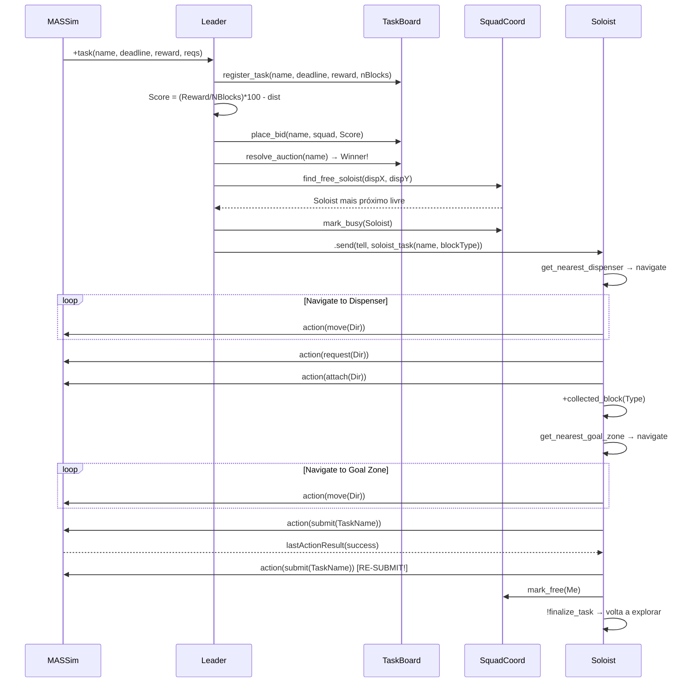

---

## Fluxo de Task Multi-Block (Connect)

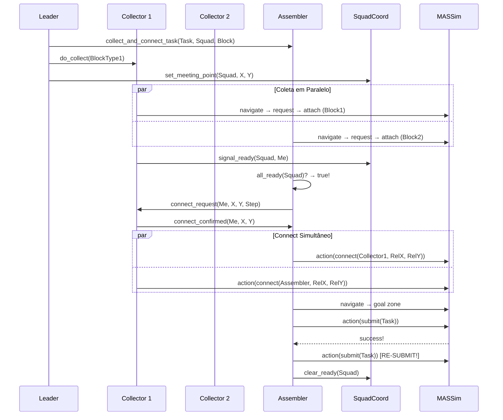

---

## Algoritmo A* (SharedMap)

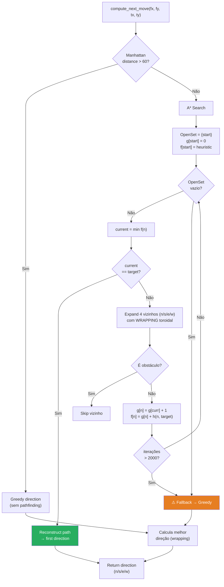

---

## Dashboard — Interface Visual

### Layout 2D (Tela Principal)

```
┌─────────────────────────────────────────────────────────────────────────────┐
│  ⚡ HIVE COMMAND CENTER          📡 LIVE   Step 0247   Score 00180   [2D] 🕐│
├─────────────────────────────────────────────────────────────────────────────┤
│                          AGENT GRID (15 cards)                              │
│ ┌─────────┐ ┌─────────┐ ┌─────────┐ ┌─────────┐ ┌─────────┐ ┌─────────┐  │
│ │ 🟡 A1   │ │ 🟡 A2   │ │ 🟡 A3   │ │ 🔵 A4   │ │ 🔵 A5   │ │ 🔵 A6   │  │
│ │ leader  │ │ leader  │ │ leader  │ │ collect │ │ collect │ │ collect │  │
│ │ (12,8)  │ │ (25,14) │ │ (37,2)  │ │ (14,9)  │ │ (11,7)  │ │ (28,15) │  │
│ │ ■ task5 │ │ □ idle  │ │ ■ task3 │ │ ■ col.. │ │ ■ col.. │ │ □ idle  │  │
│ └─────────┘ └─────────┘ └─────────┘ └─────────┘ └─────────┘ └─────────┘  │
│ ┌─────────┐ ┌─────────┐ ┌─────────┐ ┌─────────┐ ┌─────────┐             │
│ │ 🟣 A10  │ │ 🟣 A11  │ │ 🟣 A12  │ │ 🟢 A13  │ │ 🟢 A14  │ ...        │
│ │ assemb  │ │ assemb  │ │ assemb  │ │ sentinl │ │ sentinl │             │
│ └─────────┘ └─────────┘ └─────────┘ └─────────┘ └─────────┘             │
├──────────┬────────────────────────────────────────────────┬──────────────┤
│ SQUADS   │              TASK PIPELINE                     │  EVENT FEED  │
│          │                                                │              │
│ Squad 1  │  task5  [■■■■■■■□□□] collecting   ⏱ 120      │  step 247:   │
│  🟡 A1   │  task3  [■■■■■■■■■■] submitting   ⏱ 45       │  A1 won      │
│  🔵 A4,5 │  task8  [■■□□□□□□□□] delegating   ⏱ 280      │  auction     │
│  🟣 A10  │  task12 [■■■■■□□□□□] collecting   ⏱ 190      │  task5       │
│ ──────── │                                                │              │
│ Squad 2  │                                                │  step 245:   │
│  🟡 A2   │                                                │  A13 submit  │
│  🔵 A6,7 │                                                │  task9 ✓     │
│  🟣 A11  │                                                │              │
│ ──────── │                                                │  step 242:   │
│ Squad 3  │                                                │  new_task    │
│  🟡 A3   │                                                │  task12      │
│  🔵 A8,9 │                                                │  reward: 80  │
│  🟣 A12  │                                                │              │
├──────────┴──────────────────────────────┬─────────────────┴──────────────┤
│        BATTLE STATS                     │ AUCTION │   SCORE TIMELINE     │
│                                         │  HALL   │                      │
│  Tasks Completed: 12                    │         │   180 ─┐             │
│  Tasks Active:     4                    │ task12: │        │  ╱──────    │
│  Soloists Busy:    3/15                 │  sq1: 85│   120 ─┤╱            │
│  Map Coverage:    67%                   │  sq2: 72│        │             │
│  Avg Task Time:   38 steps             │  sq3: 91│    60 ─┤             │
│                                         │  ★ sq3  │        │             │
│                                         │         │     0 ─┴──────────── │
└─────────────────────────────────────────┴─────────┴──────────────────────┘
```

### Layout 3D (Three.js Viewport)

```
┌─────────────────────────────────────────────────────────────────────────────┐
│  ⚡ HIVE COMMAND CENTER          📡 LIVE   Step 0247   Score 00180   [3D] 🕐│
├────────────────────────────────────────────────────────┬────────────────────┤
│                                                        │   EVENT FEED       │
│           🎮 3D VIEWPORT (Three.js)                    │                    │
│                                                        │   step 247:        │
│      ┌─────────────────────────────────┐              │   A1 won auction   │
│      │    ╔══╗      ·  ·  ·  ·         │              │   task5             │
│      │    ║🟡║  ·  🔵  ·  ·  ·         │              │                    │
│      │    ╚══╝      ·  ·  ·  ·         │              │   step 245:        │
│      │     ·  ·  ·  ·  ·  ·  ·         │              │   A13 submit ok    │
│      │     ·  ·  🟢  ·  ·  ·  ·        │              │                    │
│      │     ·  ·  ·  ·  🔴disp ·        │              ├────────────────────┤
│      │     ·  ·  ·  ·  ·  ·  ·         │              │   BATTLE STATS     │
│      │     ·  ·  ·  🟩goal·  ·         │              │                    │
│      │     ·  ·  ·  ·  ·  ·  ·         │              │   Completed: 12    │
│      │     ·  ·  🟣  ·  ·  ·  ·        │              │   Coverage:  67%   │
│      └─────────────────────────────────┘              │                    │
│                                                        ├────────────────────┤
│   Legenda:                                             │   SCORE TIMELINE   │
│   🟡 Leader  🔵 Collector  🟣 Assembler  🟢 Sentinel  │                    │
│   🔴 Dispenser  🟩 Goal Zone  ⬛ Obstáculo             │   180 ──╱────      │
│                                                        │   120 ─╱           │
│   [Orbit Controls: drag=rotate, scroll=zoom]           │     0 ─┴───────── │
└────────────────────────────────────────────────────────┴────────────────────┘
```

### Design System

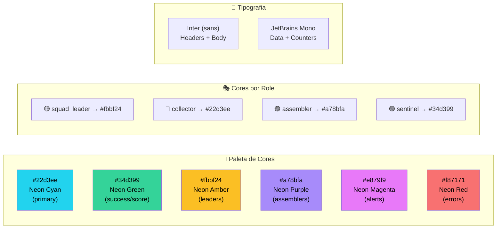

---

## Mecanismos de Coordenação

### Leilão Distribuído (Contract Net)

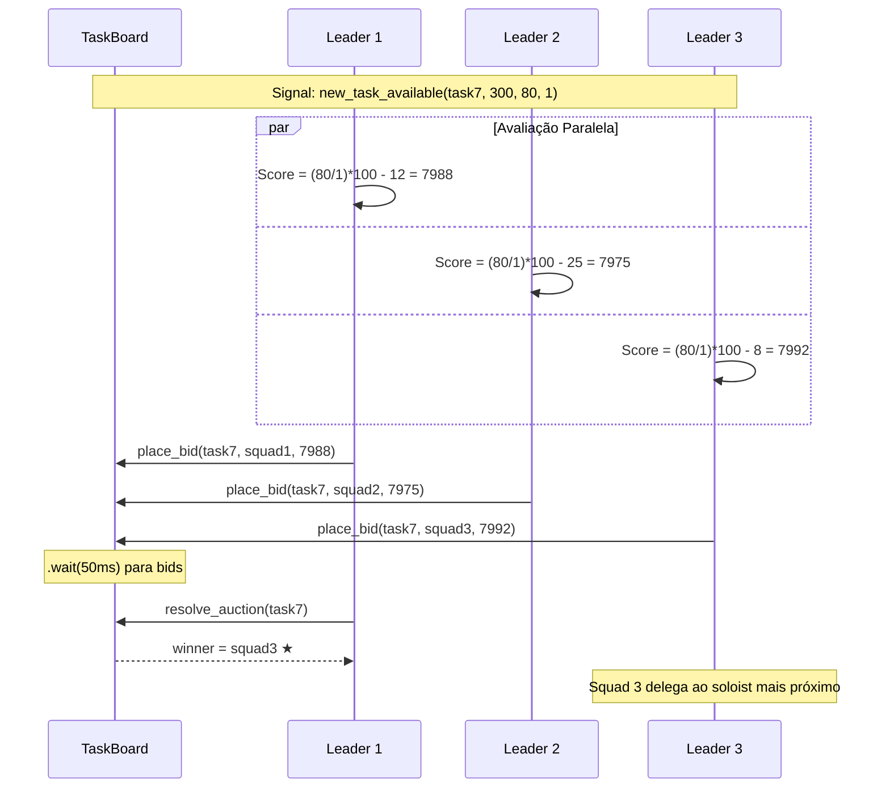

### Pool de Soloists

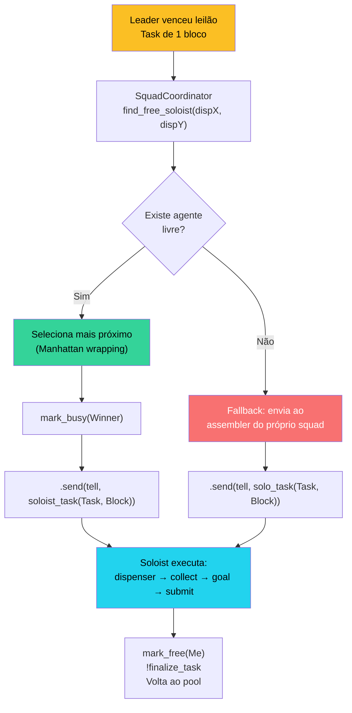

---

## Resiliência

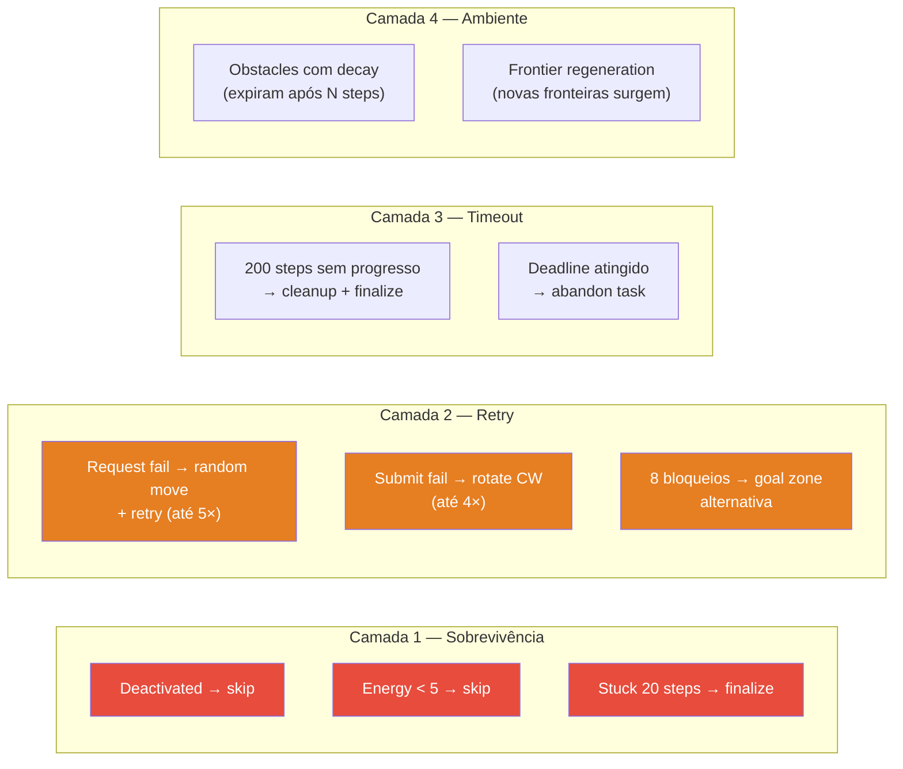

---

## Stack Tecnológico

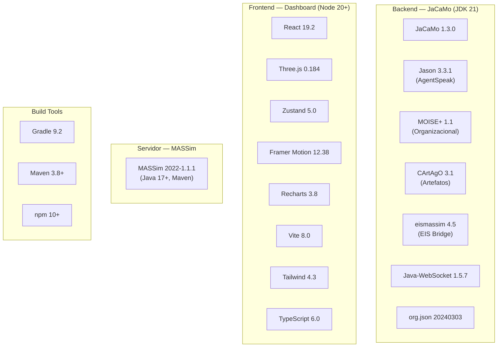

---

## Estrutura do Projeto

```
PCS5703_MAS/
│
├── 📄 build.gradle                    # Build: Java 21, JaCaMo 1.3.0, deps
├── 📄 settings.gradle                 # rootProject.name = 'hive'
├── 📄 hive.jcm                        # 15 agentes JaCaMo
├── 📄 eismassimconfig.json            # EIS → MASSim (connectionA1-15)
├── 📄 logging.properties              # JVM logging (INFO)
├── 📁 lib/                            # eismassim-4.5 JAR
│
├── 📁 src/                            # ═══ CÓDIGO FONTE ═══
│   ├── 📁 agt/                        #   Agentes Jason (AgentSpeak)
│   │   ├── squad_leader.asl           #     Líder: leilão + delegação
│   │   ├── collector.asl              #     Coletor: blocos + meeting
│   │   ├── assembler.asl             #     Montador: connect + submit
│   │   ├── sentinel.asl              #     Sentinela: solo + patrulha
│   │   ├── dummy.asl                 #     Teste mínimo
│   │   └── 📁 common/                #     Módulos compartilhados:
│   │       ├── connect_protocol.asl   #       Submit/Connect (P0)
│   │       ├── collection.asl        #       Request/Attach (P1)
│   │       ├── navigation.asl        #       Greedy/Frontier (P2)
│   │       ├── perception.asl        #       Percepts processing
│   │       ├── communication.asl     #       Sync msgs connect
│   │       └── dashboard_hooks.asl   #       WS reporting
│   │
│   ├── 📁 org/                        #   Organização MOISE+
│   │   └── hive_org.xml              #     4 roles, 3 schemes, 5 norms
│   │
│   ├── 📁 env/                        #   Artefatos CArtAgO (Java)
│   │   ├── 📁 env/
│   │   │   ├── SharedMap.java        #     Mapa: A*, greedy, frontier
│   │   │   ├── TaskBoard.java        #     Tasks + leilão
│   │   │   ├── SquadCoordinator.java #     Squads + soloist pool
│   │   │   └── HiveDashboard.java   #     WebSocket :8765
│   │   └── 📁 connection/
│   │       ├── EISAccess.java        #     EIS bridge (×15)
│   │       └── Translator.java       #     IILang ↔ Jason
│   │
│   └── 📁 java/hive/                 #   Internal Actions
│       ├── AdjacentDirection.java     #     Toroidal 40×40
│       ├── ConnectCalculator.java     #     RelX, RelY connect
│       ├── DirectionCalculator.java  #     Greedy direction
│       ├── PathFinder.java           #     A* backup
│       └── PatternMatcher.java       #     Pattern matching
│
├── 📁 conf/                           # Config MASSim server
│   └── TestConfig.json               #   40×40, 750 steps
│
├── 📁 dashboard/                      # ═══ FRONTEND REACT ═══
│   ├── package.json                  #   React 19, Three.js, Zustand
│   ├── vite.config.ts               #   Vite 8 + React
│   ├── tsconfig.json                 #   TypeScript 6
│   └── 📁 src/
│       ├── App.tsx                   #     Layout (2D/3D toggle)
│       ├── 📁 lib/
│       │   ├── store.ts             #     Zustand (HiveState)
│       │   └── ws.ts                #     useHiveSocket + reconnect
│       └── 📁 components/
│           ├── Header.tsx           #     Step, score, status
│           ├── AgentGrid.tsx        #     Cards 15 agentes
│           ├── SquadsPanel.tsx      #     3 squads + membros
│           ├── TaskPipeline.tsx     #     Pipeline visual
│           ├── EventFeed.tsx        #     Log tempo real
│           ├── AuctionHall.tsx     #     Leilões ativos
│           ├── BattleStats.tsx     #     Métricas agregadas
│           ├── ScoreTimeline.tsx   #     Gráfico (Recharts)
│           └── GridScene3D.tsx    #     Three.js viewport
│
├── 📁 massim_2022/                    # ═══ PLATAFORMA MASSim ═══
│   ├── 📁 server/                    #   Servidor simulação
│   ├── 📁 protocol/                  #   Protocolo JSON
│   ├── 📁 eismassim/                 #   EIS bridge (fonte JAR)
│   └── 📁 monitor/                   #   Web monitor
│
└── 📁 doc/                            # ═══ DOCUMENTAÇÃO ═══
    ├── ARCH.md                       #   Arquitetura C4 + UML + MAS
    ├── TECHSPEC.md                   #   Spec técnica completa
    ├── funcIdea.md                   #   Documento funcional
    └── *.pdf                         #   Enunciado + análise
```

---

## Como Executar

### Pré-requisitos

| Software | Versão | Uso |
|----------|--------|-----|
| JDK | 21+ | JaCaMo runtime |
| JDK | 17+ | MASSim server |
| Node.js | 20+ | Dashboard (opcional) |
| Maven | 3.8+ | Build MASSim (se necessário) |

### 1. Iniciar o Servidor MASSim

```bash
cd massim_2022/server
java -jar target/server-2022-1.1.1-jar-with-dependencies.jar \
     -conf ../../conf/TestConfig.json --monitor
```

- Aguardar: `Listening on port 12300...`
- Monitor: http://localhost:8000

### 2. Iniciar o Sistema HIVE

```bash
./gradlew run
```

- 15 agentes conectam automaticamente
- WebSocket dashboard inicia em :8765
- Logs no console (JaCaMo + Jason `.print()`)

### 3. Iniciar Dashboard (opcional)

```bash
cd dashboard
npm install    # primeira vez
npm run dev
```

- Acessar: http://localhost:5173
- Conecta automaticamente via `ws://localhost:8765`

### Portas

| Porta | Protocolo | Serviço |
|-------|-----------|---------|
| 12300 | TCP/JSON | MASSim Server |
| 8000 | HTTP | MASSim Web Monitor |
| 8765 | WebSocket | HiveDashboard |
| 5173 | HTTP | Vite (Dashboard) |

---

## Documentação Completa

### Documentos Centrais

| Documento | Conteúdo |
|-----------|----------|
| [`doc/ARCH.md`](doc/ARCH.md) | Modelo C4 (4 níveis), UML (classes, sequência, estado, atividades), padrões MAS (BDI camadas, Contract Net, Soloists, A&A), ADRs |
| [`doc/TECHSPEC.md`](doc/TECHSPEC.md) | Tecnologias, protocolos EIS, percepts/ações completos, dependências, config, ambiente, métricas |
| [`doc/funcIdea.md`](doc/funcIdea.md) | Ideia central, mecânicas, estratégias, fluxos de dados, riscos, diferenciais competitivos |

### Documentação por Módulo

| Documento | Escopo |
|-----------|--------|
| [`bin/main/mainDoc.md`](bin/main/mainDoc.md) | AgentSpeak compilado + MOISE+ (arquitetura agentes, fluxos, módulos) |
| [`build/buildDoc.md`](build/buildDoc.md) | Pipeline Gradle, classes compiladas, dependências resolvidas |
| [`conf/confgDoc.md`](conf/confgDoc.md) | Parâmetros MASSim (grid, tasks, normas, roles, clear events) |
| [`dashboard/dashboardDoc.md`](dashboard/dashboardDoc.md) | Componentes React, WebSocket, Zustand, Three.js, design system |
| [`massim_2022/massimDoc.md`](massim_2022/massimDoc.md) | Módulos Maven, protocolo TCP/JSON, cenário, integração HIVE |
| [`src/srcDoc.md`](src/srcDoc.md) | AgentSpeak, artefatos Java, internal actions, MOISE+, algoritmos |

---

## Correspondência com o Relatório

O enunciado ([doc/5703_ex02_26.pdf](doc/5703_ex02_26.pdf)) define o template. Mapa para a documentação:

| Seção do Relatório | Documentação |
|--------------------|-------------|
| **1. Introdução** | [`funcIdea.md`](doc/funcIdea.md) §1-2 |
| **2. Análise e especificação do SMA** | [`funcIdea.md`](doc/funcIdea.md) §3 + [`ARCH.md`](doc/ARCH.md) §3 + [`srcDoc.md`](src/srcDoc.md) §5 |
| **3. Arquitetura e design** | [`ARCH.md`](doc/ARCH.md) — C4, UML, sequência, estado |
| **4. Linguagens e plataforma** | [`TECHSPEC.md`](doc/TECHSPEC.md) §3-5 |
| **5. Estratégia para time** | [`funcIdea.md`](doc/funcIdea.md) §4 + [`ARCH.md`](doc/ARCH.md) §5 |
| **6. Características técnicas** | [`TECHSPEC.md`](doc/TECHSPEC.md) §6-10 + [`funcIdea.md`](doc/funcIdea.md) §4.6 |
| **7. Discussão e conclusão** | [`funcIdea.md`](doc/funcIdea.md) §9-10 |

---

## Fundamentação Teórica

| Conceito | Referência | Aplicação no HIVE |
|----------|-----------|-------------------|
| Modelo BDI | Bratman (1987), Rao & Georgeff (1991) | Arquitetura dos 15 agentes |
| AgentSpeak(L) | Rao (1996), Bordini & Hübner (2006) | Linguagem de programação (.asl) |
| MOISE+ | Hübner, Sichman & Boissier (2002) | Organização: roles, groups, norms |
| Contract Net | Smith (1980) | Leilão distribuído (TaskBoard) |
| A&A | Ricci, Viroli & Omicini (2007) | Artefatos CArtAgO compartilhados |
| JaCaMo | Boissier et al. (2013) | Framework integrador |
| Subsumption | Brooks (1986) | Prioridade de comportamentos |
| LTI-USP | Stabile & Sichman (2021) | Referência MAPC anterior |

---

## Métricas

| Métrica | Valor |
|---------|-------|
| Código total | ~5.410 linhas |
| AgentSpeak (.asl) | ~1.470 linhas / 11 arquivos |
| Java (artefatos + actions) | ~1.640 linhas / 11 arquivos |
| TypeScript (dashboard) | ~2.000 linhas |
| XML (MOISE+) | 120 linhas |
| Agentes BDI | 15 |
| Artefatos CArtAgO | 5 tipos / 19 instâncias |
| Internal Actions Java | 5 |
| Componentes React | 9 |
| Documentação | 6 docs por diretório + 3 centrais |

---

## Referências

[1] Multi Agent Programming Contest. http://www.multiagentcontest.org/

[2] JaCaMo project. https://jacamo-lang.github.io

[3] Hübner, J.F., Sichman, J.S., Boissier, O. (2002). *A Model for the Structural, Functional and Deontic Specification of Organizations in Multiagent Systems*. SBIA'02, LNAI 2507, pp. 118-128. Springer.

[4] Bordini, R.H., Hübner, J.F. (2006). *An overview of Jason*. ALP Newsletter, 19(3).

[5] Stabile, M.F., Sichman, J.S. (2021). *The LTI-USP Strategy to the 2020/2021 Multi-Agent Programming Contest*. MAPC 2021, LNCS 12947. Springer.

[6] Multi-Agent Programming Contest Scenario Description 2022. https://github.com/agentcontest/massim_2022/blob/main/docs/scenario.md

---

<p align="center">
  <strong>PCS 5703 — Sistemas Multi-Agentes</strong><br/>
  Escola Politécnica da USP — 2026
</p>
