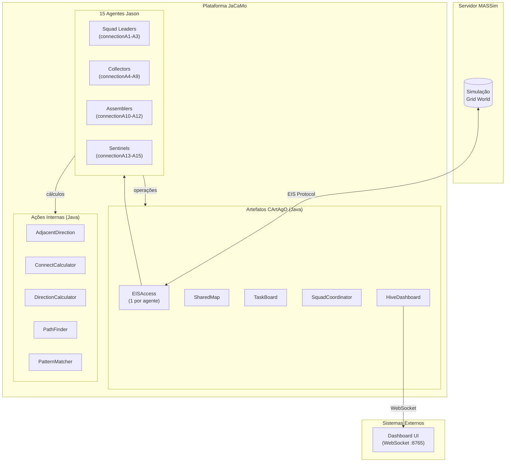
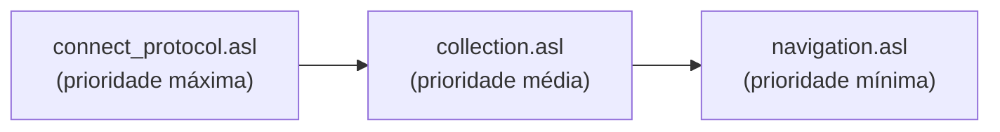
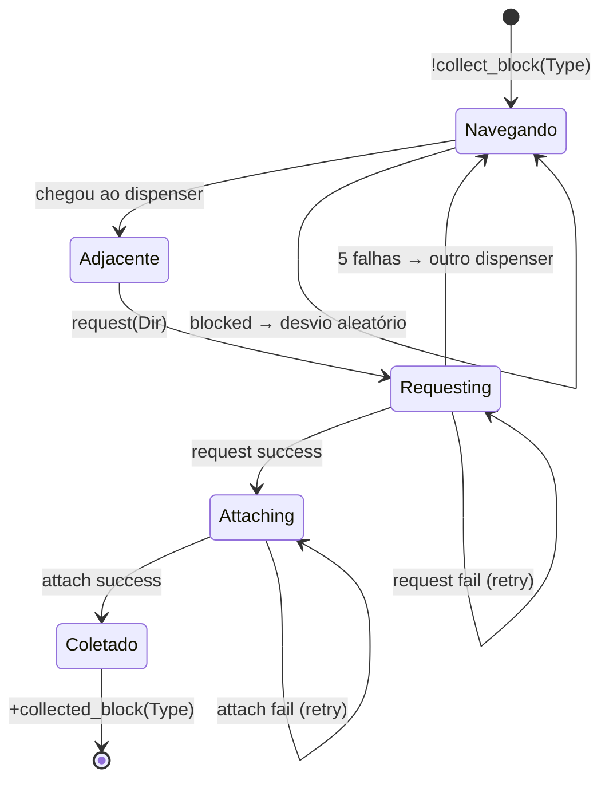
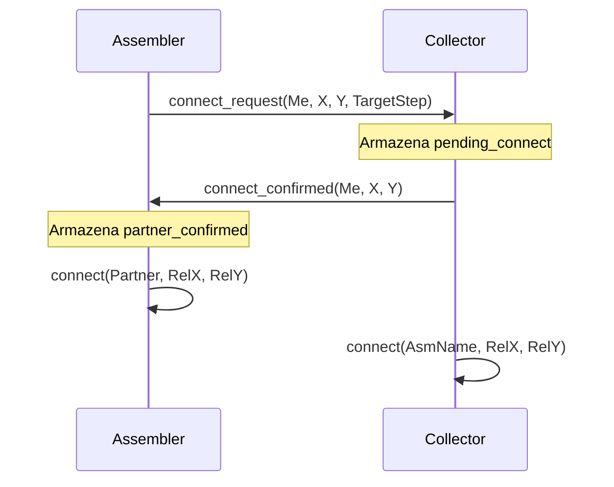
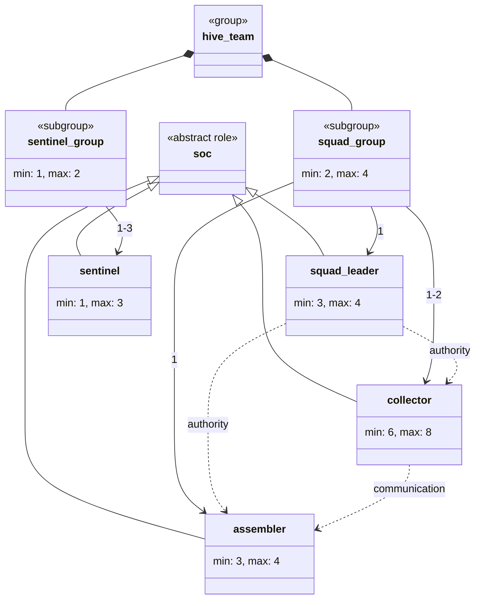
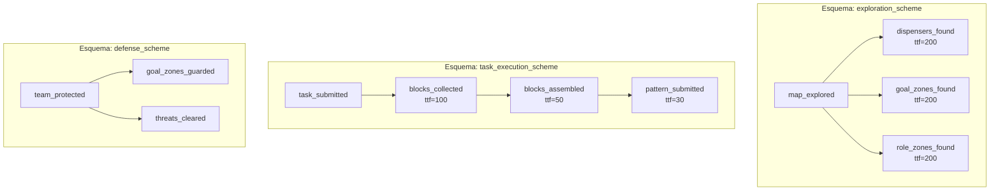
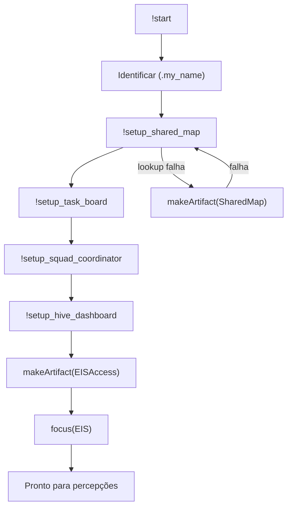
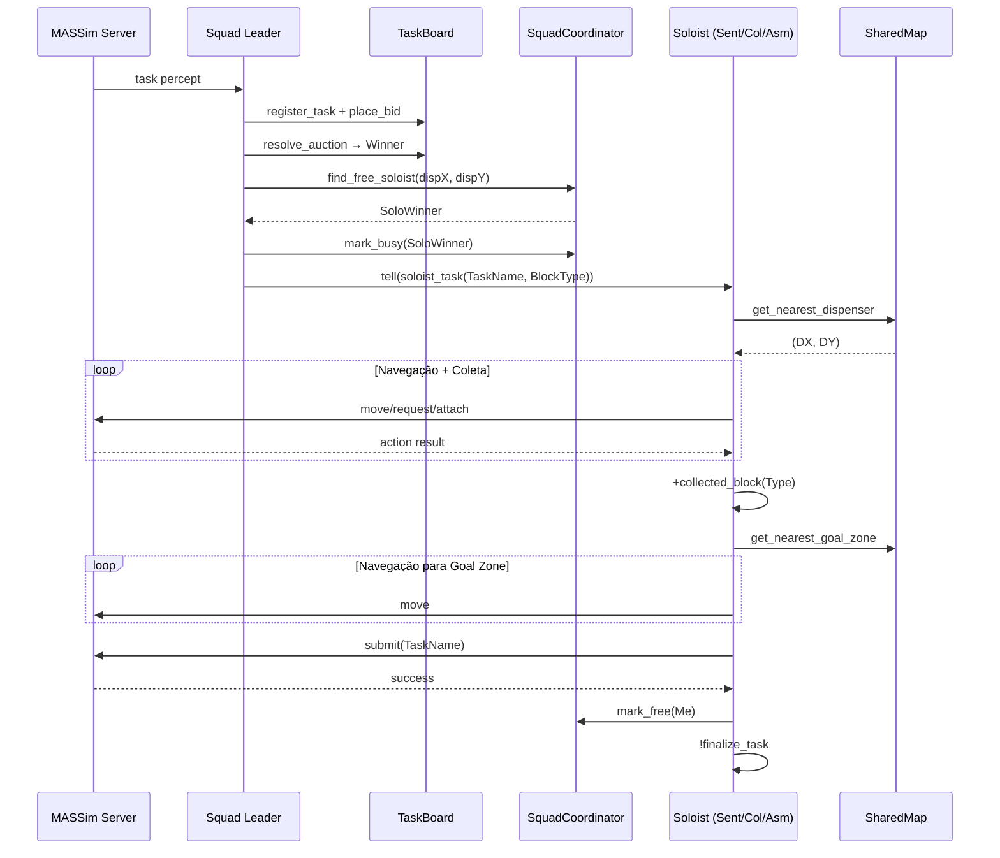
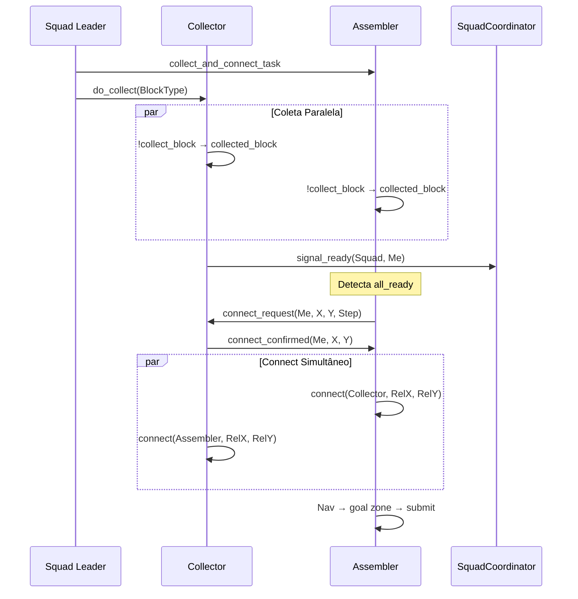
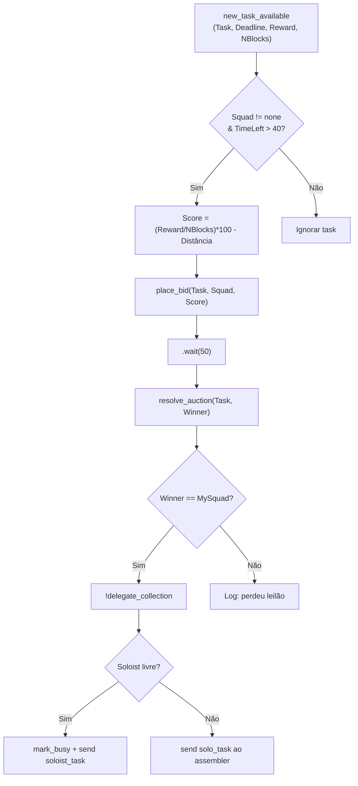

# Documentação Completa — `bin/main/`

## Sistema Multi-Agente Hive (JaCaMo + MASSim)

Este diretório contém os **programas AgentSpeak** e a **especificação organizacional MOISE+** que compõem o sistema multi-agente **Hive**, projetado para a competição **MASSim** (Multi-Agent Systems Simulation). O sistema utiliza a plataforma **JaCaMo** (Jason + CArtAgO + MOISE).

---

## Índice

1. [Estrutura do Diretório](#estrutura-do-diretório)
2. [Arquitetura Geral](#arquitetura-geral)
3. [Agentes (Papéis)](#agentes-papéis)
4. [Módulos Compartilhados](#módulos-compartilhados)
5. [Especificação Organizacional (MOISE+)](#especificação-organizacional-moise)
6. [Fluxos de Execução](#fluxos-de-execução)
7. [Diagramas de Arquitetura](#diagramas-de-arquitetura)

---

## Estrutura do Diretório

```
bin/main/
├── hive_org.xml              # Especificação organizacional MOISE+
├── squad_leader.asl          # Agente líder de esquadrão
├── collector.asl             # Agente coletor de blocos
├── assembler.asl             # Agente montador/conector
├── sentinel.asl              # Agente patrulheiro/solista
├── dummy.asl                 # Agente mínimo de teste
└── common/
    ├── perception.asl        # Processamento de percepções
    ├── collection.asl        # Ciclo de coleta de blocos
    ├── connect_protocol.asl  # Protocolo de connect + submit
    ├── navigation.asl        # Navegação e exploração
    ├── communication.asl     # Mensagens de sincronização
    └── dashboard_hooks.asl   # Integração com dashboard WebSocket
```

---

## Arquitetura Geral



---

## Agentes (Papéis)

### Squad Leader (`squad_leader.asl`)

| Atributo | Valor |
|----------|-------|
| Instâncias | 3 (connectionA1, A2, A3) |
| `my_role_type` | `squad_leader` |
| Módulos incluídos | `perception`, `dashboard_hooks`, `collection`, `navigation` |

**Responsabilidades:**
- Coordenar o esquadrão (1 líder + 2 coletores + 1 assembler)
- Avaliar e licitar por tasks disponíveis (sistema de leilão)
- Delegar coleta de blocos para agentes soloists ou assemblers
- Registrar composição do squad no dashboard

**Fluxo principal:**
1. Inicialização → cria/conecta artefatos compartilhados
2. Percebe `new_task_available` → calcula score → `place_bid`
3. Se ganhar leilão → `find_free_soloist` → delega task
4. Fallback: envia `solo_task` ao assembler do squad

---

### Collector (`collector.asl`)

| Atributo | Valor |
|----------|-------|
| Instâncias | 6 (connectionA4–A9) |
| `my_role_type` | `collector` |
| Módulos incluídos | `perception`, `dashboard_hooks`, `communication`, `connect_protocol`, `collection`, `navigation` |

**Responsabilidades:**
- Coletar blocos em dispensers
- Executar tasks como soloist (coleta + submit)
- Navegar ao meeting point para connect multi-bloco
- Coleta oportunista quando ocioso

**Modos de operação:**
- **Soloist**: recebe task do líder, coleta bloco, navega a goal zone, submete
- **Multi-block**: coleta e vai ao meeting point para connect com assembler
- **Oportunista**: coleta ao descobrir dispenser (quando sem task ativa)

---

### Assembler (`assembler.asl`)

| Atributo | Valor |
|----------|-------|
| Instâncias | 3 (connectionA10–A12) |
| `my_role_type` | `assembler` |
| Módulos incluídos | `perception`, `dashboard_hooks`, `communication`, `connect_protocol`, `collection`, `navigation` |

**Responsabilidades:**
- Executar tasks solo (1 bloco) e soloist (via pool)
- Coordenar connect multi-bloco com collectors
- Submeter padrões completos na goal zone
- Reagir quando todos collectors estão prontos

**Modos de operação:**
- **Solo/Soloist**: coleta 1 bloco → goal zone → submit
- **Multi-block**: coleta bloco → meeting point → connect com collector → goal zone → submit

---

### Sentinel (`sentinel.asl`)

| Atributo | Valor |
|----------|-------|
| Instâncias | 3 (connectionA13–A15) |
| `my_role_type` | `sentinel` |
| Módulos incluídos | `perception`, `dashboard_hooks`, `connect_protocol`, `collection`, `navigation` |

**Responsabilidades:**
- Patrulhar e explorar o mapa
- Executar tasks como soloist (pool de soloists)
- Retornar à patrulha após completar task

---

### Dummy (`dummy.asl`)

| Atributo | Valor |
|----------|-------|
| Instâncias | 0 (teste) |
| `my_role_type` | — |
| Módulos incluídos | `perception`, `collection`, `navigation` |

Agente mínimo para testes. Reage a dispensers descobertos tentando coleta oportunista.

---

## Módulos Compartilhados

### Prioridade de `+step(N)`

A ordem de inclusão dos módulos define a prioridade dos handlers de step:



---

### `perception.asl` — Processamento de Percepções

Processa percepções recebidas do servidor MASSim via EIS:

| Percepção | Ação |
|-----------|------|
| `position(X,Y)` | Atualiza mapa, verifica stuck, cleanup periódico |
| `thing(X,Y,Type,Details)` | Atualiza célula no SharedMap |
| `goalZone(X,Y)` | Registra zona de objetivo |
| `roleZone(X,Y)` | Registra zona de papel |
| `task(Name,Deadline,Reward,Reqs)` | Registra task no TaskBoard |
| `norm(Id,Start,End,Reqs,Fine)` | Registra norma ativa |
| `score(S)` | Atualiza pontuação |
| `energy(E)` | Monitora energia (alerta < 10) |
| `deactivated(Bool)` | Gerencia estado ativo/desativado |
| `lastActionResult(R)` | Rastreia obstáculos e bloqueios |
| `attached(X,Y)` | Rastreia blocos anexados |

**Regras derivadas:**
- `my_pos(X,Y)` — posição atual
- `carrying_blocks(N)` — quantidade de blocos carregados
- `has_block` — possui bloco anexado

---

### `connect_protocol.asl` — Protocolo de Connect e Submit

Handler de maior prioridade. Gerencia:

1. **Desativação**: skip quando `am_deactivated`
2. **Energia crítica**: skip quando energia < 5
3. **Submit**: submete task quando em goal zone com `pending_submit`
4. **Resultado de submit**: re-submete em sucesso, rotaciona em falha (até 4x)
5. **Connect (assembler)**: detecta entidade adjacente, executa `connect()`
6. **Connect (collector)**: navega ao assembler ou executa `connect()`
7. **Navegação para submit**: greedy movement para goal zone com desvio de obstáculos

---

### `collection.asl` — Ciclo de Coleta de Blocos

Gerencia o ciclo completo de coleta:



---

### `navigation.asl` — Navegação e Exploração

Prioridade mais baixa — executa quando nenhum protocolo específico intercepta:

| Contexto | Comportamento |
|----------|---------------|
| Chegou ao meeting point (collector) | `signal_ready` no SquadCoordinator |
| Chegou ao meeting point (assembler) | Aguarda connect |
| Destino genérico alcançado | Inicia exploração |
| Stuck detectado (solo) | Finaliza task |
| Stuck detectado (geral) | Detach forçado |
| Bloqueado | Direção aleatória |
| Com destino | Greedy movement (manhattan) |
| Sem destino | Exploração por fronteira (`get_nearest_frontier`) |

---

### `communication.asl` — Sincronização para Connect

Protocolo de mensagens entre assembler e collector:



---

### `dashboard_hooks.asl` — Integração com Dashboard

Reporta estado dos agentes via WebSocket para visualização em tempo real:

| Hook | Dados |
|------|-------|
| `!dash_log(EventType, Json)` | Evento genérico (bid, collect, submit, etc.) |
| `!dash_step_safe` | Step atual + estado do agente |
| `!dash_agent_state` | Posição, role, energia, ação, destino |
| `!dash_score(S)` | Pontuação do time |
| `!dash_task_phase(Task, Phase, Progress)` | Progresso da task |
| `!dash_squad(Squad, Members)` | Composição do squad |

---

## Especificação Organizacional (MOISE+)

### Estrutura — `hive_org.xml`



### Esquemas Funcionais



### Normas

| Norma | Tipo | Papel | Missão |
|-------|------|-------|--------|
| `n_scout` | obrigação | squad_leader | m_scout (exploração) |
| `n_collect` | obrigação | collector | m_collect (coletar blocos) |
| `n_assemble` | obrigação | assembler | m_assemble (montar blocos) |
| `n_submit` | obrigação | assembler | m_submit (submeter padrão) |
| `n_guard` | obrigação | sentinel | m_guard (guardar zonas) |

---

## Fluxos de Execução

### Inicialização do Agente



### Fluxo de Task Solo (Soloist)



### Fluxo Multi-Block (Connect)



### Sistema de Leilão



---

## Composição dos Esquadrões

| Squad | Líder | Coletores | Assembler |
|-------|-------|-----------|-----------|
| squad1 | connectionA1 | connectionA4, A5 | connectionA10 |
| squad2 | connectionA2 | connectionA6, A7 | connectionA11 |
| squad3 | connectionA3 | connectionA8, A9 | connectionA12 |

**Pool de Soloists:** connectionA13, A14, A15 (sentinels) + assemblers/collectors quando livres

---

## Artefatos CArtAgO (Dependências Java)

| Artefato | Classe | Responsabilidade |
|----------|--------|------------------|
| `shared_map` | `env.SharedMap` | Mapa compartilhado (dispensers, goal zones, obstáculos, fronteiras) |
| `task_board` | `env.TaskBoard` | Registro de tasks, leilão/bidding, atribuições |
| `squad_coordinator` | `env.SquadCoordinator` | Membros de squad, meeting points, pool soloists, readiness |
| `hive_dashboard` | `env.HiveDashboard` | Dashboard WebSocket (porta 8765) |
| `<agentName>` | `connection.EISAccess` | Bridge EIS por agente (connect ao MASSim) |

---

## Ações Internas (pacote `hive`)

| Ação | Uso | Descrição |
|------|-----|-----------|
| `hive.AdjacentDirection` | `collection.asl`, `connect_protocol.asl` | Verifica se alvo é adjacente (wrap toroidal) |
| `hive.ConnectCalculator` | `connect_protocol.asl` | Calcula coordenadas relativas para `connect()` |
| `hive.DirectionCalculator` | — | Direção greedy para alvo |
| `hive.PathFinder` | — | A* pathfinding |
| `hive.PatternMatcher` | — | Verifica blocos attached vs requirements da task |

---

## Mecanismos de Resiliência

| Mecanismo | Localização | Descrição |
|-----------|-------------|-----------|
| Retry de request | `collection.asl` | Até 5 tentativas, depois busca outro dispenser |
| Rotação no submit | `connect_protocol.asl` | Até 4 rotações CW antes de desistir |
| Detecção de stuck | `perception.asl` | 20 steps na mesma posição → detach/finalizar |
| Task timeout | agentes | 200 steps sem progresso → cleanup |
| Task expirada | agentes | Deadline atingido → cleanup |
| Energia crítica | `connect_protocol.asl` | Energia < 5 → skip para conservar |
| Desvio de obstáculos | `navigation.asl`, `collection.asl` | Direção aleatória ao encontrar bloqueio |
| Goal zone alternativa | `connect_protocol.asl` | Troca após 8 bloqueios |
| Fallback `-!` | todos os módulos | Planos de falha evitam crash |

---

## Relação `bin/main/` ↔ Código-Fonte

`bin/main/` é um **espelho 1:1** gerado pelo Gradle:

| Origem | Destino |
|--------|---------|
| `src/agt/*.asl` | `bin/main/*.asl` |
| `src/agt/common/*.asl` | `bin/main/common/*.asl` |
| `src/org/hive_org.xml` | `bin/main/hive_org.xml` |

O código Java (artefatos + ações internas) reside em `src/env/` e `src/java/` e **não** é copiado para `bin/main/`.
