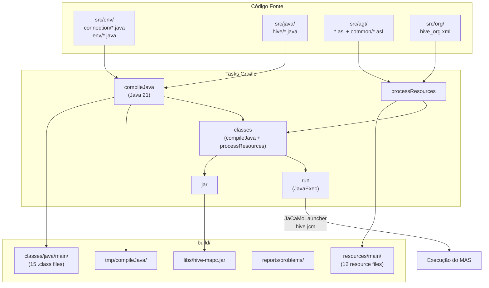
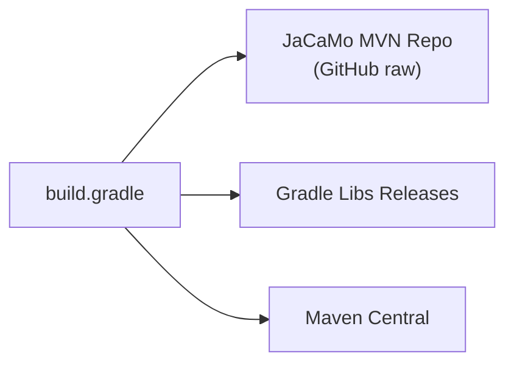
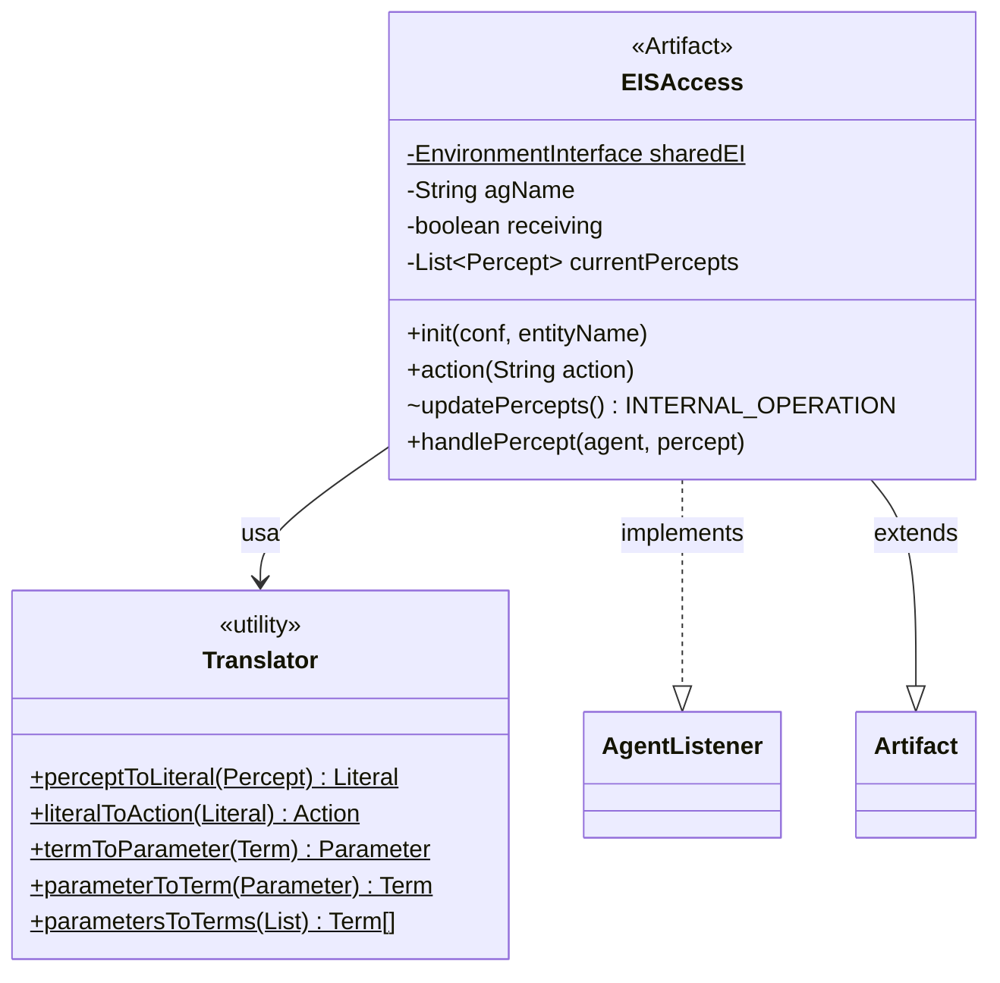
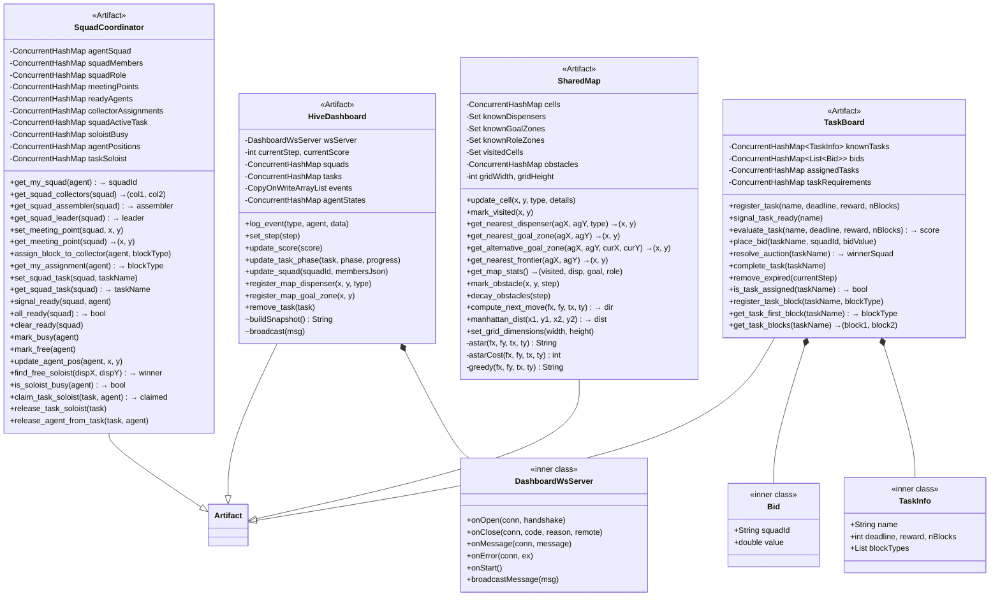
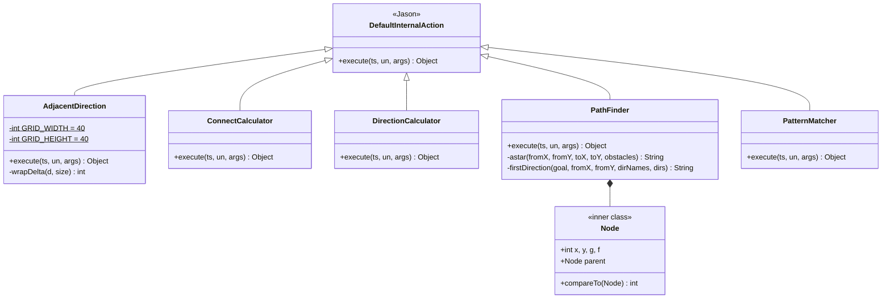
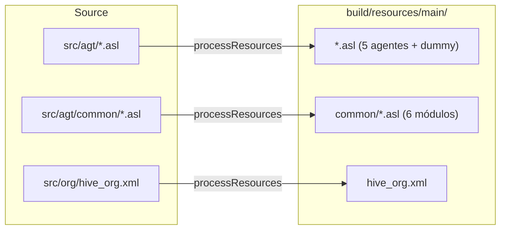
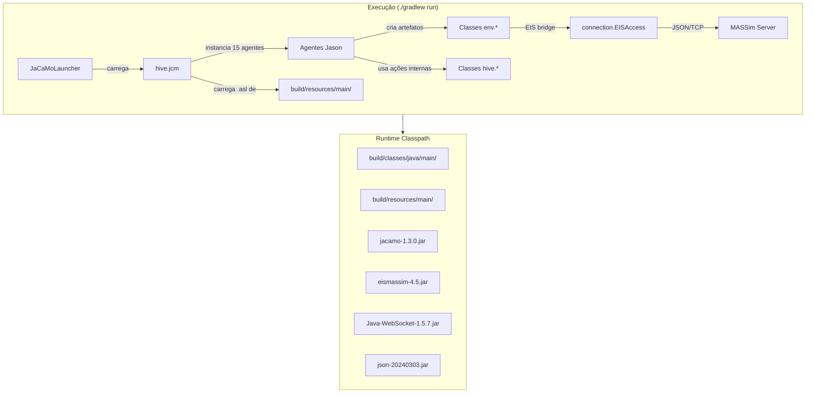
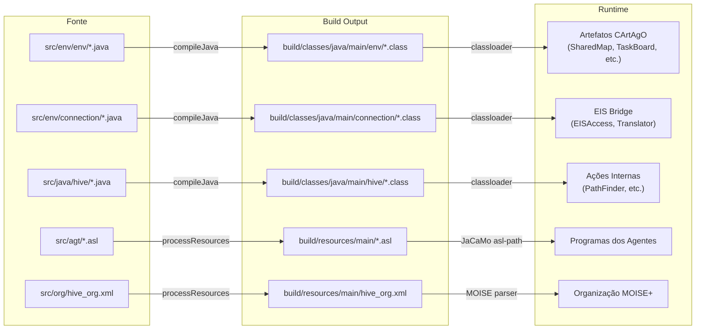
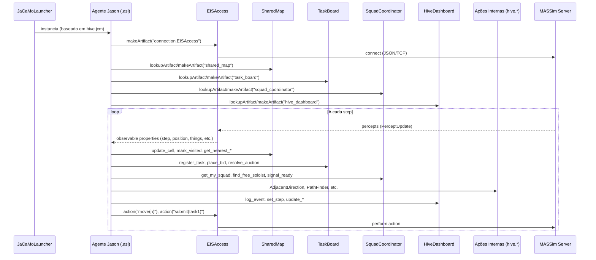

# Documentação Completa — `build/`

## Artefatos de Build do Projeto Hive-MAPC

O diretório `build/` contém os artefatos gerados pelo **Gradle 9.2** durante a compilação e empacotamento do projeto **hive-mapc**. Este é o output padrão do plugin `java` do Gradle, configurado via `build.gradle` para compilar o sistema multi-agente JaCaMo.

---

## Índice

1. [Estrutura do Diretório](#estrutura-do-diretório)
2. [Pipeline de Build](#pipeline-de-build)
3. [Classes Compiladas](#classes-compiladas)
4. [Recursos (Resources)](#recursos-resources)
5. [Artefato JAR](#artefato-jar)
6. [Relatórios](#relatórios)
7. [Arquivos Temporários](#arquivos-temporários)
8. [Diagramas de Arquitetura](#diagramas-de-arquitetura)

---

## Estrutura do Diretório

```
build/
├── classes/
│   └── java/
│       └── main/
│           ├── connection/
│           │   ├── EISAccess.class
│           │   └── Translator.class
│           ├── env/
│           │   ├── HiveDashboard.class
│           │   ├── HiveDashboard$DashboardWsServer.class
│           │   ├── SharedMap.class
│           │   ├── SquadCoordinator.class
│           │   ├── TaskBoard.class
│           │   ├── TaskBoard$Bid.class
│           │   └── TaskBoard$TaskInfo.class
│           └── hive/
│               ├── AdjacentDirection.class
│               ├── ConnectCalculator.class
│               ├── DirectionCalculator.class
│               ├── PathFinder.class
│               ├── PathFinder$Node.class
│               └── PatternMatcher.class
├── generated/
│   └── sources/
│       ├── annotationProcessor/java/main/  (vazio)
│       └── headers/java/main/              (vazio)
├── libs/
│   └── hive-mapc.jar
├── reports/
│   └── problems/
│       └── problems-report.html
├── resources/
│   └── main/
│       ├── hive_org.xml
│       ├── assembler.asl
│       ├── collector.asl
│       ├── dummy.asl
│       ├── sentinel.asl
│       ├── squad_leader.asl
│       └── common/
│           ├── collection.asl
│           ├── communication.asl
│           ├── connect_protocol.asl
│           ├── dashboard_hooks.asl
│           ├── navigation.asl
│           └── perception.asl
└── tmp/
    ├── compileJava/
    │   ├── compileTransaction/
    │   │   ├── backup-dir/
    │   │   └── stash-dir/
    │   │       └── SharedMap.class.uniqueId0
    │   └── previous-compilation-data.bin
    └── jar/
        └── MANIFEST.MF
```

---

## Pipeline de Build



### Configuração do Build (`build.gradle`)

| Parâmetro | Valor |
|-----------|-------|
| Projeto | `hive-mapc` |
| Plugin | `java` |
| Java Toolchain | 21 |
| Task padrão | `run` |
| Main class | `jacamo.infra.JaCaMoLauncher` |
| Argumento | `hive.jcm` |

### Source Sets

| Source Set | Diretórios | Tipo |
|------------|-----------|------|
| `main.java` | `src/env`, `src/java` | Código Java |
| `main.resources` | `src/agt`, `src/org` | Recursos (AgentSpeak + MOISE+) |

### Dependências

| Dependência | Versão | Propósito |
|-------------|--------|-----------|
| `org.jacamo:jacamo` | 1.3.0 | Plataforma JaCaMo (Jason + CArtAgO + MOISE) |
| `eismassim` | 4.5 (local jar) | Bridge EIS para MASSim |
| `org.java-websocket:Java-WebSocket` | 1.5.7 | Dashboard WebSocket |
| `org.json:json` | 20240303 | Manipulação JSON |

### Repositórios Maven



---

## Classes Compiladas

### Pacote `connection` — Bridge EIS/MASSim



**`EISAccess`** — Artefato CArtAgO que funciona como bridge entre agentes Jason e o servidor MASSim:
- Gerencia instância compartilhada (`sharedEI`) do `EnvironmentInterface`
- Loop interno (`updatePercepts`) que converte percepções EIS em observable properties
- Operação `action(String)` traduz literais Jason em ações EIS com retry (3x)
- Tratamento especial para percepções SIM-START (enviadas apenas no primeiro step)

**`Translator`** — Classe utilitária de conversão bidirecional:
- Percepções EIS → Literais Jason (Numeral, Identifier, Function, ParameterList)
- Literais Jason → Ações EIS (NumberTerm, StringTerm, ListTerm, Literal)

---

### Pacote `env` — Artefatos CArtAgO Compartilhados



---

### Pacote `hive` — Ações Internas Jason



| Classe | Assinatura no AgentSpeak | Função |
|--------|--------------------------|--------|
| `AdjacentDirection` | `hive.AdjacentDirection(MX, MY, TX, TY, Dir)` | Retorna direção se alvo adjacente (com wrap toroidal 40×40) |
| `ConnectCalculator` | `hive.ConnectCalculator(MX, MY, PX, PY, RelX, RelY)` | Calcula coordenadas relativas para ação `connect()` |
| `DirectionCalculator` | `hive.DirectionCalculator(FX, FY, TX, TY, Dir)` | Direção greedy (maior componente do vetor) |
| `PathFinder` | `hive.PathFinder(FX, FY, TX, TY, Dir)` | A* com limite de 2000 iterações, fallback greedy |
| `PatternMatcher` | `hive.PatternMatcher(Reqs, Result)` | Verifica se blocos attached satisfazem requirements da task |

---

## Recursos (Resources)

O diretório `build/resources/main/` é uma cópia fiel dos sources declarados em `main.resources`:



| Arquivo | Tipo | Descrição |
|---------|------|-----------|
| `squad_leader.asl` | AgentSpeak | Agente líder de esquadrão |
| `collector.asl` | AgentSpeak | Agente coletor de blocos |
| `assembler.asl` | AgentSpeak | Agente montador/conector |
| `sentinel.asl` | AgentSpeak | Agente patrulheiro/solista |
| `dummy.asl` | AgentSpeak | Agente mínimo de teste |
| `common/perception.asl` | AgentSpeak | Processamento de percepções |
| `common/collection.asl` | AgentSpeak | Ciclo de coleta |
| `common/connect_protocol.asl` | AgentSpeak | Protocolo connect + submit |
| `common/navigation.asl` | AgentSpeak | Navegação e exploração |
| `common/communication.asl` | AgentSpeak | Mensagens de sincronização |
| `common/dashboard_hooks.asl` | AgentSpeak | Hooks para dashboard |
| `hive_org.xml` | MOISE+ XML | Especificação organizacional |

---

## Artefato JAR

| Atributo | Valor |
|----------|-------|
| Caminho | `build/libs/hive-mapc.jar` |
| Manifest | `Manifest-Version: 1.0` |
| Conteúdo | Classes compiladas + resources |

O JAR é gerado pela task `jar` do Gradle mas **não é utilizado diretamente para execução**. A task `run` usa o classpath do source set `main` (incluindo dependências) e invoca `jacamo.infra.JaCaMoLauncher` com o argumento `hive.jcm`.

---

## Relatórios

### `build/reports/problems/problems-report.html`

Relatório de problemas de configuração do Gradle. Atualmente contém:

| Severidade | Problema | Localização |
|------------|----------|-------------|
| WARNING | Sintaxe deprecated `propName value` (usar `propName = value`) | `build.gradle:14` |

Este warning será removido no Gradle 10. A linha afetada é a declaração de repositório Maven com sintaxe `url "..."` (deveria ser `url = uri("...")`).

---

## Arquivos Temporários

### `build/tmp/compileJava/`

| Arquivo | Propósito |
|---------|-----------|
| `previous-compilation-data.bin` | Dados de compilação incremental (quais classes mudaram) |
| `compileTransaction/stash-dir/SharedMap.class.uniqueId0` | Backup da última compilação incremental de `SharedMap` |
| `compileTransaction/backup-dir/` | Diretório de backup (vazio) |

### `build/tmp/jar/`

| Arquivo | Conteúdo |
|---------|----------|
| `MANIFEST.MF` | `Manifest-Version: 1.0` |

### `build/generated/sources/`

Diretórios vazios gerados automaticamente pelo Gradle para:
- Processadores de anotação (`annotationProcessor/java/main/`)
- Headers JNI (`headers/java/main/`)

Nenhum processador de anotação está configurado no projeto.

---

## Diagramas de Arquitetura

### Visão Geral do Sistema Compilado



### Mapeamento Fonte → Build → Runtime



### Interações entre Componentes Compilados



---

## Comandos de Build

| Comando | Descrição |
|---------|-----------|
| `./gradlew classes` | Compila Java + copia resources |
| `./gradlew jar` | Gera `build/libs/hive-mapc.jar` |
| `./gradlew run` | Compila e executa o MAS (task padrão) |
| `./gradlew clean` | Remove todo o diretório `build/` |
| `./gradlew printCp` | Imprime o classpath de runtime |

### Execução Manual Equivalente

```bash
java -Djava.util.logging.config.file=logging.properties \
     -cp "$(./gradlew -q printCp)" \
     jacamo.infra.JaCaMoLauncher hive.jcm
```

---

## Resumo de Métricas

| Métrica | Valor |
|---------|-------|
| Classes compiladas | 15 (incluindo inner classes) |
| Pacotes Java | 3 (`connection`, `env`, `hive`) |
| Recursos copiados | 12 arquivos |
| Tamanho total de fontes Java | ~1.300 linhas |
| Dependências externas | 4 |
| Java version | 21 |
| Gradle version | 9.2 |
