# Documentação Completa — `conf/`

## Configuração do Servidor MASSim para o Projeto Hive

O diretório `conf/` contém a configuração principal do **servidor MASSim** utilizada para testes locais do sistema multi-agente Hive. Este arquivo define o ambiente de simulação (grid, tasks, normas, eventos) contra o qual os 15 agentes Jason competem.

---

## Índice

1. [Estrutura do Diretório](#estrutura-do-diretório)
2. [TestConfig.json — Visão Geral](#testconfigjson--visão-geral)
3. [Configuração do Servidor](#configuração-do-servidor)
4. [Configuração do Match](#configuração-do-match)
5. [Configuração de Times](#configuração-de-times)
6. [Relação com Outros Arquivos de Configuração](#relação-com-outros-arquivos-de-configuração)
7. [Diagramas](#diagramas)

---

## Estrutura do Diretório

```
conf/
└── TestConfig.json    # Configuração unificada do servidor MASSim (teste local)
```

Contém **1 único arquivo** que combina configuração de servidor + simulação + times em formato monolítico (diferente da versão modular em `massim_2022/server/conf/`).

---

## TestConfig.json — Visão Geral

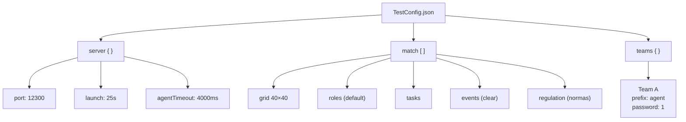

---

## Configuração do Servidor

```json
"server": {
    "tournamentMode": "round-robin",
    "teamsPerMatch": 1,
    "launch": "25s",
    "port": 12300,
    "backlog": 10000,
    "agentTimeout": 4000,
    "resultPath": "results",
    "logLevel": "normal",
    "logPath": "logs",
    "replayPath": "replays",
    "maxPacketLength": 65536,
    "waitBetweenSimulations": 5000
}
```

| Parâmetro | Valor | Descrição |
|-----------|-------|-----------|
| `tournamentMode` | `round-robin` | Modo de torneio (cada time joga contra todos) |
| `teamsPerMatch` | `1` | Apenas 1 time (modo treino/teste solo) |
| `launch` | `25s` | Auto-launch após 25 segundos de espera |
| `port` | `12300` | Porta TCP para conexão dos agentes |
| `backlog` | `10000` | Fila de conexões pendentes |
| `agentTimeout` | `4000` | Timeout para resposta do agente (ms) |
| `resultPath` | `results` | Diretório de resultados |
| `logLevel` | `normal` | Nível de log (normal/debug) |
| `logPath` | `logs` | Diretório de logs |
| `replayPath` | `replays` | Diretório de replays |
| `maxPacketLength` | `65536` | Tamanho máximo de pacote JSON (bytes) |
| `waitBetweenSimulations` | `5000` | Pausa entre simulações (ms) |

---

## Configuração do Match

### Parâmetros Gerais

| Parâmetro | Valor | Descrição |
|-----------|-------|-----------|
| `steps` | `800` | Total de steps da simulação |
| `randomSeed` | `17` | Seed para reprodutibilidade |
| `randomFail` | `1` | Probabilidade de falha aleatória (%) |
| `entities` | `{"standard": 15}` | 15 entidades do tipo "standard" |
| `clusterBounds` | `[1, 3]` | Limites de cluster de entidades |
| `absolutePosition` | `true` | Agentes conhecem posição absoluta |

### Roles (Papéis da Simulação)

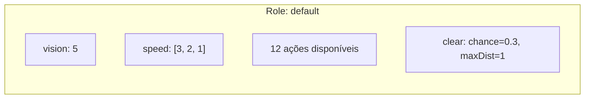

| Atributo | Valor | Descrição |
|----------|-------|-----------|
| `name` | `default` | Único role nesta configuração (simplificada) |
| `vision` | `5` | Raio de visão (células) |
| `speed` | `[3, 2, 1]` | Velocidade por nº de blocos attached (0→3, 1→2, 2+→1) |
| `clear.chance` | `0.3` | Probabilidade de sucesso do clear (30%) |
| `clear.maxDistance` | `1` | Distância máxima de clear |

**Ações disponíveis:**

| Ação | Descrição |
|------|-----------|
| `skip` | Não fazer nada |
| `move` | Mover em uma direção (n/s/e/w) |
| `rotate` | Rotacionar blocos attached (cw/ccw) |
| `adopt` | Adotar um role |
| `request` | Solicitar bloco de dispenser |
| `attach` | Anexar bloco/entidade adjacente |
| `detach` | Desanexar bloco/entidade |
| `connect` | Conectar blocos entre agentes |
| `disconnect` | Desconectar blocos |
| `submit` | Submeter task completa |
| `clear` | Limpar obstáculo/entidade |
| `survey` | Examinar entidades em alcance |

### Energia

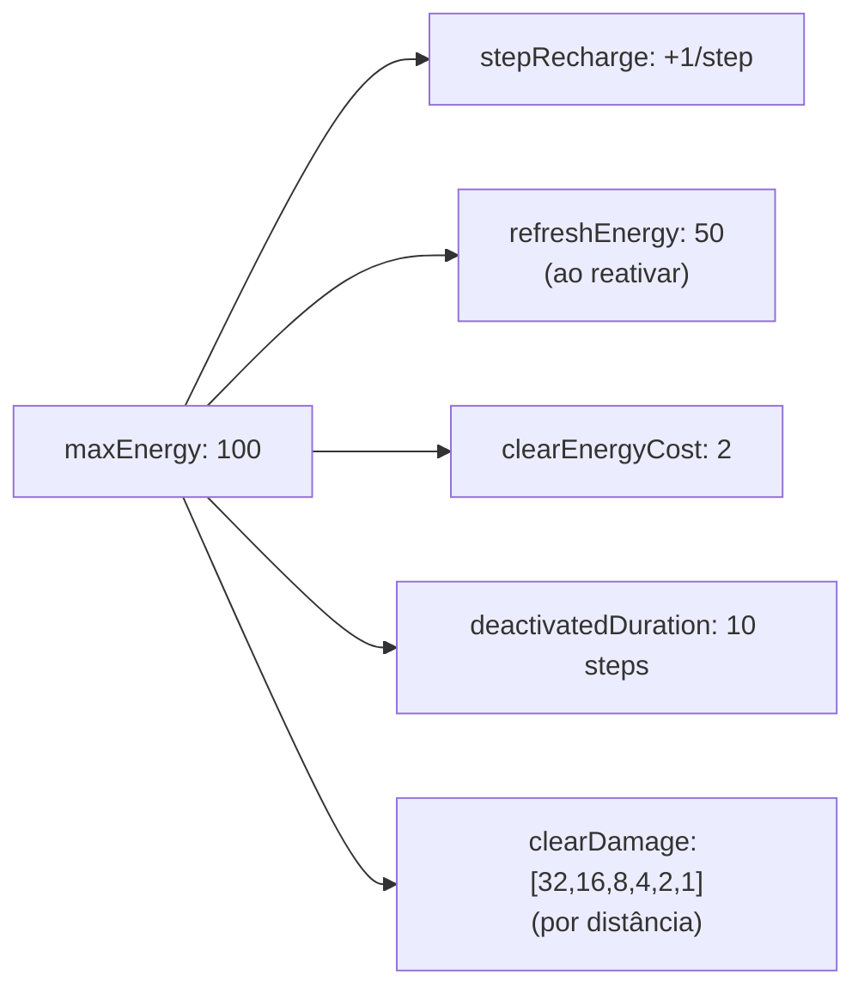

| Parâmetro | Valor | Descrição |
|-----------|-------|-----------|
| `maxEnergy` | `100` | Energia máxima |
| `stepRecharge` | `1` | Recarga por step |
| `refreshEnergy` | `50` | Energia ao reativar |
| `clearEnergyCost` | `2` | Custo de energia para clear |
| `deactivatedDuration` | `10` | Steps desativado após clear |
| `clearDamage` | `[32,16,8,4,2,1]` | Dano por distância (dist 0→32, dist 1→16, ...) |
| `attachLimit` | `10` | Máximo de entidades attached |

### Grid

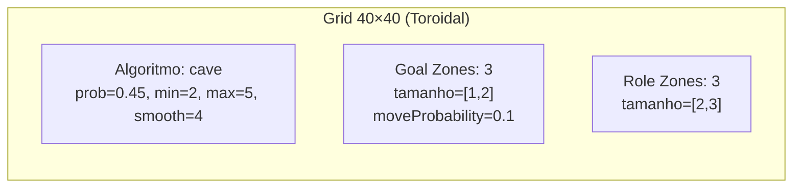

| Parâmetro | Valor | Descrição |
|-----------|-------|-----------|
| `height` | `40` | Altura do grid |
| `width` | `40` | Largura do grid |
| `instructions` | `["cave", 0.45, 2, 5, 4]` | Geração procedural tipo caverna |
| `goals.number` | `3` | Quantidade de goal zones |
| `goals.size` | `[1, 2]` | Tamanho min/max das goal zones |
| `goals.moveProbability` | `0.1` | Chance de goal zone se mover (10%) |
| `roleZones.number` | `3` | Quantidade de role zones |
| `roleZones.size` | `[2, 3]` | Tamanho min/max das role zones |

### Blocos e Dispensers

| Parâmetro | Valor | Descrição |
|-----------|-------|-----------|
| `blockTypes` | `[2, 3]` | 2 a 3 tipos de bloco (b0, b1, b2) |
| `dispensers` | `[3, 5]` | 3 a 5 dispensers por tipo de bloco |

### Tasks

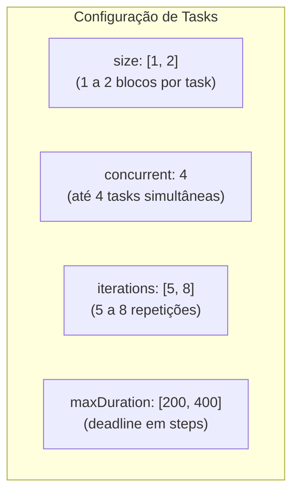

| Parâmetro | Valor | Descrição |
|-----------|-------|-----------|
| `size` | `[1, 2]` | Blocos por task (min/max) |
| `concurrent` | `4` | Tasks ativas simultaneamente |
| `iterations` | `[5, 8]` | Vezes que a task pode ser submetida |
| `maxDuration` | `[200, 400]` | Duração máxima em steps (min/max) |

### Eventos (Clear Events)

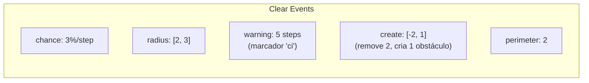

| Parâmetro | Valor | Descrição |
|-----------|-------|-----------|
| `chance` | `3` | Probabilidade por step (%) |
| `radius` | `[2, 3]` | Raio de efeito (min/max) |
| `warning` | `5` | Steps de aviso antes do evento |
| `create` | `[-2, 1]` | Obstáculos removidos/criados |
| `perimeter` | `2` | Perímetro de dano |

### Normas (Regulation)

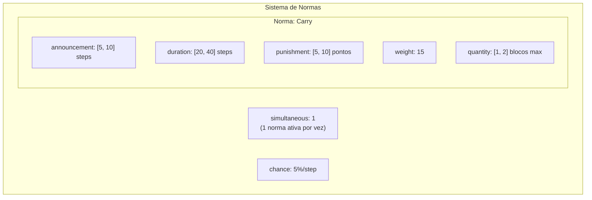

| Parâmetro | Valor | Descrição |
|-----------|-------|-----------|
| `simultaneous` | `1` | Normas ativas ao mesmo tempo |
| `chance` | `5` | Chance de nova norma por step (%) |
| `Carry.announcement` | `[5, 10]` | Steps de anúncio antes de vigorar |
| `Carry.duration` | `[20, 40]` | Duração da norma em steps |
| `Carry.punishment` | `[5, 10]` | Penalidade por violação (pontos) |
| `Carry.weight` | `15` | Peso/probabilidade de seleção |
| `Carry.quantity` | `[1, 2]` | Limite de blocos transportados |

---

## Configuração de Times

```json
"teams": {
    "A": {"prefix": "agent", "password": "1"}
}
```

| Atributo | Valor | Descrição |
|----------|-------|-----------|
| Team ID | `A` | Identificador do time |
| `prefix` | `agent` | Prefixo dos nomes de agente no servidor |
| `password` | `1` | Senha de autenticação |

Os 15 agentes se autenticam como `agentA1` a `agentA15` (mapeado via `eismassimconfig.json`).

---

## Relação com Outros Arquivos de Configuração

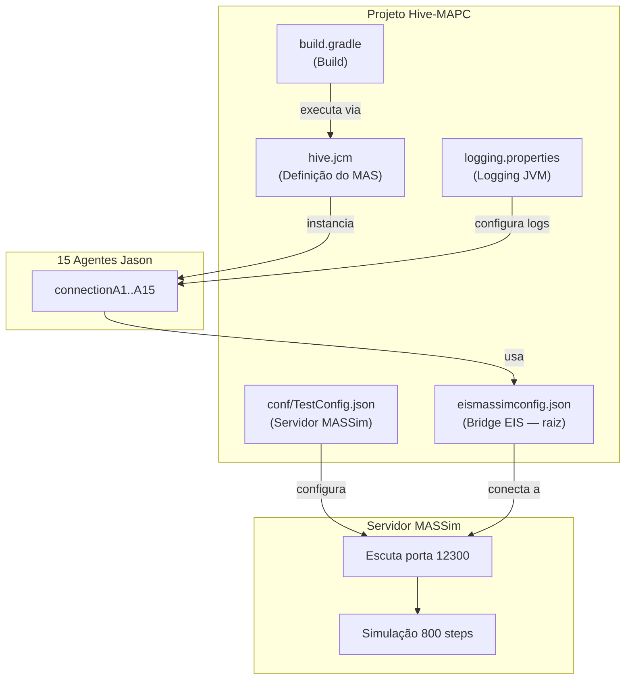

### Cadeia de Configuração Completa

| Arquivo | Localização | Responsabilidade |
|---------|-------------|------------------|
| `conf/TestConfig.json` | `conf/` | Configura servidor MASSim (ambiente, regras, match) |
| `eismassimconfig.json` | raiz | Conecta agentes ao servidor (host, porta, credenciais) |
| `hive.jcm` | raiz | Define os 15 agentes Jason e seus programas |
| `logging.properties` | raiz | Nível de log da JVM (INFO) |
| `build.gradle` | raiz | Pipeline de build e dependências |

### Mapeamento de Credenciais

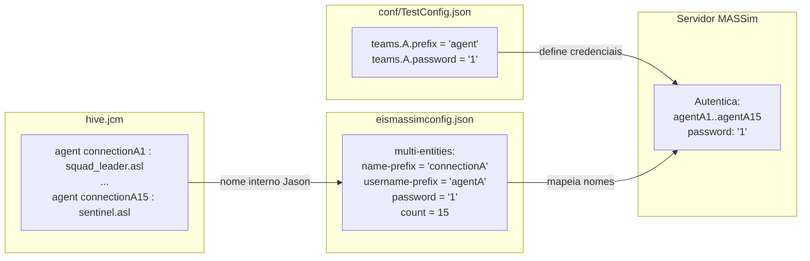

---

## Diagramas

### Ciclo de Vida de uma Simulação

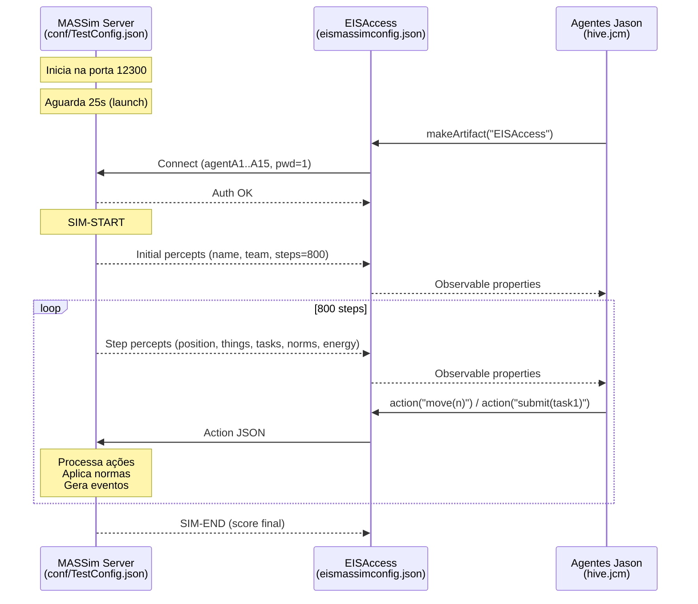

### Ambiente de Teste (Grid 40×40)

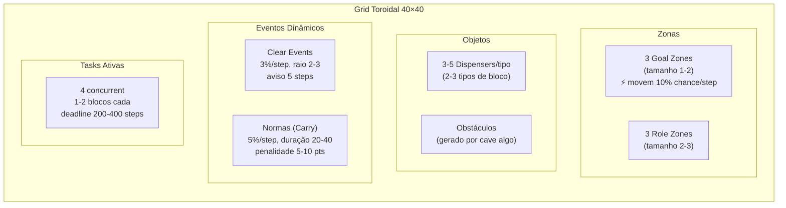

### Diferenças: TestConfig (conf/) vs Configuração Padrão (massim_2022/)

| Parâmetro | `conf/TestConfig.json` | `massim_2022/server/conf/sim/sim1.json` |
|-----------|------------------------|----------------------------------------|
| Grid | 40×40 | 70×70 |
| Steps | 800 | 750 |
| Entidades | 15 | 20 |
| Teams per match | 1 (solo) | 2 (competição) |
| Roles | 1 (default, todas ações) | 5 (default, worker, constructor, explorer, digger) |
| Tasks size | [1, 2] | [1, 4] |
| Tasks concurrent | 4 | 2 |
| Goal zones | 3 | 4 |
| Posição absoluta | sim | não |
| Clear events chance | 3% | 15% |
| Normas | Carry apenas | Carry + Adopt |
| Launch | 25s (auto) | key (manual) |

A configuração em `conf/` é **simplificada para desenvolvimento**: grid menor, um único role com todas as ações, posição absoluta (sem necessidade de localização relativa), e apenas 1 time (sem adversário).

---

## Como Usar

### Executar o Servidor MASSim com esta Configuração

```bash
cd massim_2022/server
java -jar target/server-2022-2.0-jar-with-dependencies.jar \
     -conf ../../conf/TestConfig.json
```

### Executar os Agentes Hive (em outro terminal)

```bash
./gradlew run
```

A task `run` do Gradle invoca `JaCaMoLauncher` que lê `hive.jcm`, instancia os agentes, e cada agente cria seu `EISAccess` que se conecta a `localhost:12300` usando as credenciais de `eismassimconfig.json`.

---

## Resumo

| Aspecto | Valor |
|---------|-------|
| Arquivos | 1 (`TestConfig.json`) |
| Propósito | Configuração de teste local (single-team, grid pequeno) |
| Servidor | MASSim 2022, porta 12300 |
| Grid | 40×40 toroidal, cave algorithm |
| Steps | 800 |
| Agentes | 15 (1 time, role "default") |
| Tasks | até 4 simultâneas, 1-2 blocos |
| Normas | Carry (limite de blocos transportados) |
| Eventos | Clear events 3%/step |
