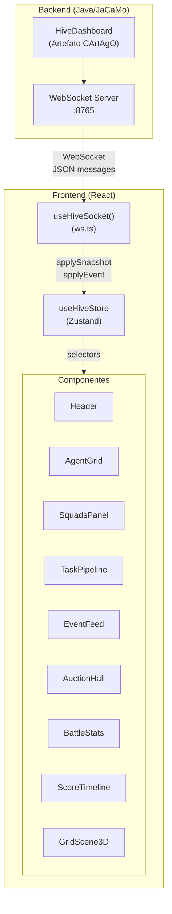
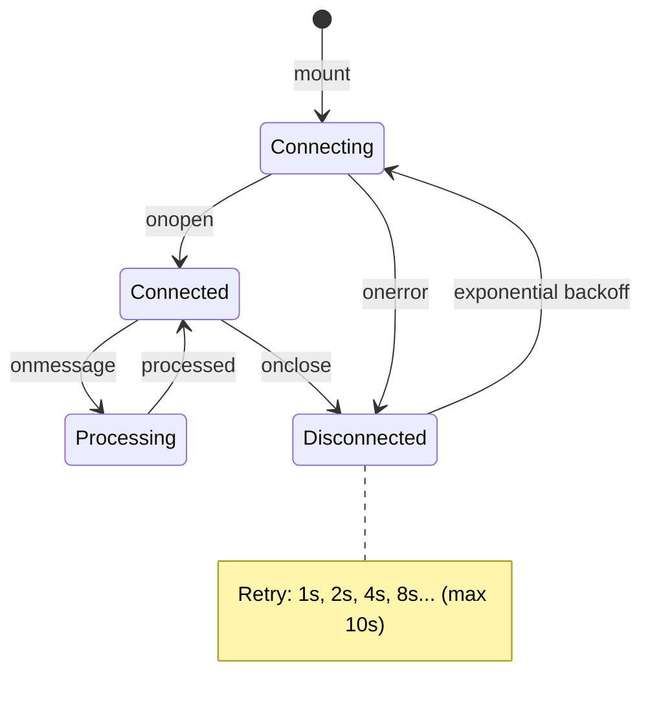
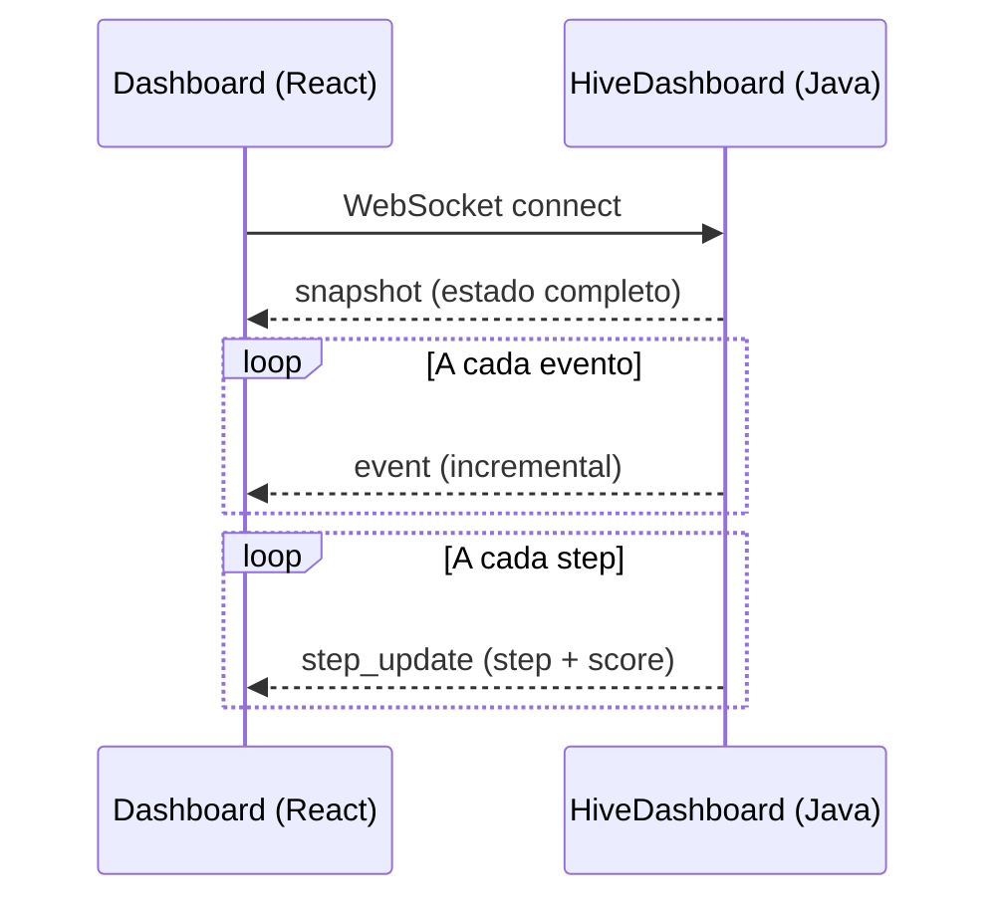
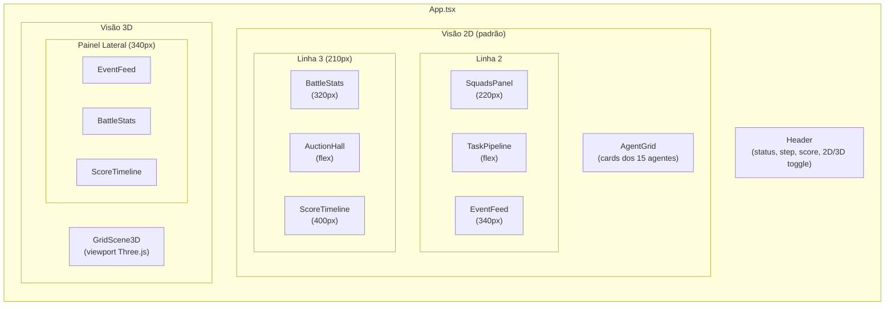
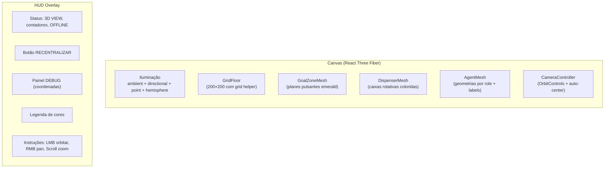
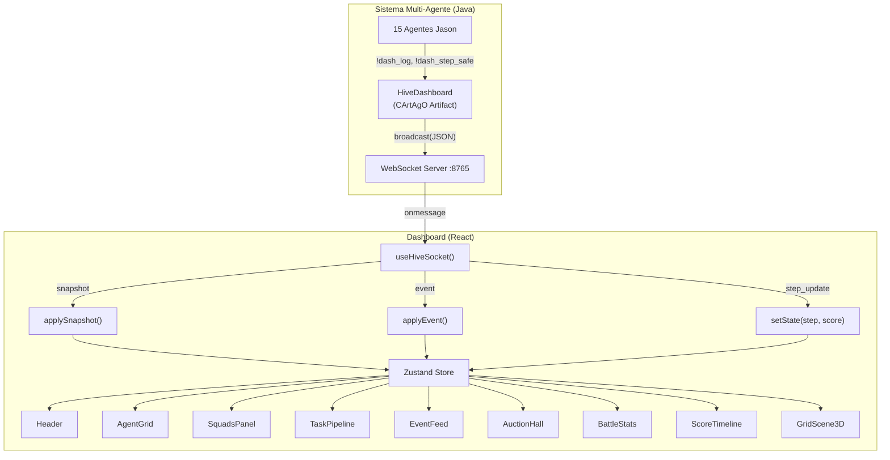
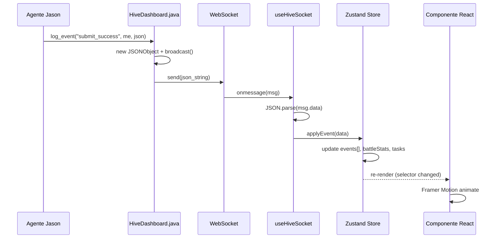
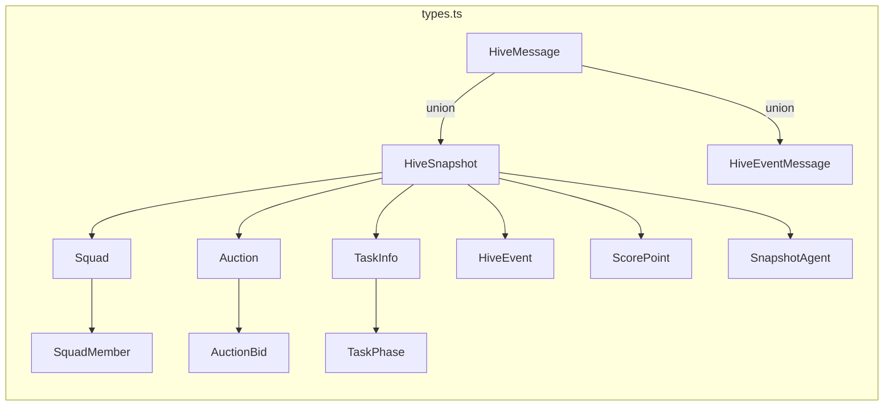
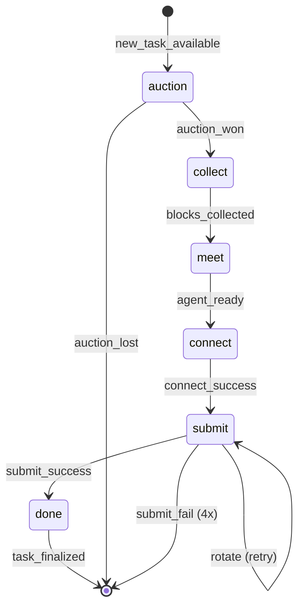

# Documentação Completa — `dashboard/`

## Hive Command Center — Dashboard de Monitoramento em Tempo Real

Aplicação web React/TypeScript que fornece visualização em tempo real do sistema multi-agente Hive, conectando-se via WebSocket ao artefato `HiveDashboard` (porta 8765). Interface com tema dark cyberpunk/sci-fi, suportando visão 2D e 3D do grid.

---

## Índice

1. [Estrutura do Diretório](#estrutura-do-diretório)
2. [Stack Tecnológica](#stack-tecnológica)
3. [Arquitetura da Aplicação](#arquitetura-da-aplicação)
4. [Comunicação WebSocket](#comunicação-websocket)
5. [Gerenciamento de Estado (Zustand)](#gerenciamento-de-estado-zustand)
6. [Componentes](#componentes)
7. [Visualização 3D](#visualização-3d)
8. [Design System](#design-system)
9. [Diagramas](#diagramas)

---

## Estrutura do Diretório

```
dashboard/
├── package.json              # Dependências e scripts
├── vite.config.ts            # Configuração Vite + React + Tailwind
├── tsconfig.json             # TypeScript config base
├── tsconfig.app.json         # TypeScript config app
├── tsconfig.node.json        # TypeScript config node
├── src/
│   ├── main.tsx              # Entry point (React 19 StrictMode)
│   ├── App.tsx               # Componente raiz (layout 2D/3D)
│   ├── index.css             # Tema global + Tailwind CSS 4
│   ├── assets/
│   │   └── vite.svg
│   ├── lib/
│   │   ├── types.ts          # Interfaces TypeScript (tipos de dados)
│   │   ├── store.ts          # Store Zustand (estado global)
│   │   └── ws.ts             # Hook WebSocket (conexão + reconnect)
│   └── components/
│       ├── Header.tsx         # Header com status, step, score
│       ├── AgentGrid.tsx      # Grid de cards dos 15 agentes
│       ├── SquadsPanel.tsx    # Painel de squads e membros
│       ├── TaskPipeline.tsx   # Pipeline visual de tasks
│       ├── EventFeed.tsx      # Feed de eventos em tempo real
│       ├── AuctionHall.tsx    # Visualização de leilões
│       ├── BattleStats.tsx    # Estatísticas de combate
│       ├── ScoreTimeline.tsx  # Gráfico de pontuação
│       ├── GridScene3D.tsx    # Viewport 3D (Three.js)
│       └── AgentBeliefs.tsx   # Crenças dos agentes (opcional)
└── node_modules/             # Dependências instaladas
```

---

## Stack Tecnológica

| Tecnologia | Versão | Propósito |
|------------|--------|-----------|
| React | 19.2 | UI framework |
| TypeScript | 6.0 | Type safety |
| Vite | 8.0 | Bundler + dev server |
| Tailwind CSS | 4.3 | Estilização utility-first |
| Zustand | 5.0 | Gerenciamento de estado |
| Three.js | 0.184 | Renderização 3D |
| React Three Fiber | 9.6 | React bindings para Three.js |
| @react-three/drei | 10.7 | Helpers 3D (OrbitControls, Line) |
| Framer Motion | 12.38 | Animações fluidas |
| Recharts | 3.8 | Gráficos (ScoreTimeline) |
| Lucide React | 1.16 | Ícones |

---

## Arquitetura da Aplicação



---

## Comunicação WebSocket

### Hook `useHiveSocket` (`ws.ts`)



| Parâmetro | Valor |
|-----------|-------|
| URL | `ws://localhost:8765` |
| Reconnect base | 1000ms |
| Reconnect max | 10000ms |
| Estratégia | Exponential backoff |

### Protocolo de Mensagens



### Tipos de Mensagem

| Tipo | Direção | Conteúdo |
|------|---------|----------|
| `snapshot` | Server → Client | Estado completo (squads, tasks, auctions, events, agents, map) |
| `event` | Server → Client | Evento individual (bid, collect, submit, etc.) |
| `step_update` | Server → Client | Step atual + score |

---

## Gerenciamento de Estado (Zustand)

### Interface `HiveState`

```mermaid
classDiagram
    class HiveState {
        +boolean connected
        +number step
        +number score
        +Squad[] squads
        +TaskInfo[] tasks
        +Auction[] auctions
        +HiveEvent[] events
        +ScorePoint[] scoreHistory
        +Record~string,AgentState~ agents
        +BattleStats battleStats
        +MapMarker[] dispensers
        +MapMarker[] goalZones
        +setConnected(c: boolean)
        +applySnapshot(s: HiveSnapshot)
        +applyEvent(e: HiveEventMessage)
    }

    class AgentState {
        +string name
        +string role
        +number x, y
        +number energy
        +string action, result
        +boolean active
        +number? destX, destY
        +number lastUpdate
    }

    class Squad {
        +string id
        +SquadMember[] members
        +string? task
        +{x,y}? meetingPoint
    }

    class TaskInfo {
        +string name
        +TaskPhase phase
        +number progress
        +string? squad
        +number? deadline, reward
    }

    class BattleStats {
        +number deactivations
        +number reactivations
        +number clearWarnings
        +number lowEnergy
        +number submitsOk, submitsFail
        +number connectsOk, connectsFail
        +number blocksCollected
        +number tasksFinalized
        +number auctionsWon, auctionsLost
    }

    HiveState --> AgentState
    HiveState --> Squad
    HiveState --> TaskInfo
    HiveState --> BattleStats
```

### Processamento de Eventos

O `applyEvent` atualiza o estado incrementalmente:

| Evento | Ação no Store |
|--------|---------------|
| `score_update` | Atualiza score + scoreHistory |
| `bid_placed` | Adiciona bid ao auction |
| `auction_won` | Marca winner, move task para "collect" |
| `auction_lost` | (contabiliza em BattleStats) |
| `task_phase_update` | Atualiza fase + progresso da task |
| `squad_update` | Atualiza/cria squad com membros |
| `task_finalized` | Remove task e auction |
| `agent_state` | Atualiza posição, energia, ação, destino |
| `map_dispenser` | Adiciona dispenser ao mapa |
| `map_goal_zone` | Adiciona goal zone ao mapa |
| `deactivated` | Incrementa battleStats.deactivations |
| `block_collected` | Incrementa battleStats.blocksCollected |
| `submit_success` | Incrementa battleStats.submitsOk |
| `connect_success` | Incrementa battleStats.connectsOk |

---

## Componentes

### Layout da Aplicação



### Detalhamento dos Componentes

#### `Header.tsx`
- Status de conexão WebSocket (LIVE/OFFLINE com animação)
- Step counter (4 dígitos padded)
- Score com animação de spring ao atualizar
- Botão toggle 2D/3D
- Relógio PT-BR

#### `AgentGrid.tsx`
- Grid responsivo (3-5 colunas) com card por agente
- Ícones por role (Crown, Box, Wrench, Shield)
- Cores por role (amber, cyan, purple, emerald)
- Barra de energia animada
- Posição + destino (com ícone de navegação)
- Última ação + resultado (success/failed com cores)
- Indicador "stale" se sem atualização >5 steps
- Indicador visual de desativação (grayscale + alert)
- Animações Framer Motion (entrada, hover, layout)

#### `SquadsPanel.tsx`
- Lista de squads com membros
- Ícone + cor por role de cada membro
- Task ativa do squad
- Meeting point (se definido)

#### `TaskPipeline.tsx`
- Pipeline visual com fases: `LEILÃO → COLETA → MEETING → CONNECT → SUBMIT → DONE`
- Barra de progresso animada por task
- Cor por fase (purple, cyan, amber, magenta, green, emerald)
- Indicadores de squad, reward e deadline

#### `EventFeed.tsx`
- Feed estilo terminal com auto-scroll
- Emojis e cores por tipo de evento (22+ tipos)
- Filtra `step_update` e `agent_state` (muito frequentes)
- Mostra: step, emoji, tipo, agente, dados contextuais
- Animações de entrada (slide-in spring)

#### `AuctionHall.tsx`
- Últimos 8 leilões
- Bids por squad com valor numérico
- Indicador visual de winner (green glow)
- Status: BIDDING (amber) / RESOLVED (green)

#### `BattleStats.tsx`
- 12 estatísticas organizadas em 3 categorias:
  - **Ofensivo**: Submits, Connects, Blocos, Leilões, Tasks OK
  - **Defensivo**: Mortes, Revives, Clears, Low Energy
  - **Falhas**: Sub. Fail, Con. Fail, Auct. Lost
- Cards com ícones, animação de número e indicador LED

#### `ScoreTimeline.tsx`
- Gráfico de linha (Recharts) step-after
- Eixos com estilo monospace
- Tooltip customizado com tema dark
- Cor neon-cyan para a linha

---

## Visualização 3D

### `GridScene3D.tsx`



### Representação Visual dos Agentes

| Role | Geometria 3D | Cor | Tamanho |
|------|-------------|-----|---------|
| Squad Leader | Octaedro | Amber (#fbbf24) | 0.30 |
| Sentinel | Dodecaedro | Emerald (#34d399) | 0.27 |
| Assembler | Tetraedro | Purple (#a78bfa) | 0.24 |
| Collector | Cubo | Cyan (#22d3ee) | 0.24×1.5 |

### Representação de Objetos do Mapa

| Objeto | Visual 3D | Comportamento |
|--------|-----------|---------------|
| Goal Zone | Plane semi-transparente emerald | Opacidade pulsante |
| Dispenser b0 | Caixa vermelha | Rotação contínua |
| Dispenser b1 | Caixa azul | Rotação contínua |
| Dispenser b2 | Caixa amber | Rotação contínua |
| Linha de destino | Line tracejada (cor do role) | Conecta agente ao destino |
| Barra de energia | Box fina acima do agente | Verde/Amber/Red conforme nível |
| Label | Sprite com CanvasTexture | Nome abreviado (A1, A2...) |

### Funcionalidades 3D

- **Movimento suave**: Posição dos agentes interpola via `lerp(0.12)`
- **Auto-center**: Câmera centraliza no centroide dos agentes (frame 30 + botão)
- **OrbitControls**: Rotação, pan e zoom com damping
- **Desativação visual**: Agente rotaciona 45° e desce ao chão
- **Breathing**: Agentes ativos oscilam levemente (sin wave)
- **Debug panel**: Coordenadas reais vs 3D de todos os agentes

---

## Design System

### Paleta de Cores

| Token | Cor | Uso |
|-------|-----|-----|
| `neon-cyan` | `#22d3ee` | Cor principal, borders, destaques |
| `neon-magenta` | `#e879f9` | Connect, assembler |
| `neon-purple` | `#a78bfa` | Tasks, auctions |
| `neon-green` | `#34d399` | Sucesso, sentinels, score |
| `neon-amber` | `#fbbf24` | Leaders, warnings |
| `neon-red` | `#f87171` | Erros, offline, desativação |
| `surface` | `#0a0a0f` | Background principal |
| `surface-card` | `rgba(15,15,25,0.8)` | Cards e painéis |
| `border-dim` | `rgba(34,211,238,0.15)` | Borders sutis |

### Tipografia

| Família | Uso |
|---------|-----|
| Inter (400-800) | Texto geral, títulos |
| JetBrains Mono (400-600) | Dados, números, código, feed |

### Efeitos

| Efeito | Classe | Uso |
|--------|--------|-----|
| Glow cyan | `.glow-cyan` | Cards de squads |
| Grid background | `.grid-bg` | Background principal |
| Backdrop blur | `backdrop-blur-md` | Header, HUD overlays |
| Scrollbar custom | `::-webkit-scrollbar-*` | Thumbs cyan transparentes |

---

## Diagramas

### Fluxo de Dados Completo



### Ciclo de Vida de um Evento



### Modelo de Tipos



### Fases de uma Task no Dashboard



---

## Execução

### Comandos

| Comando | Descrição |
|---------|-----------|
| `npm run dev` | Inicia dev server (Vite, HMR) |
| `npm run build` | Build de produção (tsc + vite build) |
| `npm run preview` | Preview do build de produção |
| `npm run lint` | ESLint |

### Pré-requisitos

1. **Node.js** instalado
2. **HiveDashboard** rodando (porta 8765) — inicia automaticamente com `./gradlew run`

### Inicialização

```bash
cd dashboard
npm install
npm run dev
# Abre http://localhost:5173
```

O dashboard conecta automaticamente ao WebSocket e reconecta com backoff exponencial se a conexão cair.

---

## Resumo

| Aspecto | Valor |
|---------|-------|
| Arquivos fonte | 17 (src/) |
| Componentes React | 10 |
| Tipos TypeScript | 12 interfaces |
| Conexão | WebSocket ws://localhost:8765 |
| Visualização | 2D (grid) + 3D (Three.js) |
| Animações | Framer Motion (spring, layout) |
| Estado global | Zustand (200 eventos max) |
| Tema | Dark cyberpunk (neon-cyan primary) |
| Eventos rastreados | 22+ tipos |
| BattleStats | 12 métricas em 3 categorias |
