# Arquitetura do Sistema — Projeto HIVE / MAPC 2022

Documento de arquitetura completo com diagramas C4, UML e padrões MAS.
Todos os diagramas utilizam Mermaid.

---

## 1. Modelo C4

### 1.1 Nível 1 — Diagrama de Contexto

Visão de mais alto nível: o sistema HIVE, os atores e sistemas externos com os quais interage.

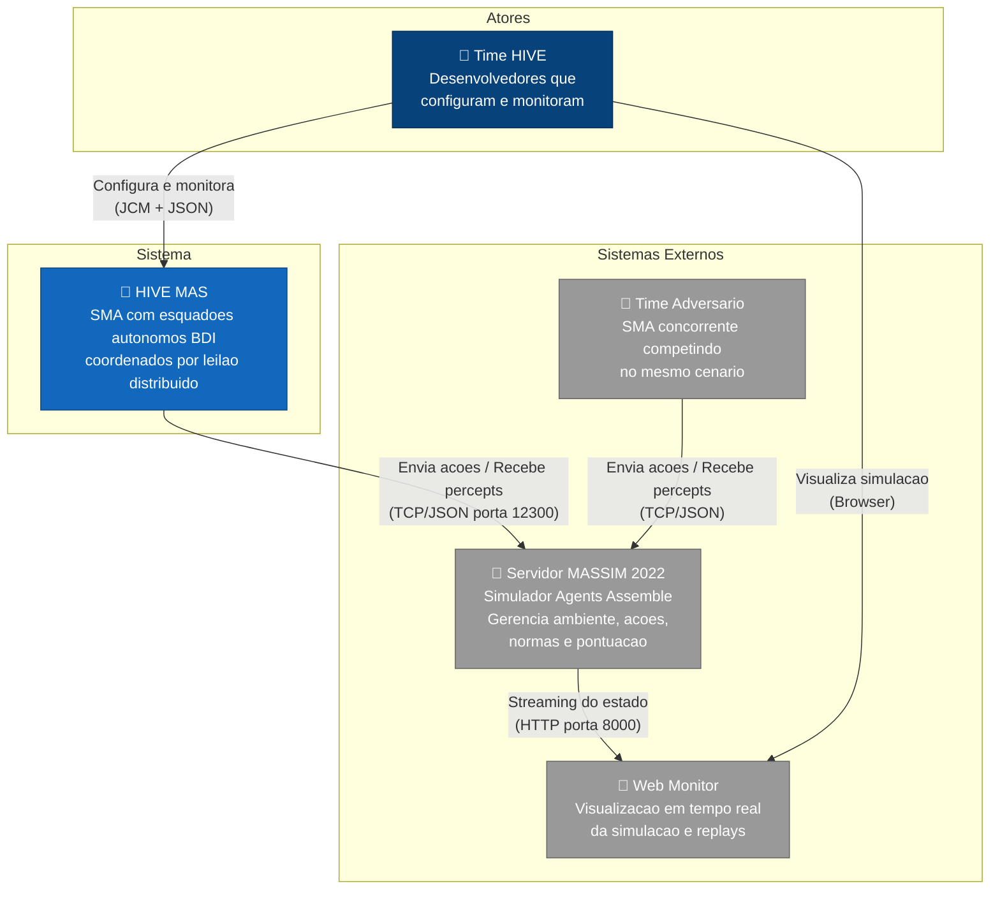

### 1.2 Nível 2 — Diagrama de Containers

Decomposição do sistema HIVE nos seus containers (processos/runtimes).

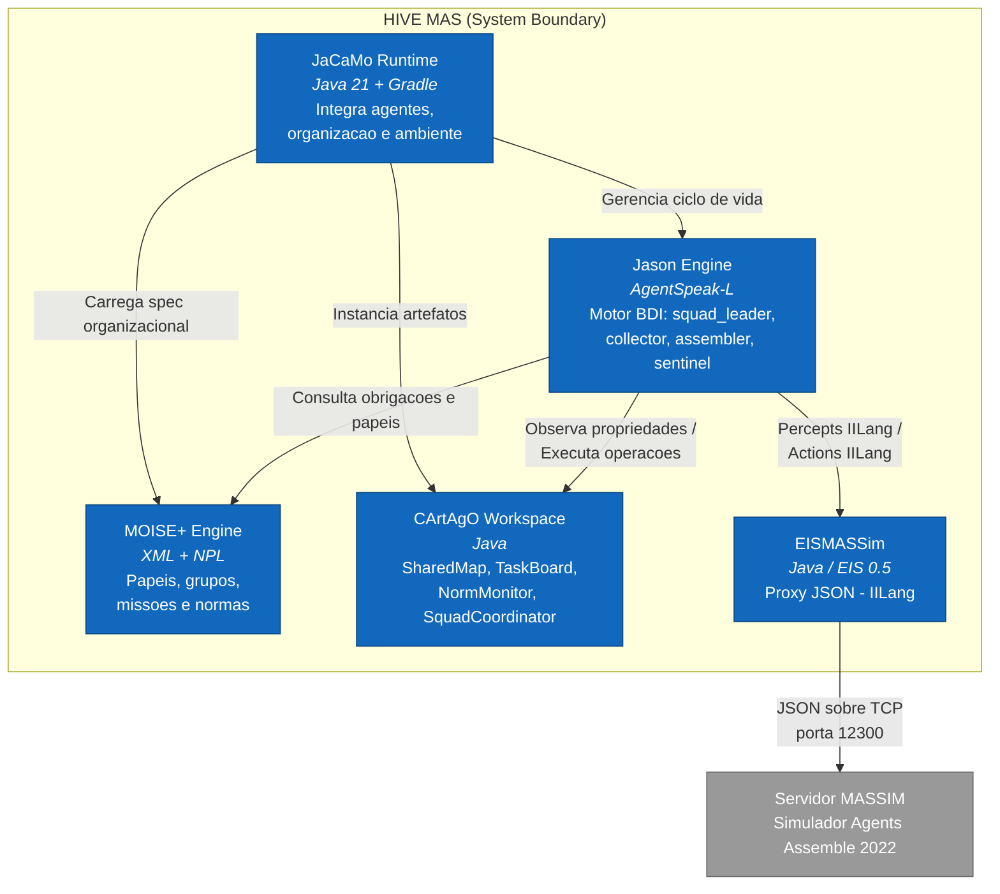

### 1.3 Nível 3 — Diagrama de Componentes

Detalhamento dos componentes dentro de cada container.

```mermaid
graph TB
    subgraph "Jason Engine — Agentes BDI"
        SL["squad_leader.asl<br/><i>Exploração, coordenação,<br/>leilão de tarefas</i>"]
        CO["collector.asl<br/><i>Coleta de blocos,<br/>transporte ao meeting point</i>"]
        AS["assembler.asl<br/><i>Montagem de padrões,<br/>submit em goal zones</i>"]
        SE["sentinel.asl<br/><i>Patrulha, clear ofensivo,<br/>proteção de assemblers</i>"]

        subgraph "common/ — Planos Reutilizáveis"
            NAV["navigation.asl<br/><i>Pathfinding A*</i>"]
            PER["perception.asl<br/><i>Processamento de percepts</i>"]
            COM["communication.asl<br/><i>Protocolos de mensagem</i>"]
            NOR["norms.asl<br/><i>Compliance de normas</i>"]
        end
    end

    subgraph "CArtAgO Workspace — Artefatos Java"
        SM["SharedMap.java<br/><i>Mapa incremental<br/>compartilhado</i>"]
        TB["TaskBoard.java<br/><i>Board de tarefas +<br/>protocolo de leilão</i>"]
        NM["NormMonitor.java<br/><i>Tracking de normas<br/>do servidor</i>"]
        SC["SquadCoordinator.java<br/><i>Estado dos esquadrões,<br/>meeting points</i>"]
    end

    subgraph "MOISE+ — Organização"
        ORG["hive_org.xml"]
        SS["Structural Spec<br/><i>Papéis + Grupos + Links</i>"]
        FS["Functional Spec<br/><i>Schemes + Goals + Missions</i>"]
        NS["Normative Spec<br/><i>Obrigações por papel</i>"]
        ORG --> SS
        ORG --> FS
        ORG --> NS
    end

    subgraph "Internal Actions — Java"
        PF["PathFinder.java<br/><i>A* em grade com obstáculos</i>"]
        PM["PatternMatcher.java<br/><i>Match padrão de blocos</i>"]
        DC["DirectionCalculator.java<br/><i>Direção relativa n/s/e/w</i>"]
    end

    subgraph "EISMASSim"
        EIS["EIS Proxy<br/><i>JSON ↔ IILang</i>"]
        CFG["eismassimconfig.json"]
    end

    SL --> NAV & PER & COM & NOR
    CO --> NAV & PER & COM & NOR
    AS --> NAV & PER & COM & NOR
    SE --> NAV & PER & COM & NOR

    SL & CO & AS & SE --> SM & TB & NM & SC
    SL & CO & AS & SE --> PF & PM & DC
    SL & CO & AS & SE --> EIS

    EIS --> MASSIM["Servidor MASSIM<br/>TCP:12300"]
```

### 1.4 Nível 4 — Código (Estrutura interna de um agente BDI)

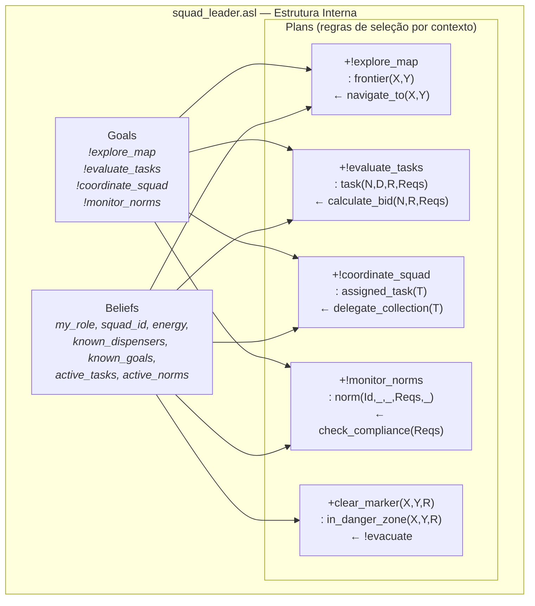

---

## 2. Diagramas UML

### 2.1 Diagrama de Classes — Artefatos CArtAgO

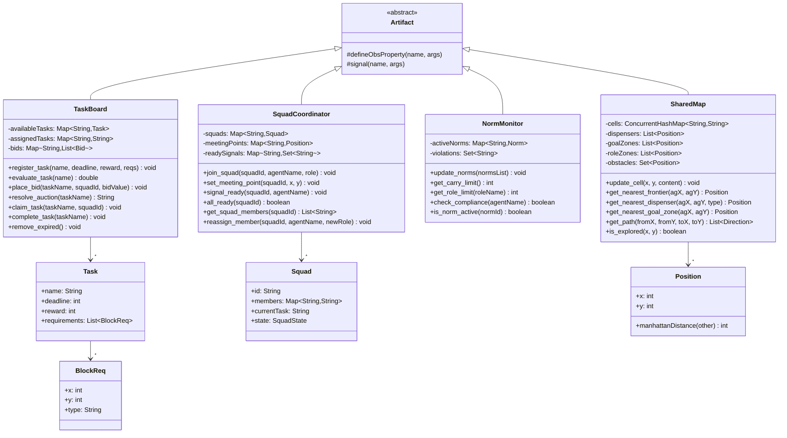

### 2.2 Diagrama de Classes — Internal Actions Java

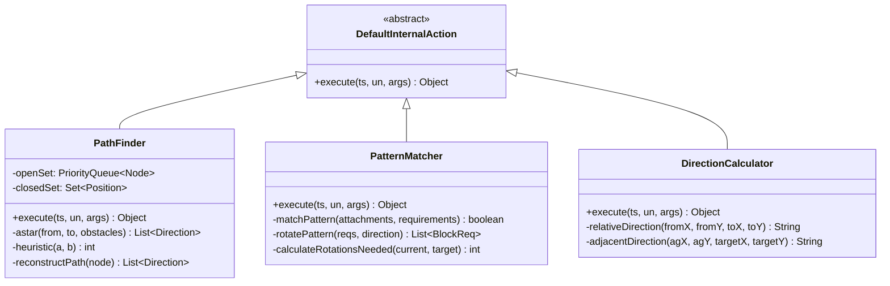

### 2.3 Diagrama de Sequência — Ciclo Completo de uma Tarefa

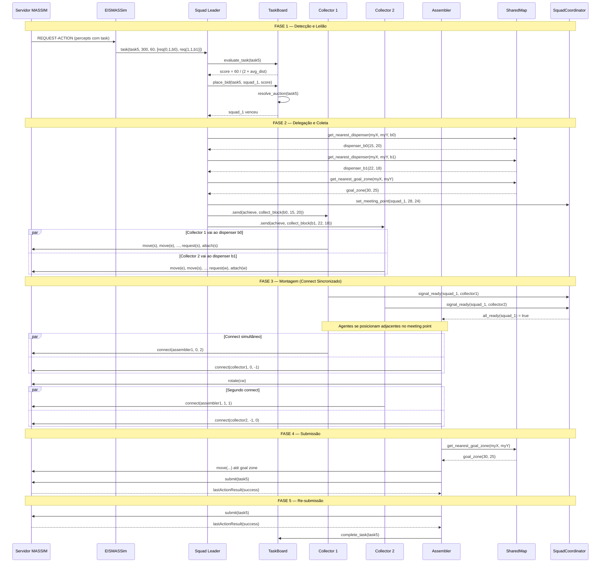

### 2.4 Diagrama de Sequência — Evasão de Clear Event

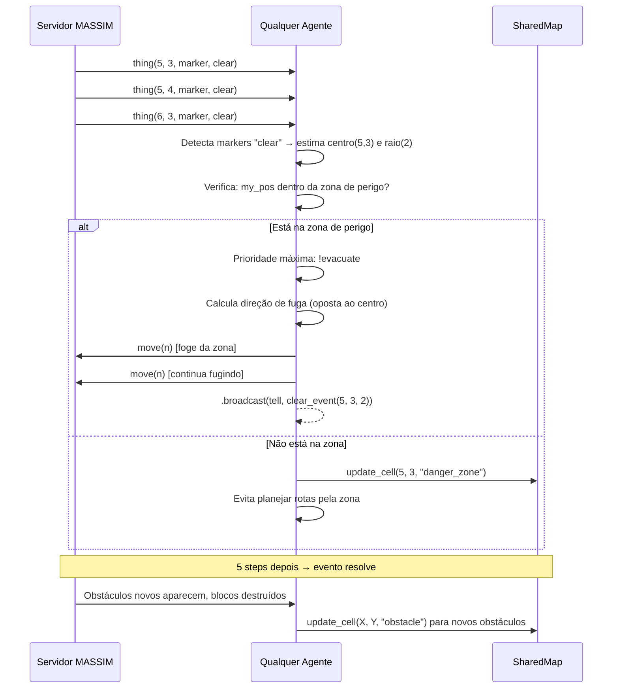

### 2.5 Diagrama de Sequência — Adaptação a Normas

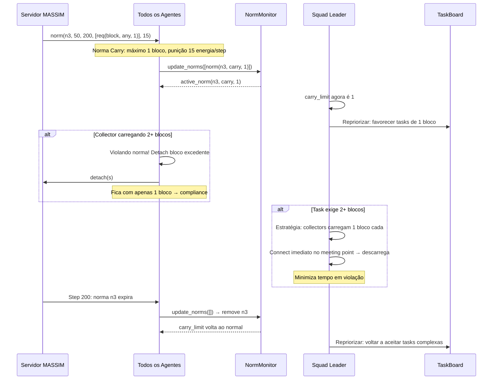

### 2.6 Diagrama de Estados — Ciclo de Vida do Agente

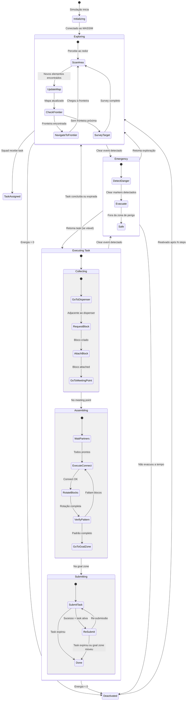

### 2.7 Diagrama de Estados — Ciclo de Vida do Esquadrão

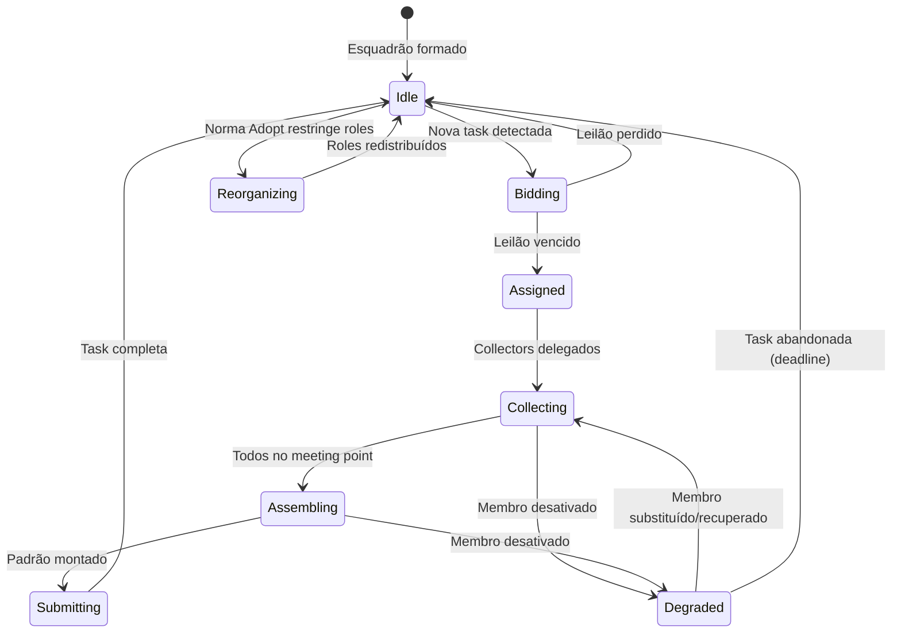

### 2.8 Diagrama de Atividades — Pipeline de Decisão por Step

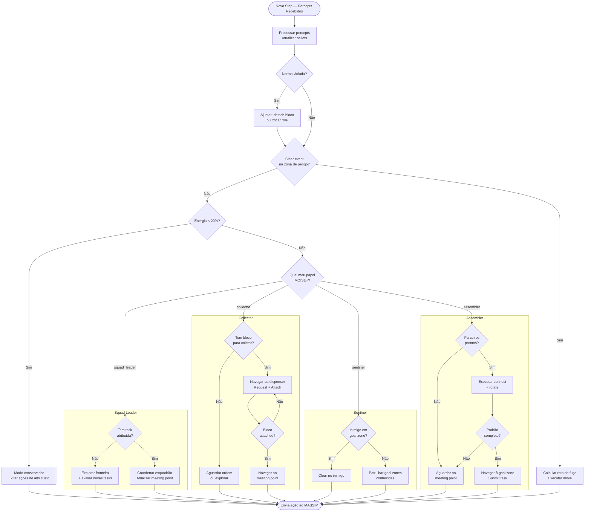

---

## 3. Padrões de Arquitetura MAS

### 3.1 Padrão: Arquitetura BDI em Camadas (Híbrida)

Inspirado nas Touring Machines (Ferguson, 1992) e INTERRAP (Müller, 1996), cada agente opera com três camadas de processamento com prioridades distintas.

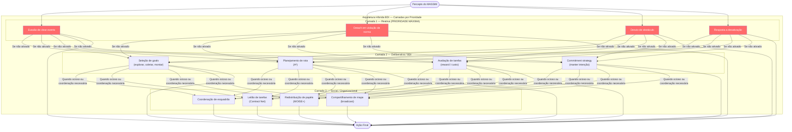

**Implementação em AgentSpeak**: A prioridade é controlada pela ordem dos planos no arquivo `.asl` e por anotações de prioridade. Planos reativos (clear event, norma) são declarados primeiro e com contextos mais específicos, garantindo que sejam selecionados antes dos planos deliberativos.

### 3.2 Padrão: Contract Net Protocol (Leilão Distribuído)

Protocolo de coordenação para alocação de tarefas entre esquadrões, baseado no Contract Net de Smith (1980).

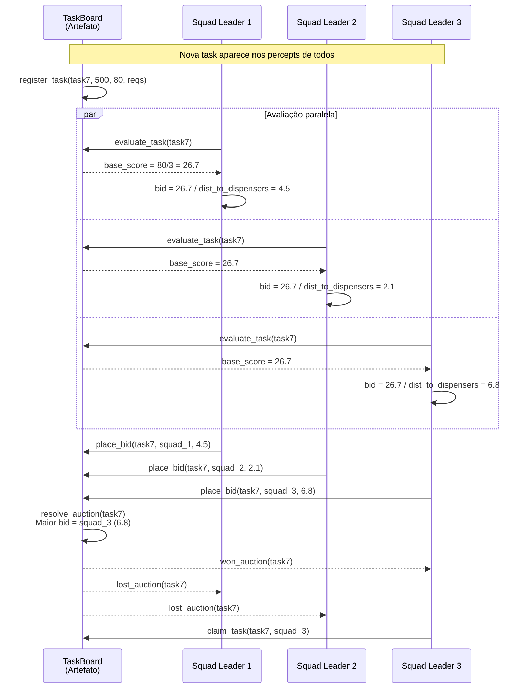

### 3.3 Padrão: Organização MOISE+ — Estrutural × Funcional × Normativo

```mermaid
graph LR
    subgraph "Structural Specification"
        direction TB
        R_SL["Role: squad_leader"]
        R_CO["Role: collector"]
        R_AS["Role: assembler"]
        R_SE["Role: sentinel"]

        G_SQ["Group: squad_group<br/>(2..4 membros)"]
        G_SN["Group: sentinel_group<br/>(1..2 membros)"]

        G_SQ --- R_SL & R_CO & R_AS
        G_SN --- R_SE

        R_SL -->|authority| R_CO
        R_SL -->|authority| R_AS
        R_CO -->|communication| R_AS
    end

    subgraph "Functional Specification"
        direction TB
        SCH_E["Scheme: exploration"]
        SCH_T["Scheme: task_execution"]
        SCH_D["Scheme: defense"]

        SCH_E --> M_SC["Mission: m_scout"]
        SCH_T --> M_CO2["Mission: m_collect"]
        SCH_T --> M_AS2["Mission: m_assemble"]
        SCH_T --> M_SU["Mission: m_submit"]
        SCH_D --> M_GU["Mission: m_guard"]
    end

    subgraph "Normative Specification"
        direction TB
        N1["squad_leader MUST m_scout"]
        N2["collector MUST m_collect"]
        N3["assembler MUST m_assemble"]
        N4["assembler MUST m_submit"]
        N5["sentinel MUST m_guard"]
    end

    R_SL -.->|obrigação| N1
    R_CO -.->|obrigação| N2
    R_AS -.->|obrigação| N3 & N4
    R_SE -.->|obrigação| N5

    M_SC -.->|vinculada| N1
    M_CO2 -.->|vinculada| N2
    M_AS2 -.->|vinculada| N3
    M_SU -.->|vinculada| N4
    M_GU -.->|vinculada| N5
```

### 3.4 Padrão: Shared Environment (A&A — Agents & Artifacts)

```mermaid
graph TB
    subgraph "Agents (Jason)"
        A1["squad_leader_1"]
        A2["collector_1"]
        A3["collector_2"]
        A4["assembler_1"]
        A5["sentinel_1"]
    end

    subgraph "Workspace (CArtAgO)"
        SM["SharedMap<br/><br/>ObsProps:<br/>dispenser(X,Y,Type)<br/>goal_zone(X,Y)<br/>frontier(X,Y)"]
        TB2["TaskBoard<br/><br/>ObsProps:<br/>available_task(N,D,R,Reqs)<br/>assigned_task(Squad,Task)<br/>task_score(Name,Score)"]
        NM["NormMonitor<br/><br/>ObsProps:<br/>active_norm(Id,Type,Limit)<br/>carry_limit(N)"]
        SC2["SquadCoordinator<br/><br/>ObsProps:<br/>meeting_point(Sq,X,Y)<br/>connect_ready(Sq,Ag)"]
    end

    A1 -->|focus + observe| SM & TB2 & NM & SC2
    A2 -->|focus + observe| SM & TB2 & SC2
    A3 -->|focus + observe| SM & TB2 & SC2
    A4 -->|focus + observe| SM & TB2 & SC2
    A5 -->|focus + observe| SM & NM

    A1 -->|update_cell()| SM
    A2 -->|update_cell()| SM
    A3 -->|update_cell()| SM
    A4 -->|update_cell()| SM
    A5 -->|update_cell()| SM

    A1 -->|place_bid()<br/>claim_task()| TB2
    A4 -->|complete_task()| TB2
    A1 -->|set_meeting_point()| SC2
    A2 & A3 -->|signal_ready()| SC2
```

### 3.5 Padrão: Subsumption de Prioridades (Brooks simplificado)

A seleção da ação final segue um modelo de subsumption onde comportamentos de maior prioridade suprimem os de menor prioridade.

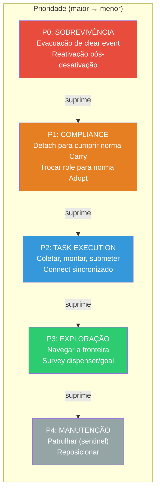

---

## 4. Deployment — Diagrama de Implantação

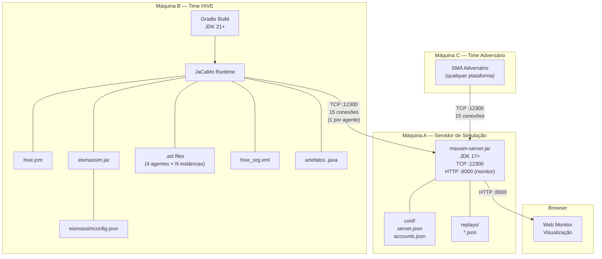

---

## 5. Decisões Arquiteturais (ADRs)

### ADR-001: Esquadrões autônomos vs. coordenador central

- **Contexto**: Times MAPC precisam coordenar 15 agentes para completar tarefas.
- **Decisão**: Esquadrões de 3-4 agentes com autonomia local, coordenados por leilão distribuído via artefato TaskBoard.
- **Justificativa**: Elimina ponto único de falha; permite paralelismo natural (3-4 esquadrões × tarefas simultâneas); alinhado com princípio de autonomia de Wooldridge.
- **Trade-off**: Coordenação inter-esquadrão é mais fraca; possível duplicação de esforço se dois esquadrões buscam o mesmo dispenser.

### ADR-002: Artefatos CArtAgO para estado compartilhado vs. mensagens puras

- **Contexto**: Agentes precisam compartilhar mapa, estado de tarefas e normas.
- **Decisão**: Usar artefatos CArtAgO (SharedMap, TaskBoard, etc.) como fonte de verdade, complementados por mensagens Jason para alertas urgentes.
- **Justificativa**: Artefatos são observáveis por todos os agentes (sem polling); propriedades observáveis geram percepts automáticos; reduz volume de mensagens.
- **Trade-off**: Acoplamento com CArtAgO; artefatos são pontos de contenção em escrita concorrente (mitigado por ConcurrentHashMap).

### ADR-003: Navegação A* em Java vs. planejamento em AgentSpeak

- **Contexto**: Agentes precisam navegar em grade com obstáculos.
- **Decisão**: Implementar A* como internal action Java, chamável do AgentSpeak.
- **Justificativa**: A* é computacionalmente intensivo; Java é mais eficiente que AgentSpeak para algoritmos iterativos; reutilizável por todos os agentes.
- **Trade-off**: Lógica de navegação fica fora do AgentSpeak (menos "puro BDI"); necessário manter mapa de obstáculos sincronizado.

### ADR-004: Sentinel ofensivo dedicado vs. todos os agentes com capacidade de clear

- **Contexto**: Ação clear pode negar pontos ao adversário.
- **Decisão**: 1-2 agentes dedicados como sentinels com role de alto clear.
- **Justificativa**: Especialização permite role otimizado para clear; não desperdiça agentes produtivos; cria vantagem assimétrica.
- **Trade-off**: 1-2 agentes a menos para tarefas produtivas; sentinel é inútil se adversário não usa goal zones previsíveis.

### ADR-005: Adaptação de roles do servidor via role zones

- **Contexto**: O servidor MASSIM define roles com capabilities diferentes; role zones são fixas.
- **Decisão**: Agentes trocam de role do servidor conforme a fase (exploração → role de alta visão; coleta → role de boa speed com carga; ataque → role de alto clear).
- **Justificativa**: Maximiza a eficiência de cada agente em cada momento; explora uma mecânica que times simplistas ignoram.
- **Trade-off**: Precisa navegar até role zones para trocar; overhead de tempo de viagem; dependente de role zones mapeadas.
