# Arquitetura do Sistema — Projeto HIVE / MAPC 2022

Documento de arquitetura completo do sistema multi-agente **Hive**, desenvolvido para a competição MASSim 2022 (Agents Assemble III). Inclui diagramas C4, UML, padrões MAS e detalhamento de todos os componentes implementados. Todos os diagramas utilizam Mermaid.

**Tecnologias:** JaCaMo 1.3.0 (Jason + CArtAgO + MOISE) | Java 21 | MASSim 2022 | React 19 + Three.js

---

## 1. Modelo C4

### 1.1 Nível 1 — Diagrama de Contexto

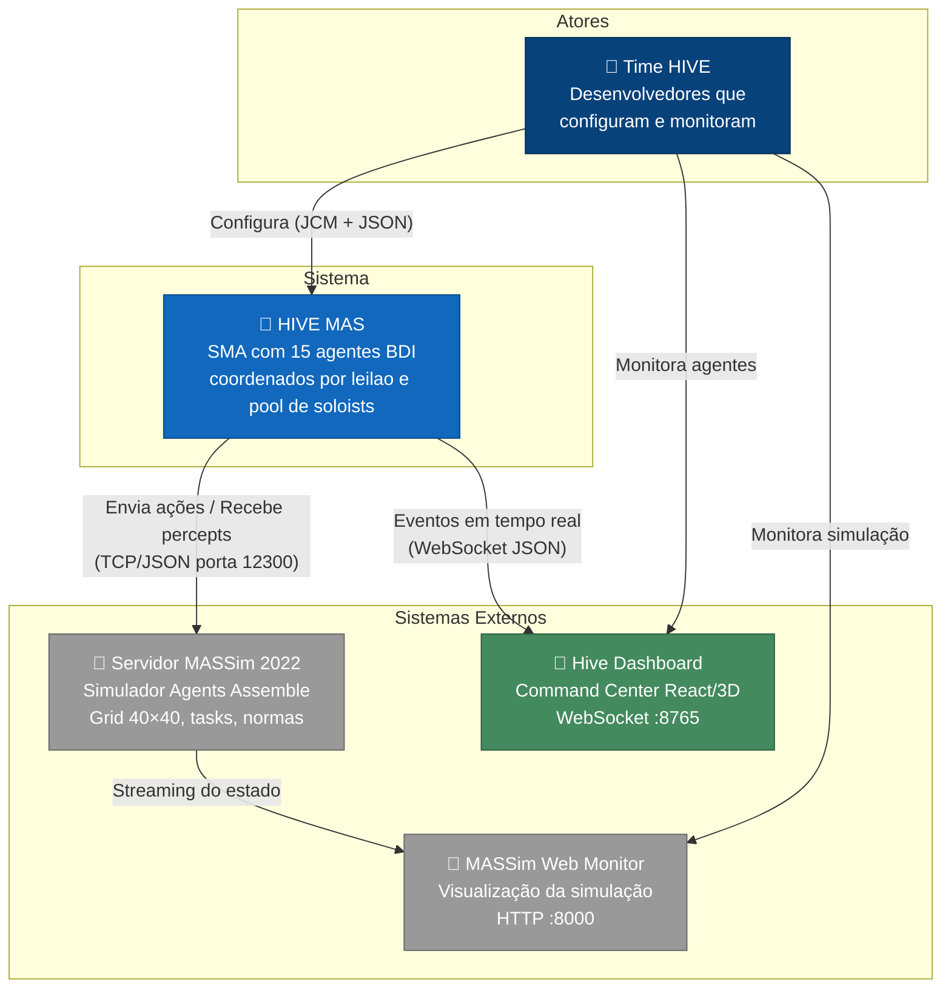

### 1.2 Nível 2 — Diagrama de Containers

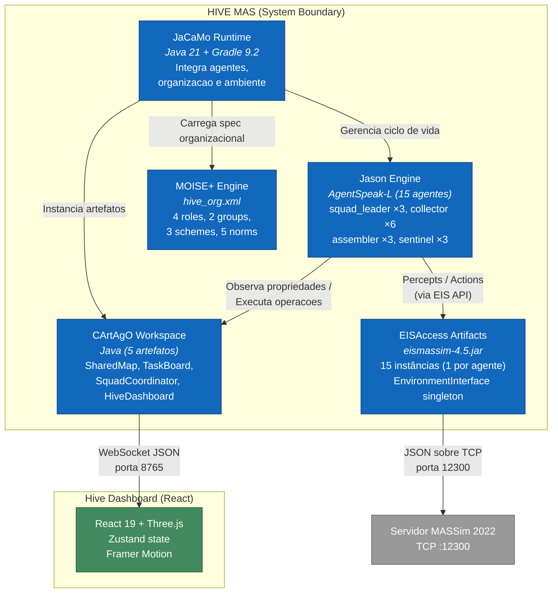

### 1.3 Nível 3 — Diagrama de Componentes

```mermaid
graph TB
    subgraph "Jason Engine — 15 Agentes BDI"
        SL["squad_leader.asl ×3<br/><i>Leilão, delegação,<br/>coordenação de squad</i>"]
        CO["collector.asl ×6<br/><i>Coleta de blocos,<br/>soloist tasks, meeting point</i>"]
        AS["assembler.asl ×3<br/><i>Solo/multi-block,<br/>connect + submit</i>"]
        SE["sentinel.asl ×3<br/><i>Patrulha,<br/>soloist tasks</i>"]

        subgraph "common/ — Módulos Compartilhados"
            CP["connect_protocol.asl<br/><i>Submit + Connect<br/>(PRIORIDADE MAX)</i>"]
            CL["collection.asl<br/><i>Request + Attach cycle</i>"]
            NAV["navigation.asl<br/><i>Greedy + Frontier exploration</i>"]
            PER["perception.asl<br/><i>Processamento de percepts</i>"]
            COM["communication.asl<br/><i>Sync msgs para connect</i>"]
            DSH["dashboard_hooks.asl<br/><i>Reportar estado via WS</i>"]
        end
    end

    subgraph "CArtAgO Workspace — Artefatos Java"
        SM["SharedMap.java<br/><i>Mapa compartilhado<br/>A* + fronteira + dispensers</i>"]
        TB["TaskBoard.java<br/><i>Registro de tasks +<br/>leilão distribuído</i>"]
        SC["SquadCoordinator.java<br/><i>Squads, meeting points,<br/>pool de soloists</i>"]
        HD["HiveDashboard.java<br/><i>WebSocket :8765<br/>broadcast JSON</i>"]
    end

    subgraph "Internal Actions — Java (hive.*)"
        AD["AdjacentDirection.java<br/><i>Adjacência com wrap 40×40</i>"]
        CC["ConnectCalculator.java<br/><i>Coords relativas connect</i>"]
        PF["PathFinder.java<br/><i>A* (2000 iter max)</i>"]
        DC["DirectionCalculator.java<br/><i>Direção greedy</i>"]
        PM["PatternMatcher.java<br/><i>Verifica padrão de blocos</i>"]
    end

    subgraph "EIS Bridge"
        EIS["EISAccess.java ×15<br/><i>Singleton EnvironmentInterface</i>"]
        TR["Translator.java<br/><i>IILang ↔ Jason AST</i>"]
    end

    SL & CO & AS & SE --> CP & CL & NAV & PER & DSH
    CO & AS --> COM

    SL & CO & AS & SE --> SM & TB & SC & HD
    SL & CO & AS & SE --> AD & CC & PF & DC & PM
    SL & CO & AS & SE --> EIS
    EIS --> TR

    EIS --> MASSIM["MASSim Server<br/>TCP :12300"]
    HD --> DASHBOARD["Dashboard React<br/>WS :8765"]
```

### 1.4 Nível 4 — Código (Fluxo interno de um step)

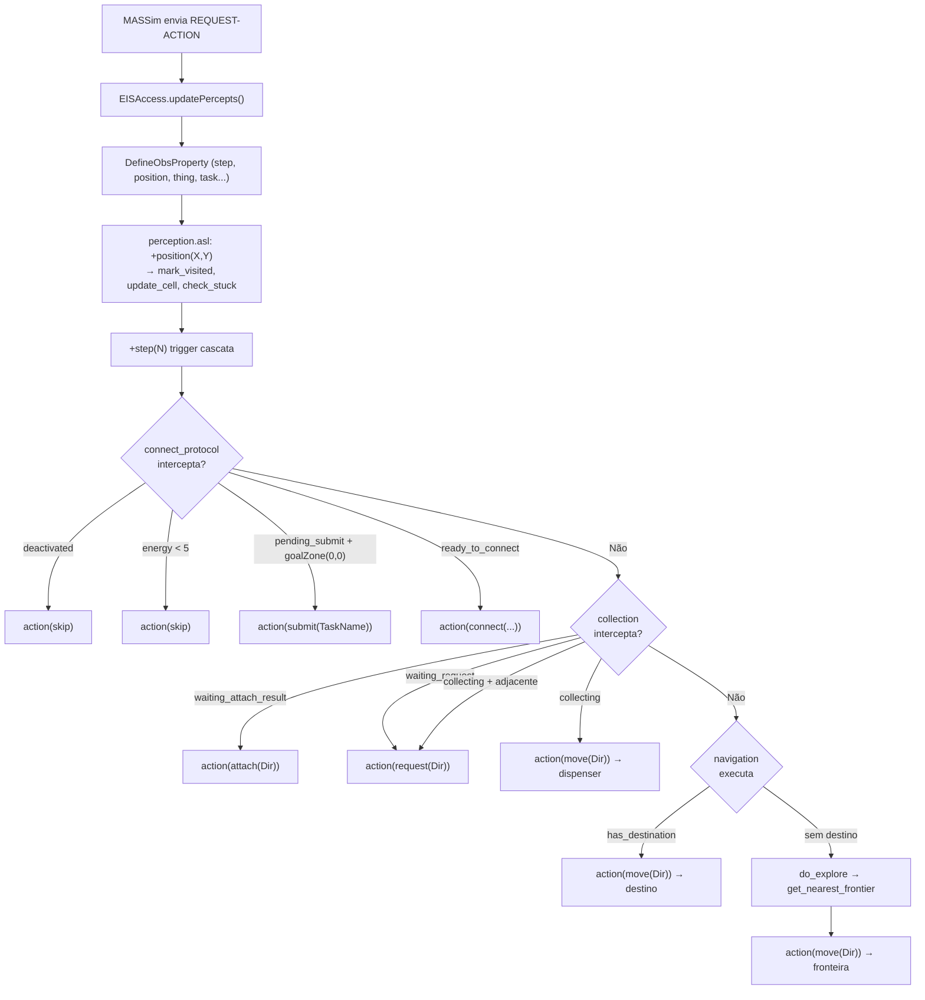

---

## 2. Diagramas UML

### 2.1 Diagrama de Classes — Artefatos CArtAgO (Implementação Real)

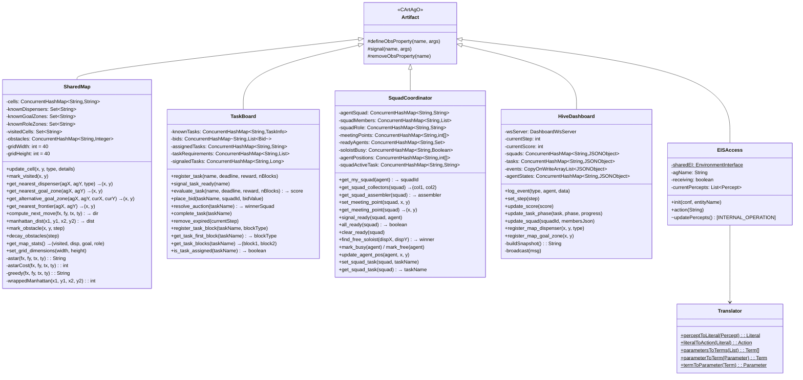

### 2.2 Diagrama de Classes — Internal Actions Java

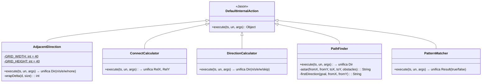

### 2.3 Diagrama de Sequência — Fluxo Completo de Task Solo (Soloist)

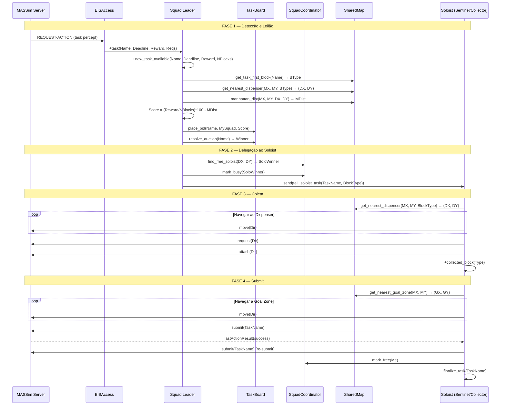

### 2.4 Diagrama de Sequência — Connect Multi-Block

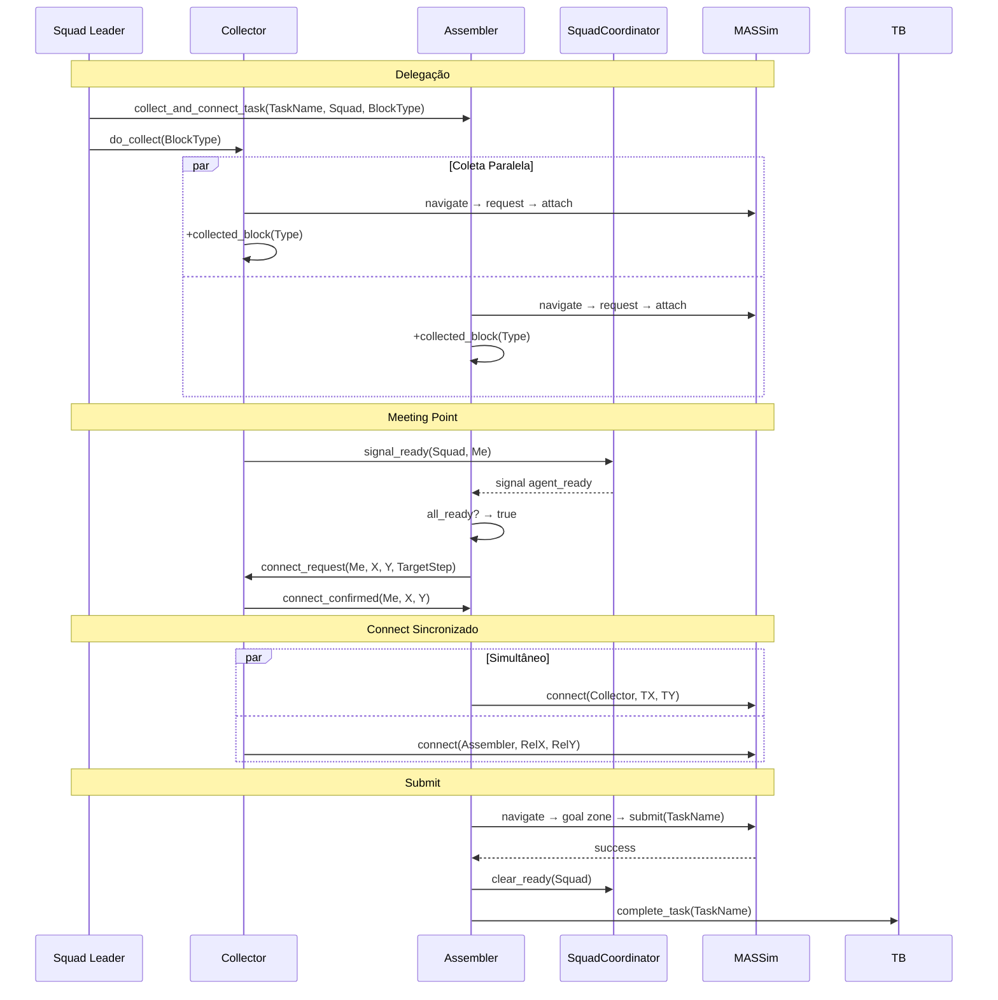

### 2.5 Diagrama de Estados — Ciclo de Vida do Agente

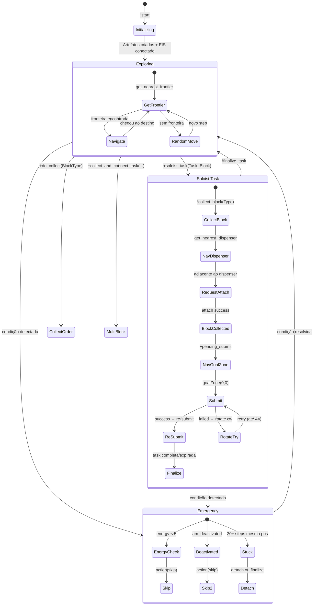

### 2.6 Diagrama de Estados — Squad

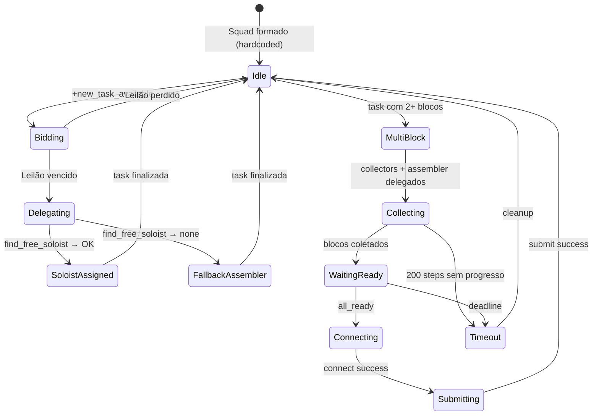

### 2.7 Diagrama de Atividades — Pipeline de Decisão por Step

```mermaid
flowchart TD
    START(["+step(N) — Percepts recebidos"]) --> DEACT{am_deactivated?}

    DEACT -->|Sim| SKIP_DEACT["action(skip)"]
    DEACT -->|Não| ENERGY{energy < 5?}

    ENERGY -->|Sim| SKIP_ENERGY["action(skip)<br/>conservar energia"]
    ENERGY -->|Não| SUBMIT_CHECK{pending_submit +<br/>goalZone(0,0)?}

    SUBMIT_CHECK -->|Sim| DO_SUBMIT["action(submit(TaskName))"]
    SUBMIT_CHECK -->|Não| SUBMIT_RESULT{submitted_task +<br/>lastAction(submit)?}

    SUBMIT_RESULT -->|success| RESUBMIT["Re-submit ou finalize"]
    SUBMIT_RESULT -->|failed| ROTATE["action(rotate(cw))<br/>retry até 4×"]
    SUBMIT_RESULT -->|Não| CONNECT_CHECK{ready_to_connect?}

    CONNECT_CHECK -->|Sim + entidade adjacente| DO_CONNECT["action(connect(...))"]
    CONNECT_CHECK -->|Sim + sem adjacente| WAIT_CONNECT["action(skip)"]
    CONNECT_CHECK -->|Não| ATTACH_CHECK{waiting_attach_result?}

    ATTACH_CHECK -->|success| COLLECTED["collected_block!<br/>action(skip)"]
    ATTACH_CHECK -->|fail| RETRY_ATTACH["action(attach(Dir))"]
    ATTACH_CHECK -->|Não| REQUEST_CHECK{waiting_request?}

    REQUEST_CHECK -->|success| DO_ATTACH["action(attach(Dir))"]
    REQUEST_CHECK -->|fail| RETRY_REQ["retry request ou mover"]
    REQUEST_CHECK -->|Não| COLLECTING{collecting(Type,DX,DY)?}

    COLLECTING -->|adjacente| DO_REQUEST["action(request(Dir))"]
    COLLECTING -->|não adjacente| MOVE_DISP["action(move(Dir)) → dispenser"]
    COLLECTING -->|Não| NAV_CHECK{has_destination?}

    NAV_CHECK -->|Sim + chegou| ARRIVED["destino alcançado"]
    NAV_CHECK -->|Sim + blocked| RANDOM_DIR["direção aleatória"]
    NAV_CHECK -->|Sim| GREEDY["greedy move → destino"]
    NAV_CHECK -->|Não| EXPLORE["get_nearest_frontier<br/>→ action(move(Dir))"]
```

---

## 3. Organização MOISE+

### 3.1 Especificação Estrutural

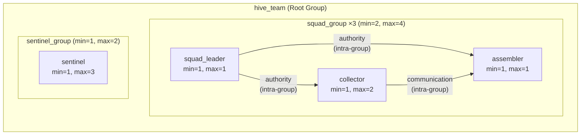

### 3.2 Especificação Funcional

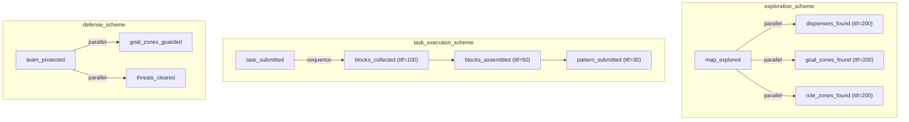

### 3.3 Especificação Normativa

| Norma | Tipo | Role → Missão | Significado |
|-------|------|---------------|-------------|
| `n_scout` | obrigação | squad_leader → m_scout | Líder deve explorar o mapa |
| `n_collect` | obrigação | collector → m_collect | Coletor deve coletar blocos |
| `n_assemble` | obrigação | assembler → m_assemble | Montador deve montar blocos |
| `n_submit` | obrigação | assembler → m_submit | Montador deve submeter padrões |
| `n_guard` | obrigação | sentinel → m_guard | Sentinela deve guardar zonas |

---

## 4. Composição dos Esquadrões (Implementação)

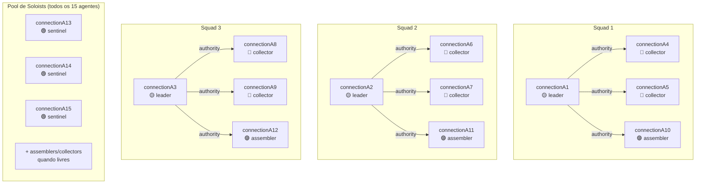

---

## 5. Padrões de Arquitetura MAS

### 5.1 Padrão: Arquitetura BDI em Camadas (Subsumption)

A seleção de ação segue prioridade por módulo de inclusão no AgentSpeak:

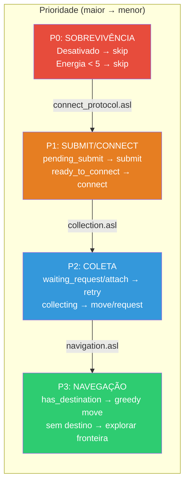

### 5.2 Padrão: Contract Net (Leilão Distribuído via TaskBoard)

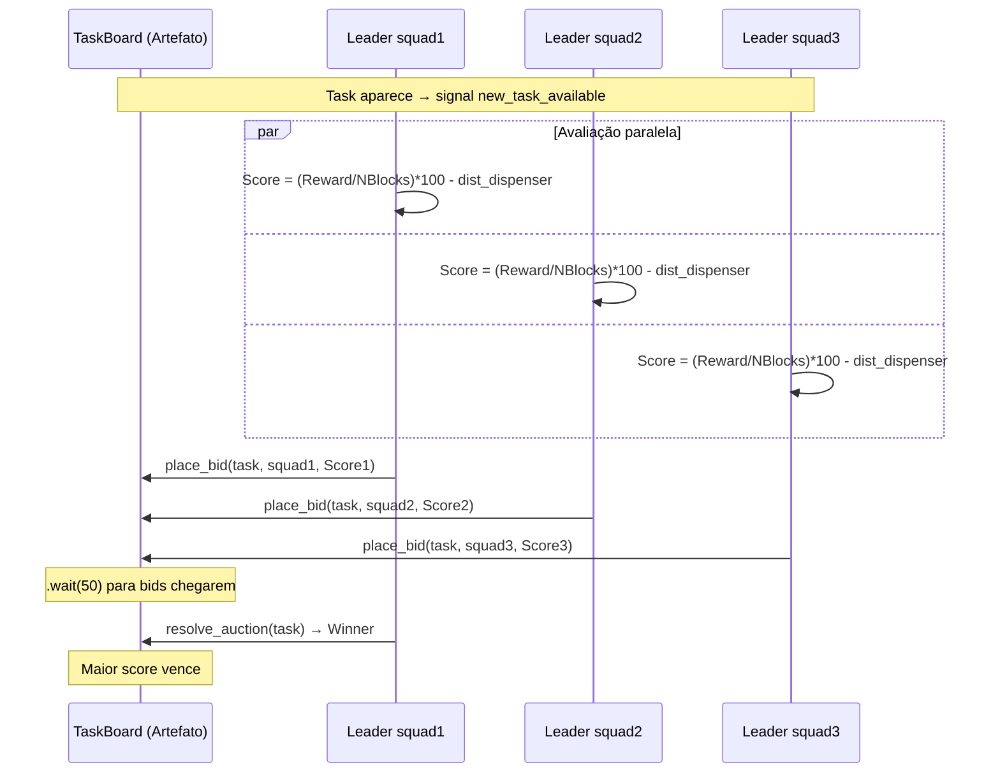

**Fórmula de Score:**
```
Score = (Reward / NBlocks) × 100 - ManhattanDistance(leader, nearest_dispenser)
```

### 5.3 Padrão: Pool de Soloists

Mecanismo adaptativo que permite qualquer agente livre executar tasks solo:

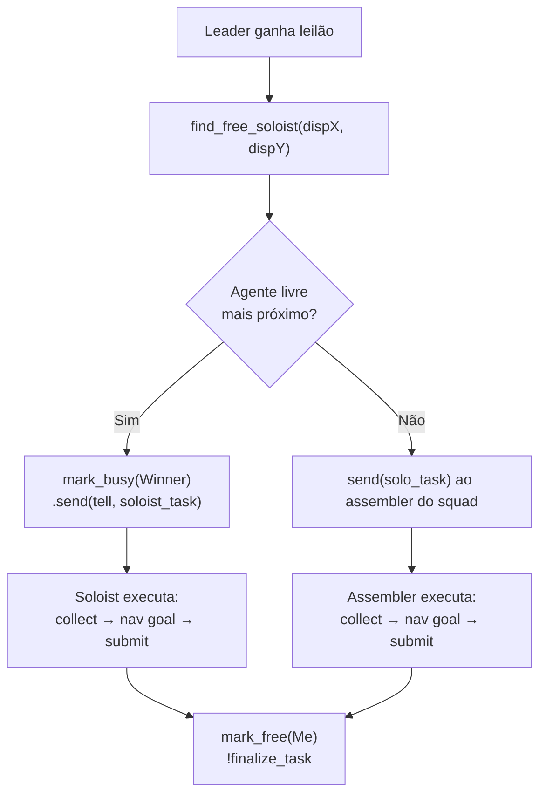

### 5.4 Padrão: Shared Environment (Agents & Artifacts)

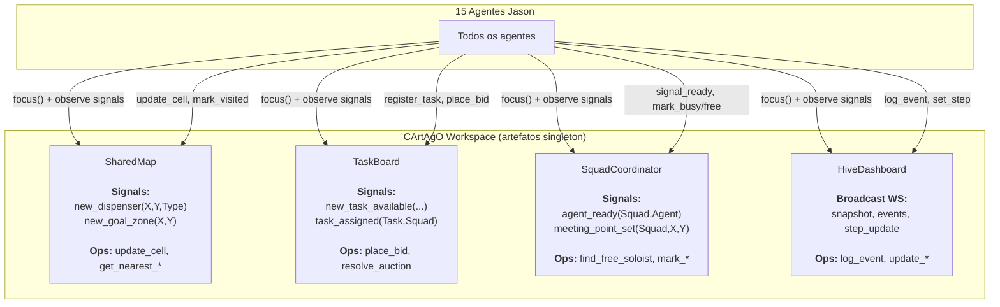

---

## 6. Mecanismos de Resiliência

| Mecanismo | Módulo | Trigger | Ação |
|-----------|--------|---------|------|
| Retry de request | `collection.asl` | request failed (até 5×) | Move aleatório + retry; após 5 falhas busca outro dispenser |
| Rotação no submit | `connect_protocol.asl` | submit failed | Rotaciona CW (até 4×), depois desiste |
| Detecção de stuck | `perception.asl` | 20 steps na mesma posição | Se solo_mode → finalize task; senão → detach |
| Task timeout | Cada agente | 200 steps sem progresso | cleanup + finalize |
| Task expirada | Cada agente | Deadline atingido | cleanup + finalize |
| Energia crítica | `connect_protocol.asl` | energy < 5 | action(skip) para conservar |
| Goal zone alternativa | `connect_protocol.asl` | 8 bloqueios | Troca para goal zone diferente |
| Fallback `-!` | Todos os módulos | Falha em plano | Plan failure não causa crash |
| Reconnect exponencial | Dashboard (`ws.ts`) | WebSocket desconecta | Retry 1s, 2s, 4s... (max 10s) |

---

## 7. Deployment

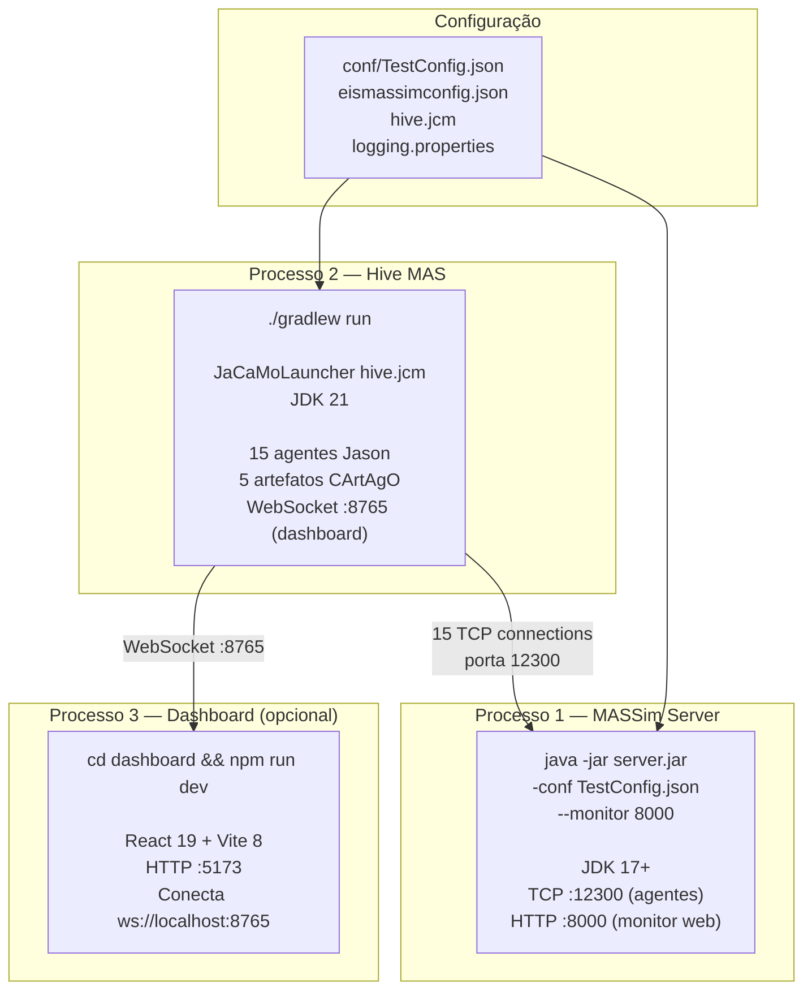

---

## 8. Decisões Arquiteturais (ADRs)

### ADR-001: Pool de Soloists vs. Squads rígidos

- **Contexto**: Tasks de 1 bloco são frequentes e squads de 4 agentes são overkill.
- **Decisão**: Todos os 15 agentes participam de um pool de soloists. Líder busca o agente livre mais próximo ao dispenser.
- **Justificativa**: Maximiza throughput de tasks simples; reduz tempo ocioso; sentinels contribuem produtivamente.
- **Trade-off**: Squads ficam com menos agentes disponíveis para tasks multi-block.

### ADR-002: Artefatos CArtAgO com ConcurrentHashMap

- **Contexto**: 15 agentes acessam estado compartilhado simultaneamente.
- **Decisão**: Usar `ConcurrentHashMap` em todos os artefatos; operações atômicas; sem locks explícitos.
- **Justificativa**: Acesso concorrente seguro sem contenção; simplicidade de implementação; boa performance para operações predominantemente de leitura.
- **Trade-off**: Não garante consistência transacional entre múltiplas operações (aceitável neste contexto).

### ADR-003: A* no SharedMap (Java) vs. A* como Internal Action

- **Contexto**: Pathfinding precisa de acesso ao mapa de obstáculos.
- **Decisão**: A* implementado diretamente no SharedMap (método `astar()`), com fallback greedy para distâncias > 60.
- **Justificativa**: Acesso direto à estrutura de obstáculos sem cópia; limitação de 8000 nós evita travamento; fallback greedy garante resposta.
- **Trade-off**: `PathFinder.java` (internal action) fica redundante — usado apenas como backup sem obstáculos.

### ADR-004: Prioridade via ordem de inclusão dos .asl

- **Contexto**: Jason seleciona o primeiro plano `+step(N)` cujo contexto é satisfeito.
- **Decisão**: Incluir `connect_protocol.asl` antes de `collection.asl` antes de `navigation.asl`.
- **Justificativa**: Garante que submit/connect têm prioridade máxima; coleta vem antes de exploração; padrão simples e auditável.
- **Trade-off**: Adição de novos módulos requer cuidado com a posição de inclusão.

### ADR-005: Dashboard separado (React) vs. MASSim Monitor

- **Contexto**: O monitor MASSim mostra o grid mas não os internals dos agentes (squads, leilões, beliefs).
- **Decisão**: Dashboard React dedicado conectado via WebSocket ao artefato HiveDashboard.
- **Justificativa**: Visibilidade total do estado interno (squads, tasks, auctions, agent states); visualização 3D; independent do MASSim.
- **Trade-off**: Overhead de manutenção de artefato + frontend separado; porta adicional (8765).

### ADR-006: EnvironmentInterface singleton compartilhado

- **Contexto**: eismassim pode criar 1 conexão TCP por agente ou compartilhar.
- **Decisão**: Singleton `EnvironmentInterface` com 15 entidades registradas, compartilhado entre os 15 artefatos EISAccess.
- **Justificativa**: Uma única instância gerencia o pool de conexões; evita duplicação de resources; simplifica inicialização.
- **Trade-off**: Lock contention em `getPercepts()`/`performAction()` se muitos agentes acessam simultaneamente (mitigado pelo scheduling mode do EIS).

---

## 9. Métricas do Sistema

| Aspecto | Valor |
|---------|-------|
| Agentes | 15 (4 roles) |
| Artefatos CArtAgO | 5 tipos (19 instâncias total) |
| Ações internas Java | 5 |
| Linhas de código (src/) | ~3.230 |
| Linhas AgentSpeak | ~1.470 |
| Linhas Java | ~1.640 |
| Linhas XML (MOISE+) | ~120 |
| Dashboard (frontend) | ~2.000 linhas TypeScript |
| Dependências | JaCaMo 1.3.0, eismassim 4.5, Java-WebSocket 1.5.7, json-20240303 |
| Java version | 21 |
| Gradle version | 9.2 |
