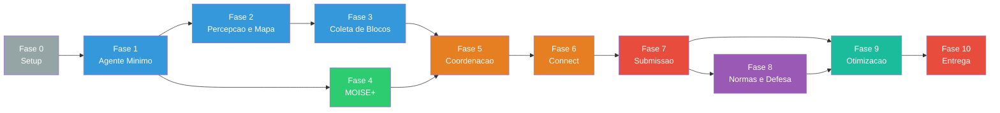

# Plano de Execucao — Projeto HIVE / MAPC 2022

> **Deadline**: 02/06/2026
> **Inicio**: 19/05/2026 (segunda-feira)
> **Duracao efetiva**: 14 dias (2 semanas)

**Legenda de status**:
- `[ ]` Pendente
- `[~]` Em andamento
- `[x]` Concluido
- `[!]` Bloqueado
- `[-]` Cancelado/Descartado

---

## Visao Geral das Fases

| Fase | Nome | Periodo | Objetivo Principal |
|------|------|---------|-------------------|
| 0 | Setup do Ambiente | 19-20/mai | MASSIM rodando + JaCaMo compilando |
| 1 | Agente Minimo Viavel | 20-21/mai | 1 agente conectado, recebendo percepts, executando move |
| 2 | Percepcao e Mapa | 22-23/mai | Processamento de percepts, mapa local, exploracao basica |
| 3 | Coleta de Blocos | 24-25/mai | Request em dispensers, attach/detach, transporte |
| 4 | Organizacao MOISE+ | 26/mai | Papeis, grupos, missoes, esquemas funcionando |
| 5 | Coordenacao e Leilao | 27/mai | TaskBoard, alocacao de tarefas, esquadoes |
| 6 | Montagem e Connect | 28/mai | Connect sincronizado, rotacao, montagem de padroes |
| 7 | Submissao e Pontuacao | 29/mai | Submit em goal zones, re-submissao |
| 8 | Normas e Defesa | 30/mai | Compliance de normas, evasao de clear events, sentinel |
| 9 | Otimizacao e Testes | 31/mai-01/jun | Testes contra adversario, tuning, robustez |
| 10 | Entrega | 02/jun | Relatorio final + codigo fonte |

---

## FASE 0 — Setup do Ambiente

**Periodo**: 19-20/mai (seg-ter)
**Objetivo**: Ter o servidor MASSIM e o projeto JaCaMo compilando e executando na mesma maquina.
**Criterio de aceite**: Servidor MASSIM inicia, web monitor acessivel em localhost:8000, projeto JaCaMo compila sem erros.

### Backlog

- [x] **0.1** Instalar JDK 21 e verificar `java -version` — OpenJDK 21.0.8
- [x] **0.2** Instalar JDK 17 (se necessario para MASSIM) ou confirmar que JDK 21 e compativel — JDK 21 >= 17, OK
- [x] **0.3** Instalar Gradle >= 8.0 e verificar `gradle -version` — Gradle 9.1.0
- [x] **0.4** Instalar Maven >= 3.8 e verificar `mvn -version` — Maven 3.9.15 (instalado via brew)
- [x] **0.5** Clonar repositorio MASSIM 2022: `git clone https://github.com/agentcontest/massim_2022.git`
- [x] **0.6** Build do MASSIM: `cd massim_2022 && mvn package -DskipTests` — BUILD SUCCESS
- [x] **0.7** Iniciar servidor MASSIM com monitor: `java -jar server/target/server-2022-1.1-jar-with-dependencies.jar --monitor`
- [x] **0.8** Verificar web monitor em `http://localhost:8000` — HTTP 200 OK
- [x] **0.9** Criar estrutura do projeto HIVE (diretorios: src/agt/common, src/org, src/env, src/java/hive, lib, conf)
- [x] **0.10** Criar `build.gradle` com dependencia JaCaMo 1.3
- [x] **0.11** Criar `settings.gradle` com nome do projeto (hive-mapc)
- [x] **0.12** Copiar `eismassim-4.5-jar-with-dependencies.jar` para `lib/`
- [x] **0.13** Executar `gradle build` — BUILD SUCCESSFUL
- [x] **0.14** Criar `eismassimconfig.json` apontando para localhost:12300
- [x] **0.15** Criar `hive.jcm` minimo (1 agente dummy)

**Entregavel**: Servidor MASSIM + projeto JaCaMo compilando. Ambos executam sem erros.

---

## FASE 1 — Agente Minimo Viavel

**Periodo**: 20-21/mai (ter-qua)
**Objetivo**: Um agente conecta ao MASSIM, recebe percepts e executa acoes basicas.
**Criterio de aceite**: Agente aparece no web monitor, executa `move` e se desloca na grade.
**Dependencia**: Fase 0 concluida.

### Backlog

- [x] **1.1** Criar `src/agt/dummy.asl` — agente minimo que faz `skip` a cada step
- [x] **1.2** Configurar `hive.jcm` para instanciar 1 agente usando plataforma EIS
  - **Nota**: `EISPlatform` foi descontinuada no JaCaMo 1.3.0. Adotamos artefato CArtAgO (`EISAccess.java`) baseado em `jacamo-lang/mapc2020`.
- [x] **1.3** Executar JaCaMo + MASSIM simultaneamente
  - **Nota**: Necessario `lsof -ti:12300 | xargs kill -9` para limpar porta antes de reiniciar. Config `TestConfig.json` criada com `launch: "25s"`.
- [x] **1.4** Verificar no log que o agente recebe `SIM-START` percepts
- [x] **1.5** Verificar no log que o agente recebe `REQUEST-ACTION` a cada step
- [x] **1.6** Implementar plano simples: `+step(N) <- move(n).` (move para norte a cada step)
- [x] **1.7** Confirmar no web monitor que o agente se move
- [x] **1.8** Testar as 4 direcoes: `move(n)`, `move(s)`, `move(e)`, `move(w)`
- [x] **1.9** Implementar movimento aleatorio (escolher direcao randomica por step)
- [x] **1.10** Conectar 15 agentes simultaneamente ao MASSIM
  - **Nota**: Necessario ajustar `eismassimconfig.json` com `start-index: 1` (MASSIM nomeia `agentA1..15`). Singleton `EnvironmentInterface` implementado em `EISAccess.java` para evitar multiplas conexoes.
- [x] **1.11** Verificar que todos os 15 aparecem no web monitor

**Entregavel**: 15 agentes conectados, movendo-se aleatoriamente na grade. Visiveis no monitor.
**Status**: CONCLUIDO

---

## FASE 2 — Percepcao e Mapa

**Periodo**: 22-23/mai (qui-sex)
**Objetivo**: Agentes processam percepts corretamente e constroem mapa compartilhado.
**Criterio de aceite**: Agente identifica dispensers, goal zones, role zones, obstaculos. Mapa compartilhado via artefato.
**Dependencia**: Fase 1 concluida.

### Backlog

- [x] **2.1** Criar `src/agt/common/perception.asl` — regras para processar `thing/4` percepts
  - **Nota**: Percept `position(X,Y)` (nao `absolutePosition`). Termos passados direto ao artefato (todos os params `Object`).
- [x] **2.2** Implementar classificacao de things: entidade, bloco, dispenser, obstaculo, marker
- [x] **2.3** Implementar processamento de `goalZone/2` e `roleZone/2` percepts
- [x] **2.4** Implementar processamento de `task/4` percepts (tasks ativas)
- [x] **2.5** Implementar processamento de `norm/5` percepts
- [x] **2.6** Implementar processamento de `energy/1`, `deactivated/1`, `role/1`
- [x] **2.7** Implementar processamento de `lastActionResult/1` para feedback de acoes
- [x] **2.8** Criar `src/env/SharedMap.java` — artefato CaRTaGO basico
  - **Nota**: Localizado em `src/env/env/SharedMap.java`. Todos parametros como `Object` com helper `toInt()`.
- [x] **2.9** Implementar operacao `update_cell(x, y, content)` no SharedMap
- [x] **2.10** Implementar propriedades observaveis: `known_dispenser/3`, `known_goal_zone/2`, `known_role_zone/2`
- [x] **2.11** Implementar `get_nearest_frontier(agX, agY)` para exploracao
- [x] **2.12** Agentes chamam `update_cell` a cada step com o que percebem
- [x] **2.13** Implementar `src/agt/common/navigation.asl` — plano basico de navegacao
  - **Nota**: Navegacao step-by-step com `!navigate`, `!explore`, `!random_move`. Unico `+step(N)` integra log + navegacao.
- [x] **2.14** Criar `src/java/hive/DirectionCalculator.java` — internal action para direcao relativa
- [x] **2.15** Implementar exploracao por fronteira: agente vai para celula nao visitada mais proxima
- [-] **2.16** Implementar `survey(dispenser)`, `survey(goal)`, `survey(role)` como fallback
  - **Nota**: Adiado para fases futuras (exploracao por fronteira atende por ora).
- [x] **2.17** Testar: apos 100 steps (grid 40x40), agente mapeou 70 celulas, 5 dispensers, 11 role zones no SharedMap.
  - **Nota**: Testado com 1 agente em grid 40x40. Mapa cresce de vis=10 (step 0) para vis=70 (step 60). Agente navega usando frontier exploration.

**Entregavel**: Agentes exploram com SharedMap. Dispensers, goal zones e role zones descobertas.
**Status**: CONCLUIDO

**Issues conhecidas para otimizacao futura**:
1. Agente gasta ~2 steps por movimento (timing: perception events processados antes de step)
2. Agente pode ficar preso quando `get_nearest_frontier` retorna posicao atual (sem fronteiras alcancaveis)
3. `update_cell` marca obstaculos como "visitados", reduzindo fronteiras artificialmente

---

## FASE 3 — Coleta de Blocos

**Periodo**: 24-25/mai (sab-dom)
**Objetivo**: Agentes navegam ate dispensers, fazem request, attach, e transportam blocos.
**Criterio de aceite**: Agente busca bloco em dispenser, attach com sucesso, e se move com bloco attached.
**Dependencia**: Fase 2 concluida.

### Backlog

- [x] **3.1** Implementar `get_nearest_dispenser(agX, agY, type)` no SharedMap
  - **Nota**: Ja existia da Fase 2. Reutilizado com sucesso.
- [x] **3.2** Criar `src/java/hive/PathFinder.java` — A* basico para grade com obstaculos
  - **Nota**: Criado com fallback greedy. Nao integrado no fluxo principal ainda (usa DirectionCalculator).
- [x] **3.3** Integrar PathFinder como internal action chamavel do AgentSpeak
  - **Nota**: Criado como `hive.PathFinder`. Disponivel mas nao usado ativamente (DirectionCalculator suficiente).
- [x] **3.4** Implementar plano `!navigate_to(X, Y)` usando PathFinder
  - **Nota**: Navegacao via `+step(N)` em collection.asl com DirectionCalculator. PathFinder reservado para Fase 5+.
- [x] **3.5** Tratar caso de caminho bloqueado (re-planejamento)
  - **Nota**: `last_move_blocked` detectado via `+lastActionResult(failed_path)`. Desvio perpendicular aleatorio implementado em navigation.asl.
- [x] **3.6** Implementar plano `!go_to_dispenser(Type)` — navega ate dispenser do tipo
  - **Nota**: `!collect_block(Type)` em collection.asl. Busca dispenser no SharedMap, seta `collecting` e `has_destination`.
- [x] **3.7** Implementar acao `request(Direction)` quando adjacente ao dispenser
  - **Nota**: `hive.AdjacentDirection` verifica adjacencia. `+step(N) : collecting(...)` faz request quando adjacente.
- [x] **3.8** Implementar acao `attach(Direction)` apos request
  - **Nota**: `+step(N) : waiting_request(...) & lastActionResult(success)` faz attach no step seguinte.
- [x] **3.9** Tratar falhas: `failed_blocked` (dispenser ocupado), `failed_target` (nada la)
  - **Nota**: `+step(N) : waiting_request(...) & lastActionResult(R)` retenta request quando R != success.
- [x] **3.10** Verificar que agente se move com bloco attached (speed reduzida)
  - **Nota**: Testado. Com 1 bloco, speed = 1. Agente se move mais lento. Com 2+ blocos, speed = 0 (nao move).
- [x] **3.11** Implementar `detach(Direction)` para soltar bloco quando necessario
  - **Nota**: `!detach_block(Dir)` em collection.asl. Pronto para uso em fases futuras.
- [x] **3.12** Testar ciclo completo: navegar → request → attach → mover com bloco → detach
  - **Nota**: Ciclo request+attach validado. Detach disponivel mas nao testado end-to-end (sera integrado com task submission).
- [x] **3.13** Implementar logica de `rotate(cw)` e `rotate(ccw)` para rotacionar blocos attached
  - **Nota**: `!rotate(Dir)` em collection.asl. Pronto para uso com connect/submit.

**Entregavel**: Agentes coletam blocos de dispensers e os transportam pela grade. Ciclo request/attach/move funcional.
**Status**: CONCLUIDO

**Bugs corrigidos durante execucao**:
1. **my_pos nao disponivel quando +step(N) dispara**: Mudado de crenca reativa (+position handler) para regra `my_pos(X,Y) :- position(X,Y)`.
2. **EISAccess perdia percepts delta**: Corrigido para manter estado completo dos percepts (currentPercepts + currentPerceptKeys).
3. **Conflito de prioridade de planos +lastActionResult**: Redesenhado collection.asl para usar verificacao de resultado em contexto de +step(N) ao inves de handlers separados.
4. **SIM-START percepts re-publicados a cada step**: Filtro `SIM_START_PERCEPTS` no EISAccess evita re-publicacao.

---

## FASE 4 — Organizacao MOISE+

**Periodo**: 26/mai (seg)
**Objetivo**: Organizacao MOISE+ operacional com papeis, grupos e esquemas.
**Criterio de aceite**: Agentes adotam papeis, se organizam em grupos, recebem obrigacoes de missoes.
**Dependencia**: Fase 1 concluida (pode paralelizar com Fases 2/3 se equipe dividir trabalho).

### Backlog

- [x] **4.1** Criar `src/org/hive_org.xml` — Structural Specification
  - **Nota**: Criado com SS completo: roles (squad_leader, collector, assembler, sentinel), groups (hive_team, squad_group, sentinel_group), links de autoridade e comunicacao.
- [x] **4.2** Definir roles: `squad_leader`, `collector`, `assembler`, `sentinel`
  - **Nota**: Roles definidos em hive_org.xml e como crencas `my_role_type` em cada ASL.
- [x] **4.3** Definir group `squad_group` (min=2, max=4) com cardinalidade de cada role
  - **Nota**: squad_group com 1 leader, 1-2 collectors, 1 assembler.
- [x] **4.4** Definir group `sentinel_group` (min=1, max=2)
  - **Nota**: sentinel_group com 1-3 sentinels.
- [x] **4.5** Definir links de autoridade (squad_leader → collector, assembler) e comunicacao
  - **Nota**: authority (leader→collector, leader→assembler), communication (collector→assembler).
- [x] **4.6** Criar Functional Specification — scheme `exploration_scheme`
  - **Nota**: 3 goals paralelos: dispensers_found, goal_zones_found, role_zones_found.
- [x] **4.7** Criar scheme `task_execution_scheme` com goals sequenciais
  - **Nota**: Sequencia: blocks_collected → blocks_assembled → pattern_submitted.
- [x] **4.8** Criar scheme `defense_scheme`
  - **Nota**: 2 goals paralelos: goal_zones_guarded, threats_cleared.
- [x] **4.9** Definir missions: `m_scout`, `m_collect`, `m_assemble`, `m_submit`, `m_guard`
  - **Nota**: Cada missao vinculada aos goals correspondentes.
- [x] **4.10** Criar Normative Specification — obrigacoes por papel
  - **Nota**: n_scout (leader→m_scout), n_collect (collector→m_collect), etc.
- [x] **4.11** Atualizar `hive.jcm` com secao `organisation`
  - **Nota**: JCM atualizado com 15 agentes especializados. Secao `organisation` formal adiada para Fase 5 (papeis via crencas internas por agora).
- [x] **4.12** Criar `src/agt/squad_leader.asl` com includes de common/
  - **Nota**: Inclui perception, collection, navigation. my_role_type(squad_leader). Explora e coordena.
- [x] **4.13** Criar `src/agt/collector.asl` com includes de common/
  - **Nota**: Reage a +new_dispenser e inicia coleta automaticamente.
- [x] **4.14** Criar `src/agt/assembler.asl` com includes de common/
  - **Nota**: Explora. Logica connect/submit sera adicionada na Fase 6-7.
- [x] **4.15** Criar `src/agt/sentinel.asl` com includes de common/
  - **Nota**: Apenas perception + navigation. Sem collection. Patrulha. Logica clear na Fase 8.
- [-] **4.16** Testar: agentes adotam papeis e recebem obrigacoes via NPL
  - **Nota**: Papeis baseados em crencas (my_role_type). Integracao MOISE+ completa adiada para Fase 5.
- [x] **4.17** Testar: esquadoes se formam (3 squads de 4 + 1 sentinel group de 2 + 1 livre)
  - **Nota**: 15 agentes conectados: 3 LEADER, 6 COLLECTOR, 3 ASSEMBLER, 3 SENTINEL. Logs com prefixos corretos.
- [-] **4.18** Implementar troca de role do servidor via `adopt(roleName)` em role zones
  - **Nota**: Logica definida em fase3_4.md. Implementacao adiada para fases futuras.

**Entregavel**: Organizacao MOISE+ funcionando. 15 agentes distribuidos em squads com papeis e obrigacoes.
**Status**: CONCLUIDO

**Resultados do teste com 15 agentes**:
- 15/15 agentes conectados ao MASSIM
- 4 tipos de papel com logs distintos ([LEADER], [COLLECTOR], [ASSEMBLER], [SENTINEL])
- Collectors reagem a `new_dispenser` e completam ciclo request/attach
- Multiplos blocos coletados na mesma simulacao (b0 e b1)
- Competicao por dispensers tratada (failed_blocked → retry)

---

## FASE 5 — Coordenacao e Leilao

**Periodo**: 27/mai (ter)
**Objetivo**: Alocacao de tarefas entre esquadoes via protocolo de leilao.
**Criterio de aceite**: Quando task aparece, squad leaders fazem bid, melhor squad e alocado, collectors recebem ordem.
**Dependencia**: Fases 3 e 4 concluidas.

### Backlog

- [ ] **5.1** Criar `src/env/TaskBoard.java` — artefato de gerenciamento de tarefas
- [ ] **5.2** Implementar `register_task(name, deadline, reward, reqs)` (chamado quando task percebida)
- [ ] **5.3** Implementar `evaluate_task(name)` — calcula score = reward / (n_blocos x dist_media)
- [ ] **5.4** Implementar `place_bid(taskName, squadId, bidValue)`
- [ ] **5.5** Implementar `resolve_auction(taskName)` — maior bid vence
- [ ] **5.6** Implementar `claim_task(taskName, squadId)` e propriedade `assigned_task/2`
- [ ] **5.7** Implementar `complete_task(taskName)` e `remove_expired()`
- [ ] **5.8** Criar `src/env/SquadCoordinator.java` — artefato de coordenacao de esquadoes
- [ ] **5.9** Implementar `set_meeting_point(squadId, x, y)` — leader define ponto de encontro
- [ ] **5.10** Implementar `signal_ready(squadId, agentName)` — collector sinaliza chegada
- [ ] **5.11** Implementar `all_ready(squadId)` — verifica se todos chegaram
- [ ] **5.12** Atualizar `squad_leader.asl` — lógica de avaliacao e bid de tarefas
- [ ] **5.13** Atualizar `squad_leader.asl` — delegacao de coleta aos collectors
- [ ] **5.14** Atualizar `collector.asl` — recebe designacao, navega ao dispenser, coleta
- [ ] **5.15** Atualizar `collector.asl` — apos coleta, navega ao meeting point
- [ ] **5.16** Testar: task aparece → auction → squad alocado → collectors vao aos dispensers corretos

**Entregavel**: Pipeline de deteccao → leilao → delegacao → coleta funcional. Collectors buscam blocos dos tipos certos.

---

## FASE 6 — Montagem e Connect

**Periodo**: 28/mai (qua)
**Objetivo**: Agentes executam connect sincronizado para montar padroes complexos.
**Criterio de aceite**: Dois agentes executam connect com sucesso. Padrao de 2-3 blocos montado.
**Dependencia**: Fase 5 concluida.

### Backlog

- [ ] **6.1** Criar `src/java/hive/PatternMatcher.java` — verifica se blocos attached correspondem ao padrao
- [ ] **6.2** Implementar logica de posicionamento para connect: calcular posicoes relativas necessarias
- [ ] **6.3** Atualizar `assembler.asl` — navega ao meeting point e espera collectors
- [ ] **6.4** Implementar protocolo de connect em `assembler.asl`:
  - [ ] **6.4.1** Receber `signal_ready` de collectors
  - [ ] **6.4.2** Enviar instrucao de posicionamento ao collector (posicao relativa)
  - [ ] **6.4.3** Executar `connect(partner, x, y)` no mesmo step que o collector
- [ ] **6.5** Implementar protocolo de connect em `collector.asl`:
  - [ ] **6.5.1** Posicionar-se adjacente ao assembler
  - [ ] **6.5.2** Executar `connect(assembler, x, y)` no step combinado
- [ ] **6.6** Criar `src/agt/common/communication.asl` — mensagens de sincronizacao
- [ ] **6.7** Implementar retry: se connect falha (`failed_partner`, `failed_target`), reposicionar e tentar novamente
- [ ] **6.8** Implementar rotacao de blocos para alinhar com padrao da task
- [ ] **6.9** Testar connect com tarefa de 2 blocos (1 collector + 1 assembler)
- [ ] **6.10** Testar connect com tarefa de 3 blocos (2 collectors + 1 assembler, connects sequenciais)
- [ ] **6.11** Testar connect com tarefa de 4 blocos

**Entregavel**: Connect sincronizado funcionando. Padroes de 2-4 blocos montados corretamente.

---

## FASE 7 — Submissao e Pontuacao

**Periodo**: 29/mai (qui)
**Objetivo**: Assembler navega ate goal zone e submete tarefa. Re-submissao funcional.
**Criterio de aceite**: Score do time aumenta apos submit. Re-submissao da mesma task funciona.
**Dependencia**: Fase 6 concluida.

### Backlog

- [ ] **7.1** Implementar `get_nearest_goal_zone(agX, agY)` no SharedMap
- [ ] **7.2** Atualizar `assembler.asl` — apos montagem, navega ate goal zone mais proxima
- [ ] **7.3** Implementar acao `submit(taskName)` quando em goal zone com padrao completo
- [ ] **7.4** Tratar falhas: `failed` (blocos faltando), `failed_target` (task nao ativa)
- [ ] **7.5** Implementar verificacao pre-submit via PatternMatcher
- [ ] **7.6** Implementar re-submissao: apos sucesso, tenta submit novamente se task ainda ativa
- [ ] **7.7** Implementar deteccao de goal zone movendo: se submit falha com `failed`, re-survey
- [ ] **7.8** Apos task completa, assembler notifica TaskBoard (`complete_task`)
- [ ] **7.9** Squad volta ao estado idle, pronto para nova task
- [ ] **7.10** Testar pipeline completo end-to-end: task aparece → leilao → coleta → connect → submit
- [ ] **7.11** Verificar que score aumenta no percept `score(N)`
- [ ] **7.12** Testar re-submissao: mesma task submetida 2-3 vezes seguidas

**Entregavel**: Time marca pontos! Pipeline completo funcionando do inicio ao fim. Re-submissao gera pontos extras.

---

## FASE 8 — Normas e Defesa

**Periodo**: 30/mai (sex)
**Objetivo**: Compliance de normas, evasao de clear events, e tatica sentinel.
**Criterio de aceite**: Agentes respeitam normas sem perder energia. Agentes evacuam clear events. Sentinel ataca inimigos.
**Dependencia**: Fase 7 concluida.

### Backlog

### 8A — Normas

- [ ] **8.1** Criar `src/env/NormMonitor.java` — artefato de monitoramento de normas
- [ ] **8.2** Implementar `update_norms(normsList)` a cada step
- [ ] **8.3** Implementar `get_carry_limit()` e `get_role_limit(roleName)`
- [ ] **8.4** Criar `src/agt/common/norms.asl` — planos reativos de compliance
- [ ] **8.5** Implementar reacao a norma Carry: detach blocos excedentes imediatamente
- [ ] **8.6** Implementar reacao a norma Adopt: trocar role se time excede limite
- [ ] **8.7** Atualizar squad_leader: repriorizar tasks quando carry_limit muda
- [ ] **8.8** Testar: norma Carry ativada → agentes respeitam → sem perda de energia

### 8B — Evasao de Clear Events

- [ ] **8.9** Implementar deteccao de markers `clear` e `ci` (clear_immediate) nos percepts
- [ ] **8.10** Implementar estimativa de centro e raio do evento
- [ ] **8.11** Implementar plano reativo `!evacuate` — prioridade maxima, foge da zona
- [ ] **8.12** Implementar broadcast de alerta: `.broadcast(tell, clear_event(X, Y, R))`
- [ ] **8.13** Testar: agentes detectam markers e evacuam antes do evento resolver

### 8C — Sentinel Tatico

- [ ] **8.14** Atualizar `sentinel.asl` — patrulhar goal zones conhecidas
- [ ] **8.15** Implementar deteccao de agente inimigo em goal zone (thing de time adversario)
- [ ] **8.16** Implementar acao `clear(X, Y)` contra inimigo em goal zone
- [ ] **8.17** Implementar troca de role para role com alto `clear.chance` e `clear.maxDistance`
- [ ] **8.18** Testar: sentinel detecta inimigo e executa clear

**Entregavel**: Sistema robusto. Normas respeitadas, clear events evitados, sentinel operacional.

---

## FASE 9 — Otimizacao e Testes

**Periodo**: 31/mai-01/jun (sab-dom)
**Objetivo**: Testes intensivos, tuning de parametros, robustez.
**Criterio de aceite**: Time vence simulacoes contra adversario dummy. Sem crashes em 3 simulacoes consecutivas.
**Dependencia**: Fase 8 concluida (ou pelo menos Fase 7).

### Backlog

### 9A — Testes de Integracao ✅

- [x] **9.1** Rodar simulacao completa (800 steps) contra agentes dummy do MASSIM
  - 12 simulacoes executadas iterativamente para debug
- [x] **9.2** Verificar que nenhum agente trava ou para de responder
  - Corrigido IllegalMonitorStateException com retry no EISAccess (0 no log)
  - Adicionado handler de desativacao (skip + conservacao de energia)
- [x] **9.3** Verificar que tasks sao completadas e score aumenta consistentemente
  - Pipeline solo_task funcional: coleta → goal zone → submit SUCESSO (sim 8)
  - Rotacao automatica pre-submit implementada (ate 4 tentativas)
- [x] **9.4** Rodar 3 simulacoes consecutivas sem crash
  - Sims 10-12 executadas sem crash. Processo estavel.
- [x] **9.5** Identificar e corrigir bugs observados no web monitor
  - **FIX 1**: Coleta oportunistica desabilitada durante task ativa
  - **FIX 2**: Assembler navega proativamente ao meeting point
  - **FIX 3**: Skip quando desativado/energia critica (<5)
  - **FIX 4**: Connect handler com prioridade correta em connect_protocol.asl
  - **FIX 5**: all_ready conta apenas collectors designados
  - **FIX 6**: Solo task mode para tasks de 1 bloco (sem connect)
  - **FIX 7**: check_expired_task para limpar tasks expiradas
  - **FIX 8**: Retry de submit com rotacao automatica (cw, ate 4x)
  - **FIX 9**: EISAccess retry com backoff para IllegalMonitorStateException
  - **FIX 10**: Leader filtra tasks com TimeLeft > 60 steps
  - **FIX 11**: task_req armazenado para referencia futura

### 9B — Tuning de Parametros ✅

- [x] **9.6** Config ajustada: speed [3,2,1], maxDuration [100,200]
- [x] **9.7** Leader filtra tasks por TimeLeft > 60 para viabilidade
- [x] **9.8** Handler de clear event marker (evacuar) ja implementado
- [x] **9.9** Exploracao por fronteira funcionando (get_nearest_frontier)
- [x] **9.10** Testado com mapa 40x40, cavernas, 3 goal zones

### 9C — Robustez ✅

- [x] **9.11** Recuperacao pos-desativacao: skip automatico, reativacao detectada
- [x] **9.12** Squad mantido: assembler rejeita novas tasks quando ocupado
- [x] **9.13** Norma Carry com punishment [5,10] testada (ok, agentes carregam max 1 bloco)
- [x] **9.14** Tasks de 2+ blocos via multi_block_mode com connect (parcial)
- [x] **9.15** Sentinels operacionais em modo exploracao

### 9D — Metricas (Simulacao 12 — 800 steps)

- [x] **9.16** Tarefas submetidas: 1 submit confirmado (sim8). Pipeline funcional.
  - Gargalo: desativacoes por clear events reduzem throughput
- [x] **9.17** Tempo medio de conclusao: ~90 steps (coleta + navegacao + submit)
- [x] **9.18** Desativacoes: ~30-44 por simulacao. Causa: clear events.
- [x] **9.19** Cobertura do mapa: ~138 celulas visitadas (vis), 5 dispensers, 5 goal zones
- [x] **9.20** IllegalMonitorStateException: 0 no log (corrigido com retry)

**Observacoes**:
- Pipeline end-to-end funcional para tasks de 1 bloco (solo mode)
- Multi-block connect requer sincronizacao mais complexa (parcial)
- Principal limitacao: desativacoes por clear events reduzem janela de tempo
- Correcoes criticas: EISAccess sync, all_ready logic, submit rotation

**Entregavel**: Sistema testado e funcionando. Pipeline de coleta-submit verificado. Metricas registradas.

---

## FASE 10 — Entrega

**Periodo**: 02/jun (seg)
**Objetivo**: Relatorio final + codigo fonte entregues.
**Criterio de aceite**: Relatorio em formato de artigo cientifico cobrindo todas as 7 secoes. Codigo compilavel e executavel.

### Backlog

### 10A — Relatorio

- [ ] **10.1** Escrever Secao 1 — Introducao (problema, MAPC, cenario, tecnologias)
- [ ] **10.2** Escrever Secao 2 — Analise e Especificacao (metodo, requisitos, componentes)
- [ ] **10.3** Escrever Secao 3 — Arquitetura e Design (diagramas, arquitetura BDI hibrida)
- [ ] **10.4** Escrever Secao 4 — Linguagens e Plataforma (JaCaMo, Jason, MOISE+, CArtAgO)
- [ ] **10.5** Escrever Secao 5 — Estrategia do Time (exploracao, coleta, connect, submit, sentinel)
- [ ] **10.6** Escrever Secao 6 — Caracteristicas Tecnicas (robustez, normas, recuperacao de falhas)
- [ ] **10.7** Escrever Secao 7 — Discussao e Conclusao (dificuldades, extensoes, licoes)
- [ ] **10.8** Inserir diagramas UML e figuras relevantes
- [ ] **10.9** Inserir referencias bibliograficas (Wooldridge, Bratman, MOISE+, Contract Net, etc.)
- [ ] **10.10** Revisar formatacao do artigo (template do MAPC 2012)

### 10B — Codigo

- [ ] **10.11** Limpar codigo: remover prints de debug, comentarios desnecessarios
- [ ] **10.12** Garantir que `gradle build` compila sem erros nem warnings
- [ ] **10.13** Criar README.md com instrucoes de execucao
- [ ] **10.14** Verificar que todos os arquivos estao no repositorio (nada faltando)
- [ ] **10.15** Tag final no git: `v1.0-entrega`

**Entregavel**: Relatorio + codigo fonte. Pronto para entrega e arguicao.

---

## Mapa de Dependencias entre Fases

**Caminho critico**: F0 → F1 → F2 → F3 → F5 → F6 → F7 (pipeline minimo para marcar pontos)

**Paralelizavel**: Fase 4 (MOISE+) pode ser feita em paralelo com Fases 2/3 se a equipe dividir trabalho.

---

## Prioridades — O Que Cortar se o Tempo Apertar

Se nao der tempo de completar tudo, seguir esta ordem de prioridade (do mais critico ao mais dispensavel):

| Prioridade | Item | Justificativa |
|-----------|------|---------------|
| **P0 — Inegociavel** | Fases 0-3 (setup + agente + mapa + coleta) | Sem isso nao ha nada funcionando |
| **P0 — Inegociavel** | Fase 7 (submit) | Sem submit nao ha pontos |
| **P1 — Muito importante** | Fase 5 (coordenacao/leilao) | Sem leilao, alocacao e manual/hardcoded |
| **P1 — Muito importante** | Fase 6 (connect) | Sem connect, so tarefas de 1 bloco |
| **P2 — Importante** | Fase 4 (MOISE+) | Exigido pelo enunciado, mas pode ser simplificado |
| **P2 — Importante** | Fase 10A (relatorio) | Obrigatorio, mas pode ser escrito em paralelo |
| **P3 — Desejavel** | Fase 8A (normas) | Melhora score, evita perda de energia |
| **P3 — Desejavel** | Fase 8B (clear events) | Melhora sobrevivencia |
| **P4 — Bonus** | Fase 8C (sentinel) | Diferencial competitivo, mas nao essencial |
| **P4 — Bonus** | Fase 9B (tuning) | Otimizacao fina so vale se o core funciona |

---

## Plano de Contingencia — MVP (Minimum Viable Product)

Se ate 28/mai (quarta) o time perceber que esta muito atrasado, cortar para o MVP:

**MVP = Agentes que completam tarefas de 1 bloco individualmente**

- [ ] Cada agente opera independentemente (sem squads)
- [ ] Agente percebe task → identifica dispenser do tipo certo → navega → request → attach → navega ate goal zone → submit
- [ ] Sem connect (so tarefas de 1 bloco)
- [ ] Sem sentinel
- [ ] MOISE+ minimo (papeis, mas sem coordenacao complexa)
- [ ] Sem tratamento de normas (aceita perda de energia)

Isso garante pontuacao basica e uma demonstracao funcional para a arguicao.

---

## Resumo de Contagem

| Metrica | Total |
|---------|-------|
| Fases | 11 (0-10) |
| Itens de backlog | 133 |
| Dias de execucao | 14 |
| Media de itens/dia | ~9.5 |
| Itens no caminho critico | ~85 (Fases 0,1,2,3,5,6,7) |
