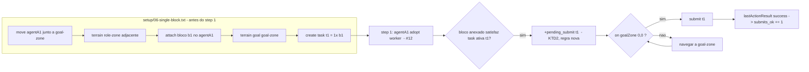

# feat: Single-block solo submit — gate de score (cenário 06-single-block)

## Summary

Fechar o **gate de score** do HIVE: provar, em cenário isolado e determinístico, que **um
worker com o(s) bloco(s) da task na mão, sobre a goal-zone, submete** — produzindo ≥1 `submit`
bem-sucedido no replay. Hoje o time adota role (provado em #12) mas pontua **0** porque nenhum
`submit` fecha. O escopo isola a **última milha do pipeline de pontuação** (bloco-em-mão →
submit), seguindo a convenção de cenários (`conf/scenarios/` + `--scenario`/`--assert`) já
mergeada.

---

## Problem Frame

O pipeline de pontuação é `adotar worker → request → attach → navegar à goal-zone → submit`. A
adoção está provada (#12, 15/15). A coleta (`request`/`attach`) e o submit existem espalhados em
`src/agt/common/collection.asl`, `src/agt/collector.asl` e `src/agt/common/connect_protocol.asl`,
mas **nunca foram exercitados end-to-end com sucesso** — o score real é 0.

**O gargalo concreto (descoberto na leitura):** o `submit`
(`src/agt/common/connect_protocol.asl:115`) é gated por `pending_submit(TaskName)`, que só é
setado em `src/agt/collector.asl` no gatilho `+collected_block(Type)`. Ou seja, **o agente só
submete se passou pela coleta** (`request`→`attach`). Se o bloco já está **na mão** (pré-anexado),
a prontidão-de-submit nunca dispara. A capacidade que o gate precisa é mais fundamental: *se o
agente tem os blocos que satisfazem a task ativa e está na goal-zone, ele deve submeter* — qualquer
que seja a origem do bloco.

Isolar a última milha (bloco-em-mão → submit) é o menor passo que **pontua**, e separa a variável
"submit" da variável "coleta" (que tem fricção própria — `failed_blocked`, navegação ao dispenser).

---

## Requirements

Rastreamento ao DoD da issue #14:

- **R1.** Entregar o cenário determinístico `conf/scenarios/06-single-block.json` +
  `conf/scenarios/setup/06-single-block.txt`, na convenção do harness (`--scenario`, `--assert`).
- **R2.** A fixture coloca o worker **com o bloco da task na mão**, sobre/junto à goal-zone, com a
  task de 1 bloco criada — isolando o submit (sem depender da coleta).
- **R3.** A prontidão-de-submit passa a reconhecer **bloco-anexado-satisfaz-task-ativa** (não só
  `collected_block`), de modo que um worker com o bloco na mão na goal-zone submeta.
- **R4.** Métrica/gate: **≥1 `submit` bem-sucedido** no replay, asseverável via
  `--assert` (`metric: submits_ok, min: 1`).
- **R5.** Determinismo: `randomFail:0`, `randomSeed` fixo, `grid.instructions:[]`,
  `events.chance:0`, `regulation.chance:0`, grid pequeno (~12×12), ~40 steps.

---

## Key Technical Decisions

- **KTD1 — Isolar o submit pré-anexando o bloco (não coletar).** A fixture usa o comando `attach`
  do setup file para dar o bloco da task ao worker já no boot. Rationale: o gate é "o time pontua
  *alguma vez*?"; pré-anexar remove a fricção de coleta (`request`/`attach`/navegação ao dispenser)
  e testa exatamente a ação que pontua. O pipeline completo `request→attach` fica para um cenário
  irmão (ver Scope Boundaries). Decorrência direta do steer do dono: *"se ele tem os blocos da
  tarefa montados e na mão, tem que submeter"*.
- **KTD2 — Decoupling da prontidão-de-submit em relação à coleta.** Introduzir uma regra de
  prontidão que dispara `pending_submit(Task)` quando os blocos anexados satisfazem a task ativa,
  além do caminho atual via `+collected_block`. Sem isso, o bloco-em-mão nunca submete (o gap do
  Problem Frame). Mudança mínima e aditiva — não remove o caminho de coleta existente.
- **KTD3 — Worker via role-zone na fixture (reuso de #12).** O setup file não seta role
  diretamente; o worker adota via uma role-zone adjacente (teleporte por nome, como no 01-adopt),
  no step 1. Assim a adoção (provada) acontece de graça e o foco fica no submit.
- **KTD4 — Um único task/worker efetivo.** A fixture cria 1 task (`t1`, 1 bloco) e prepara 1
  worker para ela; os demais agentes adotam mas não têm task atribuída. O gate `submits_ok ≥ 1`
  passa mesmo se só um submete — evita afinar contenção agora.
- **KTD5 — Mirror do padrão 01-adopt.** Config e fixture espelham
  `conf/scenarios/01-adopt.json` + `setup/01-adopt.txt` (roles reais, `absolutePosition:true`,
  bloco `//`/`//setup` documentando intenção e o gotcha de path `../../conf/...`).

---

## High-Level Technical Design

Fluxo-alvo do cenário (o que a fixture monta e o que o agente deve fazer):

A regra nova (KTD2) é o nó `G→H`: hoje só existe o caminho `+collected_block → pending_submit`.

---

## Implementation Units

### U1. Config do cenário `06-single-block.json`

- **Goal:** server-config determinístico do cenário, na convenção do harness.
- **Requirements:** R1, R5.
- **Files:** `conf/scenarios/06-single-block.json`
- **Approach:** espelhar `conf/scenarios/01-adopt.json` (roles reais default/worker/explorer,
  `absolutePosition:true`, `randomFail:0`, `randomSeed` fixo, `grid.instructions:[]`,
  `events.chance:0`, `regulation.chance:0`). Grid 12×12, ~40 steps. Garantir `blockTypes`
  contendo `b1` e `dispensers` mínimos (mesmo pré-anexando, o engine exige tipos de bloco
  válidos). Apontar `setup` para `../../conf/scenarios/setup/06-single-block.txt`. Adicionar o
  bloco `"assert": { "metric": "submits_ok", "min": 1 }`. Documentar intenção no `//`/`//setup`.
- **Patterns to follow:** `conf/scenarios/01-adopt.json` (estrutura, comentários, gotcha de path).
- **Test scenarios:** `Test expectation: none — config declarativo`; verificação = JSON parseia e
  `run-hive.sh --scenario 06-single-block` resolve o config + injeta o setup (dry-run).

### U2. Fixture determinística `setup/06-single-block.txt`

- **Goal:** montar o estado isolado: worker com bloco na mão, role-zone p/ adotar, goal-zone, task.
- **Requirements:** R2, R3 (habilita), R5.
- **Dependencies:** U1.
- **Files:** `conf/scenarios/setup/06-single-block.txt`
- **Approach:** comandos de setup (gramática exata a confirmar no parser do servidor — ver Deferred):
  `move X Y agentA1` (junto da goal-zone), `terrain Xr Yr role` (role-zone adjacente → adoção no
  step 1), `attach X Y agentA1` (ou a forma correta p/ anexar o bloco `b1` ao agente), `terrain Xg
  Yg goal` (goal-zone), `create task t1 <deadline> <req b1>`. Posições absolutas e contíguas (sem
  navegação relevante). Documentar no cabeçalho do arquivo o gotcha de cwd do servidor.
- **Patterns to follow:** `conf/scenarios/setup/01-adopt.txt` (teleporte por nome, cabeçalho
  explicativo, determinismo sem conhecer o spawn).
- **Test scenarios:** `Test expectation: none — fixture declarativa`; verificação observacional na
  U5 (o replay mostra agentA1 com bloco anexado + task t1 existente no step 1).

### U3. Prontidão-de-submit por bloco-em-mão (`.asl`) — o coração

- **Goal:** disparar `pending_submit(Task)` quando os blocos anexados satisfazem a task ativa,
  além do caminho via `+collected_block`. Resolve o gap do Problem Frame.
- **Requirements:** R3.
- **Dependencies:** U2 (para validar por sim).
- **Files:** `src/agt/collector.asl` (ou `src/agt/common/collection.asl`) — adicionar a regra; 
  possível teste JUnit se a checagem "anexados-satisfazem-task" for extraída p/ Java testável.
- **Approach:** adicionar uma regra `+step(N)` (ou reagir a `attached`/`my_active_task`) que,
  quando `my_active_task(Task,_)` e os `attached(_,_)`/`solo_block_type` satisfazem o requisito da
  task e ainda não há `pending_submit`/`submitted_task`, seta `+pending_submit(Task)`. **Cuidado
  com `src/agt/common/collection.asl:103-106`**: a regra "stale blocks → clear" pode **descartar**
  um bloco pré-anexado por não ser `solo_block_type(_)`; a fixture/lógica deve marcar o bloco como
  pertencente à task ativa (ou a regra de prontidão precede a de clear). Manter mínimo e aditivo;
  preferir extrair a decisão "anexados satisfazem task" para uma internal action Java testável se
  a lógica `.asl` ficar não-trivial (convenção do repo: lógica → Java testável).
- **Patterns to follow:** o caminho existente `+collected_block` em `src/agt/collector.asl:138`;
  o submit em `src/agt/common/connect_protocol.asl:112-128`; internal actions em `src/java/hive/`.
- **Execution note:** validar primeiro lendo o replay (a prontidão dispara? o `submit` é emitido?)
  antes de empilhar heurística — promover por evidência (STRATEGY.md).
- **Test scenarios:**
  - Happy: `my_active_task(t1) & attached(b1)` (satisfaz t1) & ainda sem `pending_submit` →
    `+pending_submit(t1)` é setado em ≤1 step.
  - Edge: bloco anexado de tipo **diferente** do requisito da task → **não** seta `pending_submit`.
  - Edge: bloco já pré-anexado **não** é descartado pela regra "stale blocks → clear".
  - Integração (via sim na U5): com `pending_submit(t1)` e `goalZone(0,0)`, o
    `connect_protocol.asl` emite `submit(t1)` e o resultado é `success`.

### U4. Wiring do gate `submits_ok` (assert + população da métrica)

- **Goal:** garantir que `--assert` do 06 afira `submits_ok ≥ 1` a partir do replay.
- **Requirements:** R4.
- **Dependencies:** U1.
- **Files:** `conf/scenarios/06-single-block.json` (bloco `assert`, em U1) +
  **verificar/estender** `.claude/skills/run-hive/analyzers/` se o campo `submits_ok` por-agente
  não for populado pelos loaders compartilhados.
- **Approach:** `m_submits_ok` já existe em
  `.claude/skills/run-hive/analyzers/assert_metric.py` lendo `d.get("submits_ok", 0)`. **Confirmar
  que o loader compartilhado (`replay_analyze.py`) computa `submits_ok` por agente** (contar
  ações `submit` com `result=success` no replay). Se não computar, adicionar — mínimo, reusando o
  padrão de histograma de ações já existente.
- **Patterns to follow:** `m_role_adoption`/contagem de ações em `assert_metric.py` e
  `replay_analyze.py`; o `adoption.py` (irmão focado) como referência de métrica derivada.
- **Test scenarios:**
  - `submits_ok` é computado a partir de um replay sintético com 1 `submit(success)` → valor 1.
  - `assert_metric.py --metric submits_ok --min 1` retorna exit 0 (PASS) nesse replay e exit 1
    (FAIL) num replay sem submits.

### U5. Rodar, medir e fechar o gate (fix-to-green)

- **Goal:** rodar o cenário pelo harness e confirmar ≥1 submit; se 0, depurar a cadeia e corrigir.
- **Requirements:** R4 (gate).
- **Dependencies:** U1, U2, U3, U4.
- **Files:** (iterativo) `src/agt/common/collection.asl`, `src/agt/collector.asl`,
  `src/agt/common/connect_protocol.asl` conforme o replay indicar.
- **Approach:** `.claude/skills/run-hive/run-hive.sh run --scenario 06-single-block --assert`
  (serial; sim é cara — rodar uma por vez). Ler o replay com `replay_analyze.py`/`adoption.py`
  e o histograma de ações: o `submit` é **emitido**? Resultado `success` ou `failed_*`
  (`failed_target`, `failed_parameter`)? Localizar o ponto de quebra (prontidão não dispara →
  U3; submit emitido mas falha → matching de task/posição/rotação no engine). Corrigir o mínimo,
  re-rodar até `submits_ok ≥ 1`. **Não** afrouxar o assert para passar.
- **Execution note:** a verdade está no replay/score, não no log (AGENTS.md). Mudar em isolamento,
  promover por evidência.
- **Test scenarios:** `Verification` — `run-hive.sh ... --scenario 06-single-block --assert` sai
  com `[PASS] métrica=submits_ok` (exit 0) e o replay mostra ≥1 `submit` com `success`.

---

## Scope Boundaries

**Nesta entrega (#14):** o cenário 06-single-block (isolando bloco-em-mão → submit), a regra de
prontidão-de-submit por bloco-anexado, e o gate `submits_ok ≥ 1`.

### Deferred to Follow-Up Work

- **Pipeline de coleta completo** (`request → attach` a partir de dispenser, sem pré-anexar) — um
  cenário irmão `06b`/Eixo dedicado; aqui a coleta é curto-circuitada pela fixture (KTD1).
- **Two-block / montagem cooperativa** (`connect` entre 2 agentes) — issues #18/#21.
- **Afinar contenção de múltiplos workers numa task** — fora do gate (KTD4).
- **Normas de Carry afetando o submit** — `regulation.chance:0` neste cenário; Eixo 9 (#19).

---

## Risks & Dependencies

- **Risco A — `submit` emitido mas `failed_*`.** O engine pode exigir match exato de
  blocos/posição/rotação relativos à task. Mitigação: U5 lê o `result` do submit no replay e
  ajusta a fixture (offset do requisito da task vs. direção do bloco anexado) — não a lógica, se o
  problema for geométrico.
- **Risco B — regra "stale blocks → clear" descarta o bloco pré-anexado**
  (`collection.asl:103-106`). Mitigação: U3 garante que o bloco da task ativa não seja tratado
  como stale (marcação/ordem de regras).
- **Risco C — atribuição da task ativa.** O worker precisa ter `my_active_task(t1)` para a
  prontidão disparar; o caminho de atribuição (TaskBoard/soloist) pode não dar t1 ao worker
  pré-anexado. Mitigação: confirmar na U5 via replay; se necessário, a fixture/lógica força a
  task ativa do worker-alvo.
- **Dependência:** #12 (adoção) — **fechada**. Convenção de harness (#11) — **fechada**.

---

## Deferred to Implementation (execution-time unknowns)

- Gramática exata do setup file para `attach`/`add`/`create task`/`terrain goal` (confirmar no
  parser do servidor MASSim — `massim_2022` `GameState`/setup reader).
- Posições absolutas exatas (worker, role-zone, goal-zone, dispenser) que garantem adjacência e
  adoção no step 1 — calibradas observando o primeiro replay.
- Predicado preciso "blocos anexados satisfazem a task ativa" (tipo + offset) e se vale extraí-lo
  para internal action Java testável.
- Se `submits_ok` já é populado pelos loaders ou precisa ser adicionado (U4).
