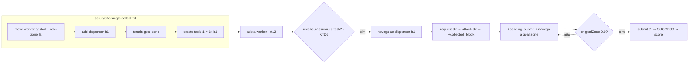

# feat: Single-block solo COMPLETO — coletar → submit (cenário 06c / #26)

## Summary

Provar a **metade de coleta** que o gate #14 pulou de propósito: um worker que **reconhece a
task, vai ao dispenser, `request`→`attach` um bloco, navega à goal-zone e `submit`** — produzindo
≥1 submit de um bloco **coletado** (não pré-anexado). É o **1º "score sem muleta"** e o elo entre
#14 (submit isolado ✅ score 10) e #18 (multi-bloco).

---

## Problem Frame

O pipeline de pontuação é `adotar → reconhecer task → coletar (request→attach) → navegar à
goal-zone → submit`. Hoje:
- **Adoção** ✅ (#12), **submit com bloco na mão** ✅ (#14), **reconhecer task** ✅ (`task_req`
  estável após o fix de flicker).
- **Coletar** (ir ao dispenser, `request`/`attach`) está **codificado** em
  `src/agt/common/collection.asl` mas **nunca provado end-to-end com submit**.

O #14 pré-anexou o bloco p/ isolar o submit. Aqui o agente **coleta de fato** — exercita
`collection.asl` (navegar ao dispenser → `request(dir)` → `attach(dir)` → `collected_block` →
`pending_submit`) + navegação ao dispenser e à goal-zone.

**Gargalo provável (a calibrar):** o worker só inicia coleta solo quando recebe a task. Os dois
caminhos de auto-atribuição (`SELF-ASSIGN` em `role_adoption.asl` e `connect_protocol.asl`) são
**gated em `N>30`** — decisão deliberada p/ o cenário oficial (deixar exploração acontecer antes).
Num cenário curto (~60 steps), isso atrasa a coleta. Resolver isso é o coração do #26.

---

## Requirements

Rastreamento ao DoD da issue #26:

- **R1.** Entregar `conf/scenarios/06c-single-collect.json` + `setup/06c-single-collect.txt` na
  convenção do harness (`--scenario`, `--assert`).
- **R2.** Fixture **NÃO pré-anexa**: 1 worker (collector), 1 **dispenser b1**, 1 goal-zone,
  1 role-zone (p/ adotar), `create task t1` de 1 bloco. Determinística (`randomFail:0`, seed fixa,
  `instructions:[]`, eventos/normas off).
- **R3.** O worker recebe/assume a task de coleta **cedo o suficiente** p/ coletar+submeter dentro
  da janela do cenário (~60 steps) — resolver o gate `N>30`.
- **R4.** Métrica/gate: **≥1 submit bem-sucedido** (`submits_ok ≥ 1`) de um bloco **coletado**.
- **R5.** Sem regressão: `regression.sh` mantém **#12 (01-adopt)** e **#14 (06-single-block)** verdes.

---

## Key Technical Decisions

- **KTD1 — Coletar de verdade (a diferença do #14).** A fixture posiciona um dispenser b1 + zonas
  + task, mas **não** anexa o bloco. O agente executa o ciclo `collection.asl` completo. Rationale:
  prova a coleta, que é a variável não-testada do pipeline de score.
- **KTD2 — Destravar a atribuição de coleta no cenário curto.** O `SELF-ASSIGN` (`N>30`) é o
  bloqueio provável. Decisão: **medir primeiro** (rodar e ver se o leader atribui `soloist_task`
  cedo, ou se nada atribui até step 30). Se nada coletar cedo, **tornar o gate sensível ao cenário**
  — ex.: baixar o limiar quando `steps` é pequeno, ou via uma crença/flag de cenário — **sem**
  regredir o comportamento do oficial (onde `N>30` é proposital). Abordagem exata = execução (ver
  Deferred).
- **KTD3 — Reusar a cadeia existente, não reinventar.** `collection.asl` (navegar→`request`→
  `attach`→`collected_block`), `collector.asl` (`+collected_block : solo_mode` → `pending_submit` +
  nav à goal), `connect_protocol.asl` (`pending_submit & goalZone` → `submit`). A regra
  "bloco-na-mão → submit" do #14 é o fallback; aqui o caminho natural é via `collected_block`.
- **KTD4 — Mirror do padrão 06-single-block / 01-adopt.** Config e fixture espelham os cenários já
  verdes (roles reais, `absolutePosition:true`, bloco `//`/`//setup`, gotcha de path `../../`).
- **KTD5 — `absolutePosition:true`.** Mantém o worker sabendo sua posição → navegação A* ao
  dispenser e à goal-zone sem drift (isola a coleta da navegação por dead-reckoning, que é outro eixo).

---

## High-Level Technical Design

Fluxo-alvo (o que a fixture monta e o que o agente executa):

O nó `F` (atribuição da task) é o que o #14 não exercitou e o gate `N>30` ameaça atrasar.

---

## Implementation Units

### U1. Config do cenário `06c-single-collect.json`

- **Goal:** server-config determinístico do cenário de coleta.
- **Requirements:** R1, R2, R5.
- **Files:** `conf/scenarios/06c-single-collect.json`
- **Approach:** espelhar `conf/scenarios/06-single-block.json` (roles reais, `absolutePosition:true`,
  `randomFail:0`, seed fixa, `instructions:[]`, `events.chance:0`, `regulation.chance:0`). Grid
  pequeno (~12×12), ~60 steps. **`dispensers` com ≥1 de b1** (diferente do 06, que zerou) — ou criar
  o dispenser via setup (`add X Y dispenser b1`). `blockTypes` com b1. `setup` aponta p/
  `../../conf/scenarios/setup/06c-single-collect.txt`. Bloco `"assert": { "metric": "submits_ok",
  "min": 1 }`. Documentar intenção no `//`/`//setup`.
- **Patterns to follow:** `conf/scenarios/06-single-block.json` (estrutura, comentários, path).
- **Test scenarios:** `Test expectation: none — config declarativo`; verificação = JSON parseia e
  `run-hive.sh --scenario 06c-single-collect` resolve config + setup (dry-run).

### U2. Fixture determinística `setup/06c-single-collect.txt`

- **Goal:** montar o estado de coleta: worker posicionado, dispenser, goal-zone, role-zone, task —
  **sem pré-anexar**.
- **Requirements:** R2, R5.
- **Dependencies:** U1.
- **Files:** `conf/scenarios/setup/06c-single-collect.txt`
- **Approach:** mover os 15 agentes a células distintas (evitar colisão de spawn — lição do #14);
  o **worker-alvo = um collector** (agentA4-A9, ver `hive.jcm`) a um spot com role-zone (`terrain X
  Y role`) p/ adotar; `add Xd Yd dispenser b1` a poucas células; `terrain Xg Yg goal` a poucas
  células; `create task t1 <dl> 1,0,b1`. Distâncias curtas (navegação real mas trivial). Documentar
  o gotcha de cwd do servidor no cabeçalho.
- **Patterns to follow:** `conf/scenarios/setup/06-single-block.txt` (mover todos, nomes de
  entidade `agentAN` ↔ tipo `connectionAN`, teleporte por nome).
- **Test scenarios:** `Test expectation: none — fixture declarativa`; verificação observacional na
  U4 (replay mostra o worker adotando, o dispenser/goal/task presentes no step 1).

### U3. Destravar a atribuição da task de coleta no cenário curto

- **Goal:** o worker recebe/assume a task de 1 bloco cedo o suficiente p/ coletar+submeter em ~60
  steps, **sem regredir o oficial** (onde `SELF-ASSIGN` é `N>30` de propósito).
- **Requirements:** R3, R5.
- **Dependencies:** U2 (p/ medir).
- **Files:** `src/agt/common/role_adoption.asl` e/ou `src/agt/common/connect_protocol.asl` (o gate
  `N>30` do SELF-ASSIGN); possível teste JUnit se a condição de gate virar lógica Java testável.
- **Approach:** **medir primeiro** (U4 inicial sem mudança): ver se o leader já atribui
  `soloist_task` cedo. Se sim, U3 pode ser no-op. Se nada coletar até step 30, baixar/condicionar o
  gate — preferir um critério **config-aware** (ex.: sensível a `steps` pequeno, ou a uma flag do
  cenário) a remover o `N>30` global. Mudança mínima e reversível; o oficial NÃO pode regredir.
- **Execution note:** mudar em isolamento, promover por evidência (STRATEGY.md) — não baixar o gate
  "no olho"; medir o delta com `regression.sh`.
- **Test scenarios:**
  - Happy: no cenário curto, o worker tem `my_active_task(t1)`/`solo_mode` antes de ~step 10.
  - Regressão: no oficial (`OfficialRolesConfig`/01-adopt), o comportamento de adoção/coleta **não**
    muda (gate ainda difere a coleta como antes) — verificado por `regression.sh` (01-adopt verde).
  - Edge: sem nenhuma task conhecida → o worker não trava nem spamma (continua explorando).

### U4. Rodar, medir e fechar o gate (fix-to-green) + regressão

- **Goal:** rodar o cenário pelo harness, confirmar ≥1 submit de bloco coletado, e garantir
  zero regressão em #12/#14.
- **Requirements:** R4, R5.
- **Dependencies:** U1, U2, U3.
- **Files:** (iterativo) `src/agt/common/collection.asl`, `src/agt/collector.asl`,
  `src/agt/common/navigation.asl` conforme o replay indicar.
- **Approach:** `.claude/skills/run-hive/run-hive.sh run --scenario 06c-single-collect --assert`
  (serial). Ler o replay/log: o worker **chega ao dispenser**? `request`/`attach` dão `success` ou
  `failed_*`? `collected_block` dispara? navega à goal e `submit` SUCCESS? Localizar a quebra,
  corrigir o mínimo, re-rodar até `submits_ok ≥ 1`. Depois, **`regression.sh`** (01-adopt +
  06-single-block + 06c) — todos PASS. **Não** afrouxar asserts.
- **Execution note:** a verdade está no replay/score, não no log (AGENTS.md). Instrumentar (print)
  se empacar, como no #14 — não chutar.
- **Test scenarios:** `Verification` — `--scenario 06c-single-collect --assert` sai `[PASS]
  submits_ok` (exit 0) com o replay mostrando `request`→`attach`→`submit(success)`; e
  `regression.sh` → 3/3 PASS (sem regredir #12/#14).

---

## Scope Boundaries

**Nesta entrega (#26):** coletar 1 bloco (request→attach do dispenser) → navegar → submit, isolado
e determinístico, mais o ajuste mínimo de timing da atribuição de coleta.

### Deferred to Follow-Up Work

- **Multi-bloco / montar arranjos** (07a/07a'/07b) — #18.
- **Connect cooperativo** (cadeias dist≥2) — #21.
- **Navegação difícil** (obstáculos, livelock, mapa aberto) — #13/#15/#16; aqui a navegação é
  curta e sem obstáculo (`absolutePosition:true`, `instructions:[]`).
- **Normas de Carry** afetando coleta — #19 (`regulation.chance:0` aqui).

---

## Risks & Dependencies

- **Risco A — `N>30` atrasa a coleta** (KTD2/U3). Mitigação: medir; condicionar o gate ao cenário
  curto sem mexer no oficial.
- **Risco B — `request`/`attach` falham** (`failed_blocked`, direção errada, não-adjacente ao
  dispenser). Mitigação: `collection.asl` já tem retry/perpendicular; U4 lê o `result` no replay.
- **Risco C — navegação ao dispenser/goal** trava (livelock). Mitigação: grid pequeno sem
  obstáculo + `absolutePosition:true`; se travar, é sinal p/ o eixo de navegação (#13), não p/ aqui.
- **Risco D — a coleta dispara a regra "stale clear"** se o agente julgar o bloco coletado como
  stale. Mitigação: caminho `collected_block : solo_mode` já trata; observar no replay.
- **Dependências:** #14 (✅, submit + regra bloco-na-mão), #12 (✅, adoção), #11 (✅, harness +
  `regression.sh`).

---

## Deferred to Implementation (execution-time unknowns)

- Posições absolutas exatas (worker, role-zone, dispenser, goal-zone) — calibradas no 1º replay.
- A abordagem exata de KTD2/U3 (baixar gate vs flag de cenário vs confiar no leader) — decidida
  **após medir** o 1º run sem mudança.
- Se a cadeia `collection.asl`→`collected_block`→`submit` funciona as-is ou precisa de fix (como o
  #14 precisou do fix de `task_req`).
