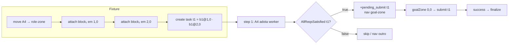

# feat: Submit de task multi-requisito com blocos pré-alinhados (Eixo 7a / #18)

## Summary

Generaliza o gate do #14 (1 bloco pré-anexado → submit) para **N blocos pré-anexados nas
posições exatas da task**. Um worker com todos os blocos já na mão — sem coletar, sem rotacionar —
faz submit de uma task multi-requisito. É o "multi-req #14": prova que a lógica de submit escala
para tarefas de N blocos quando o arranjo já está correto.

---

## Problem Frame

O pipeline de pontuação acumulado: adotar (#12) → reconhecer task → coletar (#26) → submit (#14).
O #14 provou submit solo com **1 bloco**. Tarefas MAPC frequentemente exigem **2+ blocos** em
posições específicas. Dois bloqueios impedem o submit multi-req hoje:

1. **Guard "bloco-na-mão" limita a `NBlocks == 1`** (`connect_protocol.asl` linha 81:
   `known_task(TaskName, Deadline, _, 1)`). Para tarefas de 2+ blocos, a regra nunca dispara.
2. **Regras PRE-SUBMIT descartam blocos "extras"** (linhas 53–68) com guarda `NumAtt > 1` —
   para uma task de 2 blocos, o bloco a `(2,0)` tem `|AX|+|AY|=2 > 1`, disparando
   `rotate(cw)` spuriosamente e impedindo o submit.

**Escopo desta entrega:** um worker com N blocos pré-anexados nas posições corretas faz
submit bem-sucedido. Não coletar, não rotacionar, não conectar cooperativamente.

---

## Requirements

- **R1.** Worker com N blocos pré-alinhados faz submit de task multi-req (`submits_ok ≥ 1`).
- **R2.** Regras PRE-SUBMIT não descartam blocos legítimos de task de N blocos.
- **R3.** Guard "bloco-na-mão" generalizado para NBlocks > 1 (via `AllReqsSatisfied`).
- **R4.** Lógica de verificação multi-bloco em **Java testável** (internal action + JUnit).
- **R5.** Cenário determinístico `07a-multi-req` na convenção do harness.
- **R6.** Sem regressão: `regression.sh` → 4/4 PASS (01-adopt, 06-single-block, 06c-single-collect, 07a).

---

## Key Technical Decisions

- **KTD1 — Java IA `AllReqsSatisfied(TaskName)` para o check multi-bloco.** A verificação
  "todos os `task_req(Task, DX, DY, _)` têm `attached(DX, DY)` correspondente" é lógica
  não-trivial não expressa naturalmente em cláusulas Jason puras. Mora em Java (padrão do
  projeto; ver `hive.AdjacentDirection`). Método estático puro testável em JUnit sem Jason.
  A IA é chamada no **corpo** do plano (não no contexto) — `hive.AdjacentDirection` é
  igualmente chamada em corpo, e o comportamento de falha do Jason (backtrack ao próximo plano
  `+step(N)`) garante que a step seja tratada por outra regra quando os reqs não batem.

- **KTD2 — Regra separada para NBlocks > 1, regra original intacta.** Adicionar um novo
  plano `+step(N)` antes do guard "bloco-na-mão" existente, com `NBlocks > 1 &
  hive.AllReqsSatisfied(TaskName)`. A regra original (`known_task(..., 1)`) fica inalterada —
  zero risco de regressão em 06-single-block e 06c-single-collect.

- **KTD3 — PRE-SUBMIT guarda por `NBlocks` não por `1`.** Corrigir as 3 regras de descarte
  (linhas 51–68 de `connect_protocol.asl`) de `NumAtt > 1` para `NumAtt > NBlocks`
  (onde `NBlocks` vem de `known_task(TaskName, _, _, NBlocks)`). Sem esta correção, um bloco
  em `(2,0)` dispara `rotate(cw)` mesmo sendo um requisito legítimo da task.

- **KTD4 — Geometria da fixture: cadeia leste (1,0)+(2,0), ambos b1.** Coloca dois blocos
  na mesma direção (leste) — o agente percebe `attached(1,0)` e `attached(2,0)`, e a task
  exige exatamente esses dois offsets. Sem rotação necessária, sem blocos adjacentes opostos
  (descarta a ambiguidade das regras de detach). Mais fácil de mapear e debugar.

- **KTD5 — `solo_block_type` omitido na regra multi-bloco.** A crença `solo_block_type` é
  usada apenas para re-coleta pós-submit (path de 1 bloco). Para N blocos, re-coleta é deferida
  (07b). Omitir `solo_block_type` faz o guard de re-coleta (`solo_block_type(BType) & N+40 <
  Deadline`) não disparar — comportamento correto para 07a.

---

## High-Level Technical Design

Fluxo esperado no cenário 07a (agentA4, pré-alinhado):



Correção nas regras PRE-SUBMIT (antes × depois):

| Regra | Antes | Depois |
|---|---|---|
| detach n (pares opostos n/s) | `NumAtt > 1` | `NumAtt > NBlocks` |
| detach w (pares opostos e/w) | `NumAtt > 1` | `NumAtt > NBlocks` |
| rotate (bloco distante >1) | `NumAtt > 1 & math.abs(AX)+math.abs(AY) > 1` | `NumAtt > NBlocks & ...` |

---

## Implementation Units

### U1. Java IA `AllReqsSatisfied` + JUnit

- **Goal:** internal action Java que verifica se TODOS os `task_req(Task, DX, DY, _)` da BB têm
  matching `attached(DX, DY)`, com método estático puro testável sem Jason.
- **Requirements:** R3, R4.
- **Files:**
  - `src/java/hive/AllReqsSatisfied.java` (novo)
  - `src/test/java/hive/AllReqsSatisfiedTest.java` (novo)
- **Approach:** `execute(ts, un, args)` extrai `taskName` de `args[0]`, consulta a BB de
  `ts.getAg()` para todos os `task_req(taskName, DX, DY, _)` e todos os `attached(AX, AY)`,
  chama `check(reqs, attached)` estático. `check` itera sobre reqs e verifica que cada `(DX,DY)`
  existe em attached; retorna `true` somente se todos satisfeitos.
  Retorno: `return un.unifies(args[1 ou void], BoolVal)` — ou simplesmente `return true/false`
  como em `AdjacentDirection` (retorna `Object`, Jason interpreta como booleano).
- **Patterns to follow:** `src/java/hive/AdjacentDirection.java` (DefaultInternalAction +
  método estático puro); `src/test/java/hive/AdjacentDirectionTest.java` (testes de método estático).
- **Test scenarios:**
  - Happy: `check([(1,0),(2,0)], [(1,0),(2,0)])` → true (ambos satisfeitos)
  - Parcial: `check([(1,0),(2,0)], [(1,0)])` → false (falta (2,0))
  - Nenhum: `check([(1,0),(2,0)], [])` → false
  - Vazio de reqs: `check([], [(1,0)])` → true (sem requisitos = trivialmente satisfeito)
  - Ordem diferente: `check([(2,0),(1,0)], [(1,0),(2,0)])` → true (ordem irrelevante)
  - Extra attached não importa: `check([(1,0)], [(1,0),(0,1)])` → true
- **Verification:** `~/tools/gradle-8.10/bin/gradle test --tests "hive.AllReqsSatisfiedTest"` → verde.

---

### U2. Corrigir regras PRE-SUBMIT no `connect_protocol.asl`

- **Goal:** as 3 regras de descarte de blocos "extras" (linhas 51–68) não devem disparar quando
  o agente carrega exatamente os blocos que a task exige (NBlocks).
- **Requirements:** R2.
- **Dependencies:** nenhuma (fix independente, mas deve ser feito antes de U3 para não mascarar
  o bug ao testar).
- **Files:** `src/agt/common/connect_protocol.asl`
- **Approach:** as 3 regras `pending_submit & solo_mode & NumAtt > 1` passam a usar
  `known_task(TaskName, _, _, NBlocks) & NumAtt > NBlocks` em vez de `NumAtt > 1`.
  A variável `NBlocks` é unificada a partir de `known_task`. Como `solo_mode(TaskName)`
  e `pending_submit(TaskName)` garantem que `TaskName` é o mesmo, o bind é seguro.
- **Patterns to follow:** linhas 37–47 de `connect_protocol.asl` (uso de
  `.count(attached(_,_), NumAtt)` em contexto com aritmética; bind `NBlocks` de `known_task`).
- **Test scenarios:**
  - Regressão sim (via U5): 06-single-block (1 bloco) ainda passa → detach de bloco extra
    (task de 1 bloco com 2 attached) ainda dispara corretamente.
  - Happy (via U5): 07a (2 blocos, NumAtt=2, NBlocks=2) → `NumAtt > NBlocks` = false → sem
    rotate espúrio.
- **Verification:** nenhum teste JUnit isolado (lógica Jason); verificado por regressão no U5.

---

### U3. Regra "blocos-na-mão → submit" para NBlocks > 1

- **Goal:** um worker com todos os N blocos da task pré-anexados entra em `pending_submit` e
  navega à goal-zone, sem coletar nem descartar.
- **Requirements:** R1, R3.
- **Dependencies:** U1 (AllReqsSatisfied), U2 (PRE-SUBMIT corrigido).
- **Files:** `src/agt/common/connect_protocol.asl`
- **Approach:** adicionar novo plano `+step(N)` imediatamente **antes** do plano "bloco-na-mão"
  existente (linha 76), com contexto:
  ```
  : can_score_role & not my_active_task(_, _) & not pending_submit(_) & ...
    & known_task(TaskName, Deadline, _, NBlocks) & NBlocks > 1 & Deadline > N
    & .count(attached(_, _), NumAtt) & NumAtt >= NBlocks
    & my_pos(MX, MY)
  ```
  No corpo: `hive.AllReqsSatisfied(TaskName)` (falha → backtrack para próximo plano `+step(N)`);
  se passa, define `my_active_task`, `solo_mode`, `task_accepted_step`, `pending_submit`,
  navega `get_nearest_goal_zone`, `action("skip")`. **Omite `solo_block_type`** (re-coleta multi-bloco deferida).
- **Patterns to follow:** plano "bloco-na-mão" existente (linhas 76–98 de `connect_protocol.asl`).
- **Test scenarios:**
  - Happy (via U5): agentA4 com 2 blocos pré-alinhados → dispara no step 1 → `pending_submit t1`.
  - Negativo: agentA com só 1 dos 2 blocos → `NumAtt >= NBlocks` falso → não dispara.
  - Regressão: agente com 1 bloco e task de 1 bloco → regra original (linha 76) ainda dispara.
- **Verification:** replay do 07a mostra agentA4 indo de adopt direto para pending_submit (sem
  `request`/`attach` no histograma — diferente do 06c).

---

### U4. Cenário `07a-multi-req` (config + fixture)

- **Goal:** cenário determinístico que isola submit de task de 2 blocos pré-alinhados.
- **Requirements:** R5.
- **Dependencies:** nenhuma (declarativo).
- **Files:**
  - `conf/scenarios/07a-multi-req.json`
  - `conf/scenarios/setup/07a-multi-req.txt`
- **Approach:**
  - Config: espelhar `conf/scenarios/06-single-block.json` (roles reais, `absolutePosition:true`,
    `randomFail:0`, seed 17, `instructions:[]`, `events.chance:0`, `regulation.chance:0`,
    grid 12×12, 60 steps, `dispensers:[0,0]`). Assert: `submits_ok ≥ 1`.
  - Fixture: mover todos 15 agentes a células distintas (lição do #14 — evitar spawn collision);
    agentA4 a `(3,3)` com `terrain 3 3 role`; dois blocos em cadeia:
    `add 4 3 block b1`, `attach 3 3 4 3` (bloco₁ a (1,0) do agente),
    `add 5 3 block b1`, `attach 4 3 5 3` (bloco₂ a (2,0) — encadeado via bloco₁);
    `terrain 3 7 goal`; `create task t1 100 1,0,b1;2,0,b1`.
  - Comentários: geometria, gotcha de cwd do servidor, mapeamento agentAN↔connectionAN.
- **Patterns to follow:**
  - `conf/scenarios/06-single-block.json` (estrutura, bloco `//`/`//setup`, path `../../`).
  - `conf/scenarios/setup/06-single-block.txt` (ordem: mover todos → alvo → add → attach → task).
- **Test scenarios:** `Test expectation: none — declarativo`; verificação por U5.
- **Verification:** `python3 -c "import json; json.load(open('conf/scenarios/07a-multi-req.json'))"` OK.

---

### U5. Rodar, medir e fechar o gate + regressão

- **Goal:** confirmar `submits_ok ≥ 1` no cenário 07a e zero regressão em cenários anteriores.
- **Requirements:** R1, R6.
- **Dependencies:** U1, U2, U3, U4.
- **Files:** iterativo (fixar conforme replay indicar).
- **Approach:**
  1. `~/tools/gradle-8.10/bin/gradle test --no-daemon` → todos os testes JUnit passam (inclui U1).
  2. `.claude/skills/run-hive/run-hive.sh run --scenario 07a-multi-req --assert`
  3. Ler replay: agentA4 adota → sem `request`/`attach` (pré-alinhado) → `submit 1` → success.
  4. Se FAIL: ler histograma — `rotate` espúrio? (`NumAtt > NBlocks` fix ausente) — `AllReqsSatisfied`
     retornou false? — `pending_submit` nunca setado? Instrumentar e corrigir.
  5. Após PASS: `.claude/skills/run-hive/regression.sh 01-adopt 06-single-block 06c-single-collect 07a-multi-req`
- **Execution note:** verdade está no replay, não no log. A regra "medir antes de chutar" do
  STRATEGY.md se aplica: se submit falha, diagnose pelo histograma de ações antes de qualquer fix.
- **Test scenarios:**
  - PASS: `[PASS] métrica=submits_ok → 1` (exit 0); histograma de A4 sem `request`/`attach`.
  - Regressão: 01-adopt, 06-single-block, 06c-single-collect → todos PASS.
- **Verification:** `regression.sh` → `4 PASS · 0 FAIL`.

---

## Scope Boundaries

**Nesta entrega (07a):** N blocos pré-alinhados → submit. Java IA + JUnit. Cenário determinístico.

### Deferred to Follow-Up Work

- **07a' (rotação):** `rotate(cw|ccw)` para reposicionar blocos desalinhados — próxima issue.
- **07b (coletar+montar multi-bloco):** coletar N blocos (possivelmente com `connect` cooperativo
  envolvendo assembler) — depende de #21 (Eixo 8) para o caso multi-agente.
- **SELF-ASSIGN para NBlocks > 1:** `connect_protocol.asl` linha 113 ainda limita SELF-ASSIGN a
  tarefas de 1 bloco. Nesta entrega, o path é BLOCO-NA-MÃO (pré-alinhado), então SELF-ASSIGN
  multi-bloco não é necessário.
- **`soloist_task` multi-bloco do leader:** o handler em `collector.asl` só cheuca 1 bloco.
  Deferred para quando o leader distribuir tarefas multi-bloco.
- **Re-coleta pós-submit multi-bloco:** `solo_block_type` omitido intencionalmente; re-coleta
  de N blocos é 07b.
- **assembler.asl / sentinel.asl:** aplicar lógica análoga quando exercitado (hoje o path
  07a só usa collector agentA4).

---

## Risks & Dependencies

- **Risco A — `AllReqsSatisfied` no corpo (não contexto) requer fallback seguro.** Se a IA
  falha no corpo, Jason tenta o próximo `+step(N)` — que pode ser navegação ou skip. Comportamento
  correto, mas exige que **todos** os `+step(N)` abaixo tenham pelo menos um plan fallback
  executando `action(...)`. Verificar: o agente nunca deixa de emitir ação por step.
- **Risco B — Cadeia de `attach` no setup.** `attach X1 Y1 X2 Y2` encadeia bloco₁→bloco₂;
  se o motor exige ordem específica (agente→bloco₁→bloco₂ vs bloco₁→bloco₂→agente), o
  bloco₂ pode não aparecer em `attached`. Verificar no replay se `attached(2,0)` é percebido.
  Mitigação: documentar no `//` da fixture; se falhar, tentar ordem inversa dos `attach`.
- **Risco C — PRE-SUBMIT com `known_task` em contexto:** a variável `NBlocks` precisa ser
  unificada em contexto (`known_task(TaskName, _, _, NBlocks)`). `TaskName` vem de
  `pending_submit(TaskName)` + `solo_mode(TaskName)`. Garantir que as 3 variáveis unificam
  corretamente no mesmo plano.
- **Dependências:** #14 ✅, #26 ✅, #11 ✅ (harness). Nenhuma dependência bloqueante.

---

## Deferred to Implementation

- Assinatura exata de `AllReqsSatisfied.execute()` para acessar a BB (padrão Jason de acesso
  à BB em IA customizada — verificar via `ts.getAg().getBB().getCandidateBeliefs(...)`).
- Se `hive.AllReqsSatisfied(TaskName)` puder ser usado em **contexto** (não corpo), a regra
  U3 fica mais limpa e segura. Testar durante implementação: se funcionar em contexto, preferir.
- Posições exatas dos 14 agentes na borda (evitar sobreposição com (3,3), (4,3), (5,3), (3,7)).
