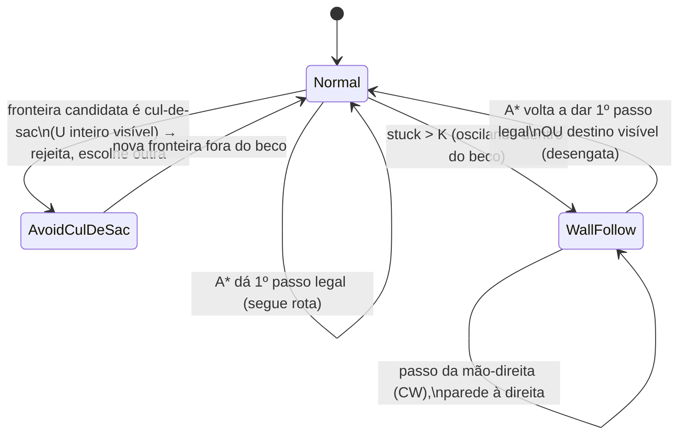

# feat: U-shape — evitar entrar (visível) e escapar (se entrou), contorno horário

**Issue #27** (Eixo 3b — Sair de U-shape / beco sem saída). **Worktree:** `feat/sc-27-wall-following`
(base = `main` com o fix do #15 já mergeado). **Sem PR** — squash merge após validação do dono.
**Portas:** 8003 MASSim / 8103 dashboard. **Sim isolada por porta.**

---

## Resumo

Dar ao agente dois comportamentos complementares diante de um U de paredes (beco sem saída),
ambos no sentido **horário (regra da mão direita)**, conforme o dono detalhou:

1. **Evitar (Cap A) — "nem deve entrar".** Quando o U cabe **inteiro no cone de visão** (vê início
   e fim das paredes), o agente **reconhece o cul-de-sac e não entra** — segue explorando/contornando
   por fora.
2. **Escapar (Cap B) — "se entrar, tem que sair".** Quando o U é **maior que a visão** e o agente já
   está dentro antes de ver o fundo, ele **sai sem oscilar** — wall-following horário persistente até o
   A\* voltar a oferecer rota limpa.

O #27 original pede só a Cap B (é o item exato do **parking lot**: *"wall-follower horário como
fallback de `failed_path`"*, [docs/backlog.md](../backlog.md) L441). O dono ampliou para incluir a
Cap A (a camada inteligente que economiza os passos do beco). Este plano entrega **as duas**, cada uma
cercada por um cenário determinístico que a **prova ou refuta** — o #27 é um **gate de evidência** do
parking lot (PASS promove; FAIL mantém parado).

---

## Frame do problema

O #15 (já mergeado) fez o A\* **enxergar** paredes percebidas (`update_cell("obstacle")` →
`obstacles`). Isso muda o terreno do #27 de duas formas que o plano explora:

- **A condição de parada do wall-follower deixou de depender do GPS.** O parking lot gateava a Cap B
  "pelo GPS" (saber quando o destino voltou ao campo de visão). Com paredes marcadas por visão, o
  próprio **A\* já dá a condição de parada**: quando `astar` devolve um 1º passo legal que não recolide,
  o agente está livre → desengata o follow. Sem infra nova.
- **O trap residual hoje é em EXPLORAÇÃO, não com alvo fixo.** Com um alvo fixo fora do U e as 3 paredes
  marcadas, o `astar` (grid ≤ 60 de distância, sempre obstacle-aware num 16×16) **já roteia para fora**
  pela boca — sem oscilar. O ralo real é a **seleção de fronteira**:
  [`get_nearest_frontier_biased`](../../src/env/env/SharedMap.java#L284) ranqueia por
  `wrappedManhattan` (linha reta), **não por A\***, então escolhe a fronteira **dentro** do U
  (manhattan-próxima) e manda o agente para o beco. É exatamente o que a Cap A corrige.

**Consequência metodológica (STRATEGY.md — medir antes de promover):** é plausível que o #15 + A\* já
satisfaçam a Cap B no cenário de escape. Por isso a U1 roda o cenário de escape como **caracterização
de baseline ANTES** de implementar o wall-follower — a evidência decide se a Cap B é load-bearing ou se
o gate já está satisfeito (e o wall-follower entra como defesa-em-profundidade, não como muleta).

---

## Decisões técnicas-chave (KTD)

- **KTD1 — Posição, não `max_stuck`, é a métrica primária.** `max_stuck` (maior corrida de
  `failed_path`, [assert_metric.py](../../.claude/skills/run-hive/analyzers/assert_metric.py#L61)) tem
  **ponto cego**: oscilar entre duas células **livres** dentro do beco **não gera `failed_path`** →
  `max_stuck` fica 0 enquanto o agente está preso. As novas métricas `exited_region`/`entered_region`
  leem a **posição absoluta** do replay (ground-truth; `absolutePosition:true` afeta só o que o *agente*
  percebe, não o replay). `max_stuck ≤ 5` entra como assert **secundário** (pega colisão real).
- **KTD2 — Gate dual por cenário (lista de asserts).** Estender o bloco `assert` para aceitar **uma
  lista** de checagens (todas precisam passar), além do objeto único atual (retrocompatível). Permite
  asserir `exited_region ≤ 30` **e** `max_stuck ≤ 5` no mesmo run, como o #27 pede.
- **KTD3 — Lógica de decisão em Java puro testável; `.asl` orquestra (AGENTS.md).** O *stepper* do
  wall-following (regra da mão direita) e a *detecção de cul-de-sac* (flood-fill limitado) são **funções
  puras** com teste JUnit (ms, sem sim) — espelhando `hive.AdjacentDirection`/`hive.RotationsNeeded`. O
  `.asl` só detecta o gatilho, mantém o estado de modo e chama as funções.
- **KTD4 — Sentido horário consistente (mão direita) une as duas capacidades.** O wall-follower mantém a
  parede à **direita** (CW: N→E→S→W); o contorno da Cap A prefere o mesmo sentido. Reusa & melhora o
  tiebreak horário já em [`pick_escape`](../../src/agt/common/navigation.asl#L226) (plano 002) — *cite
  & improve*, não duplica convenção.
- **KTD5 — Cap A atua na seleção de fronteira, não no A\*.** O A\* já contorna o que conhece; o defeito é
  a fronteira **escolhida**. A rejeição de cul-de-sac filtra fronteiras *antes* de virarem `has_destination`,
  com **fallback**: se TODAS as fronteiras candidatas forem cul-de-sac, não rejeita nenhuma (evita
  deadlock sem destino).
- **KTD6 — Boundary A↔B = o raio de visão.** Cap A só dispara quando o beco cabe na visão ("vê início e
  fim"); becos mais fundos que a visão caem naturalmente na Cap B. A fronteira física entre as duas é o
  alcance de percepção — sem limiar mágico extra.
- **KTD7 — "Beco" = enclausuramento de UMA boca, não qualquer parede (refino do dono).** A detecção tem
  que reconhecer **U de verdade** (3 lados fechados, 1 abertura = a boca por onde se entrou), e **NÃO**
  disparar com: (a) **trema `¨`** — dois obstáculos isolados (a região livre é aberta, toca a borda da
  janela por todo lado → não-cercada); (b) **barra dupla `||`** — corredor de **duas aberturas** (passagem
  com saída no extremo oposto → **não** é beco; o agente deve atravessar). Predicado: a região livre
  alcançável da fronteira tem **exatamente uma** abertura para o desconhecido, e ela é do lado da
  aproximação do agente (sair = voltar por onde entrou). Falso-positivo aqui é **perigoso** — classificar
  corredor como beco faria o agente recusar corredores e degradaria a exploração inteira → os casos
  negativos são teste obrigatório (U4).
- **KTD8 — "Retornar antes de bater no fim" (refino do dono).** Quando o agente **entrou** antes de ver o
  fundo (boca mais funda que o 1º passo de visão) e, ao avançar, **passa a perceber o fundo** (o U fecha no
  cone de visão), ele **dá meia-volta cedo (CW)** — não vai até encostar na parede. É uma reação da Cap A
  em movimento (checagem por step), não só na seleção de fronteira; degrada graciosamente para a Cap B se
  já estiver fundo demais e oscilando.

---

## Design técnico de alto nível

Máquina de modos de navegação (o `.asl` orquestra; as caixas Java são puras e testadas):



Geometria dos cenários (coordenadas absolutas do servidor; visão Chebyshev=5):

```
03b — ESCAPE (U mais fundo que a visão, agente DENTRO):     03c — AVOID (U inteiro na visão, agente FORA):
  y2  #############   (parede N: x5..10)                       y2  ########   (parede N: x6..9)
  y3  #  . . . .  #   (interior x6..9)                         y3  # . . #   (interior x7..8)
  ..  #  . . . .  #   parede O=x5  parede L=x10                y4  # . . #
  y4  #  . A . .  #   agente em (7,4) — não vê a boca          y5  #  .  #   (boca sul entre x7..8)
  ..  #  . . . .  #                                            y6     A     agente em (7,6) — vê o U todo
  y10 #  . . . .  #                                            
  y11    (boca sul, x6..9 livre) → saída                       região U = [6,2,9,5]; entered_region == 0
  região U = [5,2,10,11]; exited_region (último step dentro) ≤ 30
```

---

## Posicionamento arquitetural (BDI / CArtAgO / MOISE+) — p/ as Seções 5 e 7 do relatório

O enunciado ([local/5703_ex02_26.pdf](../../local/5703_ex02_26.pdf)) exige **JaCaMo + JASON + MOISE+** —
não "tudo em `.asl`". JaCaMo é o meta-modelo **A&A** em três dimensões; este #27 cai assim:

| Dimensão JaCaMo | Papel no #27 | Onde |
|---|---|---|
| **Agente (Jason/BDI)** | a **deliberação**: reconhecer beco → *adotar objetivo de escapar*; ver cul-de-sac → *largar a intenção de entrar*; engatar/desengatar follow; meia-volta | **`.asl`** (máquina de modos) |
| **Ambiente (CArtAgO/Java)** | a **primitiva geométrica** sem deliberação: passo da mão-direita; flood-fill que conta aberturas | **Java** (kernel puro testável) |
| **Organização (MOISE+)** | **intocada** — navegação é habilidade transversal a todo role, não coordenação | — |

**Por que o MOISE+ não entra (e isso é correto):** o modelo organizacional governa **quem faz o quê**
(roles, missions `m_collect`/`m_submit`). Contornar uma parede é capacidade que **todo** agente usa,
independe do role org → forçá-la no MOISE+ seria erro de categoria. A história de org-model que a
**Seção 7** avalia ("facilidade/dificuldade do modelo organizacional") vive nos tracks de adoção de
role / coleta / submit; este #27 é material da **Seção 5** ("algoritmo de deslocamento dos agentes").

**Por que a conta vai pro Java (e não enfraquece o BDI):** segue a convenção já estabelecida do projeto
([AGENTS.md](../../AGENTS.md): *"lógica de decisão não-trivial mora em Java testável; `.asl` é orquestração
fina"*) e o que o `SharedMap` já faz (A\*, tradução de frame). O *comportamento* (decidir evitar/escapar/
retornar) permanece em `.asl`, como o `score_dir`/`compute_legal` atuais; só o "qual a próxima célula
seguindo a parede" — pergunta sem deliberação — é delegado ao ambiente. Flood-fill em regra Jason pura
seria frágil, não-testável em ms, e não agregaria nada à narrativa organizacional.

---

## Unidades de implementação

### U1. Cenário 03b-obstacle-uhole (escape) + métrica `exited_region` + baseline

**Goal:** cercar a Cap B com um cenário determinístico e a métrica de posição correta; **medir o baseline**
(só #15+A\*) antes de qualquer código de wall-following.

**Requirements:** #27 (escape ≤ 30 steps, `max_stuck ≤ 5`). | **Dependencies:** nenhuma.

**Files:**
- `conf/scenarios/03b-obstacle-uhole.json` (criar) — grid 16×16, `absolutePosition:true`, `randomFail:0`,
  `randomSeed:17`, `entities:{standard:1}`, `steps:35`, espelha [03-obstacle-avoid.json](../../conf/scenarios/03-obstacle-avoid.json)/[02-navigate-open.json](../../conf/scenarios/02-navigate-open.json).
- `conf/scenarios/setup/03b-obstacle-uhole.txt` (criar) — paredes via `terrain X Y obstacle` (N: y2,x5..10;
  O: x5,y2..10; L: x10,y2..10; boca sul aberta x6..9), `move 7 4 agentA1`.
- `.claude/skills/run-hive/analyzers/assert_metric.py` (modificar) — **(a)** nova métrica `exited_region`
  (lê `spec["region"]=[x0,y0,x1,y1]`; valor = **maior, entre os agentes, do último step com posição
  DENTRO da box**; melhor = menor); **(b)** threading de `spec` para as funções de métrica
  (`fn(results, spec)`; as existentes passam a aceitar e ignorar o 2º arg); **(c)** `evaluate` aceita
  `assert` como **lista** (todas as checagens passam) além de objeto único — ver KTD2.
- `conf/scenarios/README.md` (modificar) — documentar `exited_region`/`entered_region`, o param `region`,
  e o `assert` em lista.

**Approach:** `assert` dual: `[ {metric:"exited_region", max:30, region:[5,2,10,11]}, {metric:"max_stuck", max:5} ]`.
"Dentro da box" = `x0≤x≤x1 ∧ y0≤y≤y1`; o agente sai pela boca sul para `y≥12`. **Execution note:** rodar
03b contra o código atual (`main`+#15) **primeiro** — caracterização. Se já PASS, a Cap B (U2) é
defesa-em-profundidade e o gate do parking lot está satisfeito por #15; se FAIL, U2 é load-bearing.
Registrar o resultado do baseline na U6 (decisão do gate).

**Patterns to follow:** estrutura de cenário de [03-obstacle-avoid.json](../../conf/scenarios/03-obstacle-avoid.json);
fixture `terrain`/`move` de [setup/03-obstacle-avoid.txt](../../conf/scenarios/setup/03-obstacle-avoid.txt);
funções de métrica puras em [assert_metric.py](../../.claude/skills/run-hive/analyzers/assert_metric.py#L43).

**Test scenarios:**
- E2E (a própria sim): agente parte de (7,4) e termina **fora** de `[5,2,10,11]` com último-step-dentro
  ≤ 30 **e** `max_stuck ≤ 5`. *Covers #27 (exit ≤ 30).*
- Unit de `exited_region` (em `test_assert_metric` ou fixture sintética estilo
  [test_adoption.py](../../.claude/skills/run-hive/analyzers/test_adoption.py)): rows sintéticos com o
  agente dentro até step 12 e fora depois → valor 12 (PASS contra max:30); agente que nunca sai → valor =
  step final (FAIL).
- Unit do `assert` em lista: uma checagem passa e outra falha → veredito global FAIL; ambas passam → PASS.

**Verification:** `run-hive.sh run --scenario 03b-obstacle-uhole --port 8003 --assert` imprime os dois
PASS; o baseline (sem U2) está registrado.

### U2. WallFollower (Cap B, regra da mão direita CW) + engate no escape

**Goal:** wall-following horário persistente que tira o agente de um beco mais fundo que a visão sem
oscilar; engata por stuck, desengata quando o A\* volta a dar rota limpa.

**Requirements:** #27 (escape robusto). | **Dependencies:** U1 (cenário + baseline que decide se é
load-bearing).

**Files:**
- `src/java/hive/WallFollower.java` (criar) — função pura. Heading int `0=N,1=E,2=S,3=W` (mesma convenção
  de [`inPreferredDirection`](../../src/env/env/SharedMap.java#L336)). `rightOf(h)=(h+1)%4` (CW),
  `leftOf=(h+3)%4`, `back=(h+2)%4`. `step(int heading, boolean[] blocked) → int[]{moveDir,newHeading}`:
  tenta na ordem **[direita, frente, esquerda, trás]**, 1º não-bloqueado; `moveDir==-1` se cercado.
- `src/test/java/hive/WallFollowerTest.java` (criar) — JUnit puro.
- `src/agt/common/navigation.asl` (modificar) — no caminho de escape/boxed
  ([navigation.asl L211-253](../../src/agt/common/navigation.asl#L211)): ao atingir stuck consecutivo
  `> K` (reusar `boxed_count`/`escape_shake_k`), entrar em modo `wall_follow(Heading)`; a cada step montar
  `blocked[]` dos `thing(_,_,obstacle/entity/block,_)` + obstáculos conhecidos, chamar `WallFollower.step`
  via internal action, mover, atualizar `wf_heading`. **Desengatar** quando `compute_next_move` ao destino
  real der 1º passo legal (não recolide) — ver U5.

**Approach:** o stepper é puro/local (sem CArtAgO) → uma internal action fina (`hive.wall_follow_step`) ou
método empacotado num `@OPERATION` do SharedMap exposto ao `.asl`. Mantém a parede à direita; em
corredores e na boca do U, a ordem [direita,frente,esquerda,trás] garante saída de qualquer beco
simplesmente-conexo. **Cite & improve:** generaliza o passo lateral isolado do escape atual
([navigation.asl L211](../../src/agt/common/navigation.asl#L211)) para um contorno **persistente** com
estado de heading (o que o parking lot pediu).

**Patterns to follow:** classe pura + teste como [AdjacentDirection.java](../../src/java/hive/AdjacentDirection.java)
/ `hive.RotationsNeeded`; tiebreak horário de [pick_escape](../../src/agt/common/navigation.asl#L221).

**Test scenarios:**
- Mão-direita básica: heading=N (subindo) com parede à frente e à esquerda, livre à direita → vira E
  (CW). *Happy path.*
- Saída do U: sequência de `blocked[]` reproduzindo o interior de 03b a partir de (7,4); asserir que os
  passos sucessivos contornam (parede à direita) e **alcançam a boca sul** (chegam a `y≥11`) sem repetir
  célula indefinidamente. *Integração da regra.*
- Corredor de 1 célula: livre só frente e trás → segue em frente (não inverte). *Edge.*
- Cercado (4 lados bloqueados): `moveDir==-1`. *Failure path.*
- E2E: 03b PASS **com** U2 ativo (exit ≤ 30, `max_stuck ≤ 5`), inclusive se o baseline da U1 falhar.

### U3. Cenário 03c-obstacle-uavoid (avoid) + métrica `entered_region`

**Goal:** cercar a Cap A — U **inteiro na visão**, agente fora; provar que **não entra**.

**Requirements:** #27 ampliado (não entrar em beco visível). | **Dependencies:** U1 (infra de métrica/param).

**Files:**
- `conf/scenarios/03c-obstacle-uavoid.json` (criar) — grid 16×16, `absolutePosition:true`, `seed:17`,
  `randomFail:0`, `entities:{standard:1}`, `steps:25`. `assert`:
  `{metric:"entered_region", max:0, region:[6,2,9,5]}`.
- `conf/scenarios/setup/03c-obstacle-uavoid.txt` (criar) — U pequeno (N:y2,x6..9; O:x6,y2..5; L:x9,y2..5;
  boca sul x7..8 aberta), `move 7 6 agentA1` (Chebyshev ≤ 4 do U inteiro → percebido no step 1).
- `.claude/skills/run-hive/analyzers/assert_metric.py` (modificar) — métrica `entered_region` (valor = nº
  de agentes que **em algum step** estiveram dentro da box; melhor = menor).

**Approach:** as células interiores `(7,3),(7,4),(8,3),(8,4)` são as fronteiras **manhattan-mais-próximas**
do agente em (7,6) → o código atual entraria (baseline FAIL, discrimina). Com a Cap A (U4), o agente as
rejeita e explora o espaço aberto do 16×16 → `entered_region == 0`. Espaço aberto sobra para ele ter para
onde ir.

**Test scenarios:**
- E2E baseline (sem U4): agente entra → `entered_region ≥ 1` (FAIL — documenta o defeito).
- E2E com U4: `entered_region == 0` (PASS).
- Unit de `entered_region`: rows sintéticos com/sem passagem pela box → 1/0.

### U4. Rejeição de cul-de-sac na seleção de fronteira + meia-volta antecipada (Cap A)

**Goal:** **(a)** detectar que uma fronteira candidata leva a um beco enclausurado de uma boca e **não
escolhê-la** (não entrar quando o U é visível por inteiro); **(b)** se já entrou (boca mais funda que a
visão) e ao avançar passa a perceber o fundo, **dar meia-volta cedo (CW)** sem encostar na parede — KTD8.

**Requirements:** #27 ampliado (reconhecer U real; retornar antes de bater no fim). | **Dependencies:** U3
(cenário que prova).

**Files:**
- `src/env/env/SharedMap.java` (modificar) — método package-private `boolean isCulDeSacFrontier(int agX,
  int agY, int fx, int fy, int window)`: **flood-fill** das células livres (∉ `obstacles`) a partir de
  `(fx,fy)`, limitado a uma janela Chebyshev `window` (≈ 2×visão = 10) ao redor do agente. F é cul-de-sac
  **sse** a região livre alcançável tiver **exatamente UMA abertura** para o desconhecido/fora da janela e
  essa abertura estiver do **lado da aproximação** do agente (sair = voltar por onde entrou) — i.e., um
  **beco enclausurado de uma só boca** (KTD7). Operacionalmente: contar as células de **borda** da região
  (adjacentes à região, ∉ `obstacles`) que tocam o desconhecido/borda-da-janela; **0 aberturas** (totalmente
  fechada) **ou 1 abertura no lado do agente** → cul-de-sac; **≥2 aberturas** (corredor/passagem) → **não**.
  Filtrar em [`nearestFrontierBiased`](../../src/env/env/SharedMap.java#L300) (e no fallback global): pular
  fronteiras cul-de-sac; **se todas forem**, não filtrar nenhuma (KTD5).
- `src/agt/common/navigation.asl` (modificar) — **meia-volta antecipada (KTD8):** no handler de `+step` de
  exploração, antes de comprometer um passo rumo a `has_destination`/fronteira que esteja **dentro** de uma
  região agora reconhecida como cul-de-sac (o fundo entrou na visão), abolir o destino e mover no sentido de
  **saída CW** (reverso da entrada, preferindo horário) em vez de prosseguir até a parede.
- `src/test/java/env/SharedMapAStarTest.java` (modificar) — JUnit puro (reusa o estilo `mapWithInit()`).

**Approach:** pura sobre `obstacles`+`visitedCells` (sem CArtAgO) → testável direto. A janela limita o
custo e materializa o KTD6 ("vê início e fim"). A contagem de aberturas materializa o KTD7: distingue **U
real** (≤1 boca) de **corredor/dois-pontos** (≥2 aberturas), evitando o falso-positivo perigoso que
recusaria corredores. A meia-volta (b) reusa `isCulDeSacFrontier` por step: mesmo critério de
enclausuramento, aplicado à célula-destino atual em vez de a uma fronteira candidata.

**Test scenarios:**
- **U verdadeiro** (3 lados): `obstacles` = paredes do U pequeno; `visitedCells` = caminho até a boca; F =
  interior → `true`. *Happy path.*
- **Trema `¨`** (dois obstáculos isolados, sem fechar região): F entre/perto deles → `false` (região
  aberta, múltiplas aberturas). *Negativo obrigatório (KTD7).*
- **Barra dupla `||`** (corredor de 2 paredes paralelas, ambos extremos abertos): F dentro do corredor →
  `false` (2 aberturas = passagem, não beco). *Negativo obrigatório (KTD7).*
- **Fronteira aberta:** F em campo livre cujo flood-fill toca a borda da janela em vários pontos → `false`.
- **Fallback:** única fronteira é cul-de-sac → `nearestFrontierBiased` ainda devolve uma (não trava sem
  destino). *Failure path.*
- **Edge toroidal:** com `gridWidth/Height>0`, flood-fill respeita o wrap (reusa `normX/normY`).
- **Meia-volta antecipada (KTD8):** estado em que o agente entrou 1-2 células e o fundo do U acabou de
  entrar na visão (`isCulDeSacFrontier` da célula-destino vira `true`) → a decisão é **sair (reverter CW)**,
  não avançar. *Integração Cap A em movimento.*

### U5. Desengate / re-target do wall-follow (condição pura testada)

**Goal:** quando, no meio do contorno, o destino volta a ter rota limpa (ou fica visível), **abandonar o
follow e voltar ao A\***. Robustez explicitamente pedida pelo dono.

**Requirements:** #27 (não ficar contornando além do necessário). | **Dependencies:** U2.

**Files:**
- `src/env/env/SharedMap.java` (modificar) — método `boolean hasCleanPath(int fx,int fy,int tx,int ty)`:
  `astar` devolve 1º passo cujo destino **não** está em `obstacles` e custo < fallback (`mDist*3`). Reusa o
  `astar` existente.
- `src/test/java/env/SharedMapAStarTest.java` (modificar) — JUnit.
- `src/agt/common/navigation.asl` (modificar) — no modo `wall_follow`, a cada step checar `hasCleanPath`;
  se verdadeiro, `-wall_follow(_)`, `-wf_heading(_)`, retomar `compute_next_move`.

**Test scenarios:**
- Bloqueado → limpo: alvo atrás de parede conhecida com desvio só de greedy-fallback → `false`; após
  marcar uma abertura → `true` (desengata).
- Alvo adjacente livre → `true`. *Happy path.*
- Sem rota (cercado) → `false` (continua no follow). *Edge.*

### U6. Regressão, decisão do gate e docs

**Goal:** registrar o veredito do gate (parking lot), rodar a regressão e atualizar o glossário.

**Requirements:** higiene de projeto. | **Dependencies:** U1–U5.

**Files:**
- `docs/backlog.md` (modificar) — atualizar o item do parking lot (L441): se 03b/03c PASS → **promover**
  o wall-follower (Cap B) e a rejeição de cul-de-sac (Cap A) de "parado" para "landado", anotando que o
  gating-por-GPS caiu com o #15; se algum FAIL → registrar o que falta. Anotar o resultado do **baseline**
  da U1 (o #15+A\* já escapava?).
- `CONCEPTS.md` (modificar, se existir) — entradas: *wall-following (mão direita / CW)*, *cul-de-sac /
  beco sem saída*, *U-shape*, distinguindo "evitar" (Cap A) de "escapar" (Cap B).
- Rodar `.claude/skills/run-hive/regression.sh` (toca arquivo core de navegação — exige regressão antes
  de mesclar).

**Test scenarios:** `Test expectation: none — unidade de docs/regressão.` A prova de comportamento está
em U1–U5.

**Verification:** `regression.sh` todo verde (03b/03c entre eles); backlog reflete a decisão do gate.

---

## Fronteiras de escopo

**No escopo:** Cap A (evitar beco visível) e Cap B (escapar de beco mais fundo que a visão), ambas CW;
métricas de posição; cenários 03b/03c; desengate/re-target como condição pura testada.

### Deferido para follow-up

- **Cenário E2E 03d-uretarget dedicado** (sim cheia do re-target mid-follow). A *lógica* de desengate é
  coberta por unit em U5; uma sim própria é confirmação extra, não o gate — adiável se o prazo apertar.
- **Cenários E2E dedicados para os negativos da Cap A** (`||` corredor que o agente DEVE atravessar; `¨`
  dois pontos que ele DEVE passar) e para a **meia-volta antecipada** (U meio-fundo). A distinção
  U-real-vs-corredor e a meia-volta são provadas por **unit** em U4 (barato, determinístico); sims próprias
  são guarda extra contra falso-positivo, adiáveis se o prazo apertar.
- **Extrair o A\* do SharedMap para classe pura / GPS** (follow-up do PR #5; parking lot "Artefato GPS").
  Este plano consome o `astar` in-place; a extração é trabalho à parte.
- **Look-ahead de footprint / handedness no A\*** (parking lot GPS) — não necessário para o gate do #27.
- **U muito grande (> janela do flood-fill) totalmente visível** — fora do alcance da Cap A por
  construção (KTD6); cai na Cap B. Sem tratamento especial.

### Não-objetivos

- Becos dinâmicos (paredes que aparecem por `clear`/evento) — cenários têm `events.chance:0`.
- Coordenação multi-agente no beco (2 agentes presos juntos) — `entities:1` isola a capacidade.

---

## Riscos e dependências

- **R1 — A Cap B pode não ser load-bearing.** Se o baseline (U1) já passa via #15+A\*, o wall-follower é
  redundante para *este* cenário. **Mitigação:** medir primeiro (U1 Execution note); manter U2 como
  defesa-em-profundidade para becos onde o A\* cai no greedy (distância > 60, fora do 16×16) e registrar a
  decisão honestamente na U6. Não inflar heurística sem evidência (STRATEGY.md).
- **R2 — Determinismo do `wf_heading` no escalonador Jason.** O heading é estado entre steps; `+thing` e
  `+step(N)` são intenções distintas (cicatriz do #15). **Mitigação:** heading só lido/escrito no handler
  de `+step`; cenário com `randomFail:0` + seed fixa; assert tolera 1 step de lag se preciso (calibrar
  como no #15, `max` ajustável).
- **R3 — Custo do flood-fill por step.** Limitado pela janela (≈10 Chebyshev) e só sobre fronteiras
  candidatas → O(janela²) barato. **Mitigação:** janela fixa; teste unitário trava o custo lógico.
- **R4 — Fiação de grid-dims em `absolutePosition:true`.** Espelhar exatamente o que
  [02-navigate-open.json](../../conf/scenarios/02-navigate-open.json) (grid 10×10, `true`) já faz —
  é caminho provado; verificar no boot da U1.
- **Dependência:** #15 (mergeado em `main`, commit `974e267`) — paredes percebidas em `obstacles`.

---

## Sources & Research

- **Parking lot — wall-follower horário** ([docs/backlog.md](../backlog.md) L441) e **dívida "A\* aprende
  parede só por colisão"** (L477, resolvida pelo #15) — origem direta do #27.
- **Plano 002** ([2026-06-18-002-...](2026-06-18-002-feat-navegacao-heading-handedness-plan.md)) —
  tiebreak horário em `pick_escape`; **plano 001**
  ([2026-06-17-001-...](2026-06-17-001-feat-livelock-escape-reativo-plan.md)) — escape reativo. *Cite &
  improve* da convenção CW, sem duplicar.
- **#15** ([2026-06-19-007-...](2026-06-19-007-fix-astar-obstacles-percebidos-plan.md)) — fundação; o
  cenário [03-obstacle-avoid](../../conf/scenarios/03-obstacle-avoid.json) é o template de 03b/03c.
- **Código âncora:** [`SharedMap.astar`](../../src/env/env/SharedMap.java#L446),
  [`nearestFrontierBiased`](../../src/env/env/SharedMap.java#L300),
  [`navigation.asl` escape](../../src/agt/common/navigation.asl#L211),
  [`assert_metric.py`](../../.claude/skills/run-hive/analyzers/assert_metric.py).
