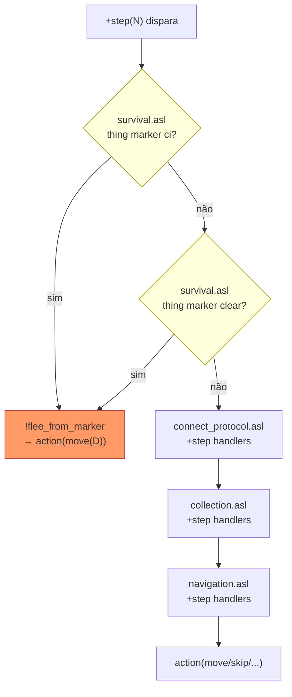

# feat: U10 — survival de clear-events (fuga reativa)

## Summary

Adicionar `survival.asl` com handler de `+step(N)` de máxima prioridade: quando
o agente percebe `thing(RX,RY,marker,ci)` ou `thing(RX,RY,marker,clear)`, move-se
na direção oposta ao vetor do marker antes de qualquer outro handler de passo
(coleta, navegação, connect). Nova métrica `deactivated_count` nos analyzers + cenário
`10-survival` que garante `deactivated_count == 0` como gate de capacidade.

---

## Problem Frame

No config oficial `events.chance: 15` → ~112 eventos/run de 750 steps (raio 3–5,
`warning: 5`). Um agente sobre a área de evento tem energia zerada, fica desativado
por `deactivatedDuration` steps e perde todos os blocos attached. Hoje nenhum `.asl`
tem handler para `thing(_, _, marker, _)` — o agente nem percebe o alerta.

O campo `deactivated` existe no replay JSON (confirmado em entidade do servidor) mas
não é extraído pelos analyzers atuais.

(see origin: docs/brainstorms/2026-06-20-u10-survival-clear-events-requirements.md)

---

## Requirements

- **R1** Agente detecta `thing(RX,RY,marker,ci)` e `thing(RX,RY,marker,clear)` no
  mesmo step em que chegam e move-se para longe da área marcada.
- **R2** Escape tem prioridade máxima: interrompe coleta, navegação, connect e submit.
- **R3** Agente foge COM blocos attached (sem pré-detach).
- **R4** Quando a direção primária de fuga está bloqueada, fallback para
  `!escape_move` (já existente em `navigation.asl`).
- **R5** Métrica `deactivated_count` disponível em `assert_metric.py` para asserir
  `max: 0` em cenários controlados.
- **R6** Cenário `10-survival` (assert + setup): roda em ≤ 3 min; sem handler →
  FAIL; com handler → PASS.
- **R7** Marcador `cp` (perimeter) — deferred, fora do escopo desta issue.

---

## Key Technical Decisions

| Decisão | Escolha | Rationale |
|---------|---------|-----------|
| Mecanismo de prioridade de step | Novo arquivo `survival.asl` incluído antes de `connect_protocol.asl` em `hive_agent.asl` | Primeiro `+step(N)` correspondente na plan library vence em Jason; separar em arquivo próprio evita engordar `navigation.asl` e dá controle explícito de prioridade via ordem de `include` |
| Direção de fuga | Oposto ao vetor `(RX,RY)` do marker mais próximo (cardinal dominante) | Simples, sem A*, resolve em 1 step; suficiente com `warning ≥ 5` e `radius ≤ 5` |
| Fallback de direção bloqueada | `!escape_move(MX, MY, MX-RX, MY-RY)` de `navigation.asl` | Reutiliza o mecanismo de desvio já testado sem duplicar lógica |
| Atoms vs strings nos percepts | `thing(RX,RY,marker,ci)` e `thing(RX,RY,marker,clear)` — atoms, sem aspas | `Translator.java:75` parseia `Identifier` como termo Jason; `ci`/`clear` são átomos válidos |
| `deactivated_count` = transições False→True | Conta eventos de desativação, não steps desativado | Mais preciso para o assert "agente NÃO foi deativado"; equivalente a steps para o cenário de isolamento |
| Arquivos de analyzer | Modificação local-only em `.claude/skills/run-hive/analyzers/` (não rastreado em git) | Convenção do projeto: skill compartilhado no dir raiz do repo, não por branch |

---

## High-Level Technical Design

### Cadeia de prioridade de `+step(N)` (por ordem de `include`)



### Lógica de direção de fuga

```
dado marker em (RX, RY) relativo:
  se |RX| >= |RY|:
    FleeDir = w  se RX > 0   (marker está a leste  → fugir para oeste)
    FleeDir = e  se RX < 0   (marker está a oeste  → fugir para leste)
  senão:
    FleeDir = n  se RY > 0   (marker está ao sul   → fugir para norte)
    FleeDir = s  se RY < 0   (marker está ao norte → fugir para sul)

  se compute_legal(FleeDir) → action(move(FleeDir))
  senão → !escape_move(MX, MY, MX-RX, MY-RY)   // alvo = oposto ao marker
```

O alvo do `!escape_move` no fallback é `(MX-RX, MY-RY)` — a posição simétrica
ao marker no frame local — que faz o `pick_escape` pontuar direções que afastem
do evento mesmo quando a direção primária está obstruída.

---

## Scope Boundaries

### Deferred to Follow-Up Work

- Marcador `cp` (perimeter): cria novos obstáculos após o evento — impacta
  pathfinding (A*), não sobrevivência imediata. Follow-up separado.
- Múltiplos markers simultâneos (centróide vs nearest-first): V1 usa o primeiro
  `thing(RX,RY,marker,_)` unificado pelo Jason.
- Reiniciar task específica após fuga vs reentrar no ciclo de exploração geral.

### Out of Scope

- Fuga multi-hop com A* até fora do raio do evento.
- Pré-detach de blocos antes de fugir.
- Track adversário / jogo ofensivo com clear.

---

## Implementation Units

### U1. Handler específico de marker em `perception.asl`

**Goal:** Tratar `thing(RX,RY,marker,Type)` antes do catch-all, com log de detecção.

**Requirements:** R1

**Dependencies:** —

**Files:**
- `src/agt/common/perception.asl` (modificar)

**Approach:** Inserir um handler específico para `Type == marker` ANTES do handler
catch-all existente. O handler chama `update_cell` (igual ao catch-all) e emite um
`dash_log` de detecção. Não usa `escape_pending` — o escape acontece no handler de
`+step(N)` em `survival.asl`. Handler não deve disparar quando `Type` é outro valor
(o catch-all cobre os demais).

**Patterns to follow:** Handler de `dispenser` e handler de `entity` em
`src/agt/common/perception.asl` (mesma estrutura de contexto com `my_pos`).

**Test scenarios:**
- `thing(1,0,marker,ci)` percebido → handler específico de marker dispara (não o
  catch-all); `update_cell(MX+1,MY,marker,ci)` chamado.
- `thing(0,2,marker,clear)` → idem.
- `thing(0,0,entity,teamA)` → catch-all do entity dispara, não o marker handler.
- Test expectation: verificável apenas via run de cenário (sem JUnit para .asl).

**Verification:** Confirmação indireta via log `[SURVIVAL] Marker` aparecendo no
`agents.log` quando cenário 10-survival roda com evento próximo.

---

### U2. `survival.asl` — step handler de escape com prioridade máxima

**Goal:** Implementar a lógica de fuga de clear-event no `+step(N)` de maior
prioridade da plan library.

**Requirements:** R1, R2, R3, R4

**Dependencies:** U1 (para garantir que update_cell acontece; lógico, não técnico)

**Files:**
- `src/agt/common/survival.asl` (criar)

**Approach:** Dois handlers de `+step(N)`, um para `ci` e outro para `clear`
(Jason não suporta disjunção `|` em contexto de plano; handlers separados garantem
que `ci` — mais urgente — é checado primeiro). Contexto inclui `& not am_deactivated`
para não tentar mover quando já desativado.

O `!flee_from_marker(MX,MY,RX,RY)` implementa a lógica de direção (ver HTD).
Referencia `!get_dir_offset/3`, `!compute_legal/2` e `!escape_move/4` de
`navigation.asl` — válido pois a plan library é flat em Jason (disponibilidade
independe de ordem de include).

Após `!compute_legal(OX,OY)`, checar `legal_ok` e fazer `.abolish(legal_ok)`
antes de executar `action(...)` para não poluir o estado.

**Technical design (diretivo, não spec de implementação):**

```
// prioridade P1: ci (≤2 steps)
+step(N)
    : my_pos(MX,MY) & thing(RX,RY,marker,ci) & not am_deactivated
    <- !flee_from_marker(MX,MY,RX,RY).

// prioridade P2: clear (warning N steps)
+step(N)
    : my_pos(MX,MY) & thing(RX,RY,marker,clear) & not am_deactivated
    <- !flee_from_marker(MX,MY,RX,RY).

+!flee_from_marker(MX,MY,RX,RY)
    <- // calcular FleeDir conforme HTD
       !get_dir_offset(FleeDir, OX, OY);
       !compute_legal(OX, OY);
       if (legal_ok) { .abolish(legal_ok); action("move(FleeDir)") }
       else { .abolish(legal_ok);
              FX = MX-RX; FY = MY-RY;
              !escape_move(MX,MY,FX,FY) }.
-!flee_from_marker(_,_,_,_) <- action("skip").
```

**Patterns to follow:** Handlers de `+step(N)` em `src/agt/common/collection.asl`
(estrutura de contexto + ação inline). `!escape_move` em
`src/agt/common/navigation.asl:303`.

**Test scenarios:**
- Marker `ci` em (1,0) → agente move `w` neste step (verificar coluna `action` no
  replay).
- Marker `clear` em (0,-3) → agente move `s` (marker ao norte, fuga ao sul).
- Marker em (2,0) + célula w bloqueada → `!escape_move` acionado; agente move em
  direção alternativa (não `w`).
- Sem marker → `+step(N)` de survival não dispara; collection/navigation assumem.
- Agente com `am_deactivated` + marker → handler de survival não dispara; step cai
  para navigation (skip/explore).
- Marker `ci` presente + agente em modo `pending_submit` → escape interrompe submit
  (verifcar que action do step é `move`, não `submit`).

**Verification:** `agents.log` mostra `[SURVIVAL]` no step em que marker aparece;
replay mostra action `move` (não `skip`/`submit`) para o agente; `deactivated_count
== 0` no assert do cenário 10-survival.

---

### U3. `hive_agent.asl` — include de `survival.asl` antes de `connect_protocol`

**Goal:** Garantir que os `+step(N)` de `survival.asl` têm prioridade sobre todos
os handlers de ação (connect_protocol, role_adoption, collection, navigation).

**Requirements:** R2

**Dependencies:** U2 (arquivo deve existir)

**Files:**
- `src/agt/hive_agent.asl` (modificar)

**Approach:** Inserir `{ include("common/survival.asl") }` imediatamente antes de
`{ include("common/connect_protocol.asl") }`. Não alterar outras linhas de include.

Ordem resultante relevante:
```
...
{ include("common/map_merge.asl") }
{ include("common/survival.asl") }      ← inserir aqui
{ include("common/connect_protocol.asl") }
{ include("common/role_adoption.asl") }
{ include("common/collection.asl") }
{ include("common/navigation.asl") }
```

**Test scenarios:**
- Test expectation: none (mudança puramente estrutural; sem Java).
- Smoke: servidor inicia, 15 agentes conectam sem erro de parse ASL (verificável
  pelo output de `agents.log` mostrando `[AGENT] agentA1 iniciado.`).

**Verification:** Run de smoke (`--steps 5`) sem erro; `agents.log` sem
`ParseException`.

---

### U4. Métrica `deactivated_count` nos analyzers (local-only)

**Goal:** Extrair transições `deactivated: False→True` do replay e expor como
métrica plugável para o `assert_metric.py`.

**Requirements:** R5

**Dependencies:** —

**Files (local-only, não rastreados em git — modificar no repo raiz):**
- `.claude/skills/run-hive/analyzers/replay_analyze.py` (modificar)
- `.claude/skills/run-hive/analyzers/assert_metric.py` (modificar)
- `.claude/skills/run-hive/analyzers/test_assert_metric.py` (modificar)

**Approach:**

Em `replay_analyze.py` → `analyze()`:
- No loop de entities por step, ler `e.get("deactivated", False)`.
- Rastrear `prev_deactivated[name]` (default False antes do step 1).
- Quando `prev_deactivated == False` e `current == True`: incrementar
  `agent_deact_count[name]`.
- Adicionar `"deactivated_count": agent_deact_count[name]` ao dict de results
  por agente.

Em `assert_metric.py` → `METRICS`:
- `m_deactivated_count(results, spec)`: soma `d.get("deactivated_count", 0)` de
  todos os agentes; retorna total e detalhe human-readable.
- Registrar em `METRICS["deactivated_count"]`.

**Patterns to follow:** `m_role_adoption` e `m_submits_ok` em `assert_metric.py`
(estrutura `(results, spec)` + `(value, detail)` de retorno). Extração de campos
de entidade em `replay_analyze.py:105-113` (mesmo loop).

**Test scenarios:**
- Replay mock sem evento: `deactivated_count == 0` → PASS com `max: 0`.
- Replay mock com 1 agente deactivated 2× (`False→True→False→True`): `deactivated_count == 2`.
- Replay mock com 3 agentes, 1 deactivado 1×: total `== 1`.
- `assert_metric.py --metric deactivated_count --max 0` em replay limpo → exit 0.
- `assert_metric.py --metric deactivated_count --max 0` em replay com event → exit 1.
- Teste de regressão: métricas existentes (`role_adoption`, `submits_ok`) continuam
  corretas após a modificação.

**Verification:** `assert_metric.py --metric deactivated_count --max 0` em replay
de run sem evento retorna `PASS` (exit 0).

---

### U5. Cenário `10-survival` (config + setup + README)

**Goal:** Cenário determinístico que isola a capacidade de fuga e fornece o gate
`deactivated_count == 0`.

**Requirements:** R6

**Dependencies:** U4 (métrica disponível), U2+U3 (handler ativo)

**Files:**
- `conf/scenarios/10-survival.json` (criar)
- `conf/scenarios/setup/10-survival.txt` (criar)
- `conf/scenarios/README.md` (criar — documentação do harness de cenários)

**Approach:**

`10-survival.json`:
- Grid **20×20**, steps **50**, `randomFail: 0`, `randomSeed` a calibrar (ver
  abaixo), `absolutePosition: true` (facilita setup posicional).
- `events.chance: 100` (evento garantido por step), `warning: 10`, `radius: [2,3]`,
  `create: [0,0]` (sem novos obstáculos — isola sobrevivência, não `cp`).
- 15 agentes (padrão), papeis e roles idênticos ao `01-adopt.json`.
- `assert: { "metric": "deactivated_count", "max": 0 }`

`setup/10-survival.txt`: Posicionar agent A1 (ou todos) no centro do grid (10,10)
via `move 10 10 agentA1` etc. **Calibração de seed**: identificar via run de 3 steps
sem handler qual célula o primeiro evento cobre, posicionar agente lá. Se seed 17
produz evento no centro, usar diretamente; senão iterar seeds até encontrar
comportamento limpo.

`README.md`: Copiar e adaptar o README existente em
`~/repos/PCS5703-MAS-HIVE/conf/scenarios/README.md` (de feat/u9-fusao-mapa),
que documenta o schema do bloco `assert` e a convenção de nomes. **Não copiar
verbatim** — adaptar apenas o que é necessário e citar origem (cite & improve).

**Test scenarios:**
- Smoke: `run-hive.sh run --scenario 10-survival --steps 5` inicia sem erro.
- **Regressão baseline**: comentar include de `survival.asl`, rodar `--assert` →
  FAIL (`deactivated_count > 0`); confirma que o cenário realmente testa a capacidade.
- **Gate de capacidade**: com `survival.asl` ativo, `run-hive.sh run --scenario
  10-survival --assert` → PASS (`deactivated_count == 0`, exit 0).
- `agents.log` mostra `[SURVIVAL] Marker` em pelo menos 1 agente em pelo menos 1
  step → confirma que o handler disparou.

**Verification:** `run-hive.sh run --scenario 10-survival --assert` retorna exit 0
(PASS) com a implementação completa.

---

## Open Questions

- **Seed de calibração**: qual `randomSeed` produz evento na posição esperada com
  `chance: 100` e `radius: [2,3]` no grid 20×20? Determinar via run de exploração
  no início da implementação.
- **Múltiplos markers no mesmo step**: se dois `ci` markers cobrem posições opostas
  (ex.: (2,0) e (-2,0)), Jason unifica com o PRIMEIRO na belief base. Resultado é
  não-determinístico entre o leste e o oeste. Aceitável para V1; se problemático,
  usar `.findall` para pegar todos os markers e calcular o mais próximo.
- **Reinício de task após fuga**: após sair da área, o agente retoma `has_destination`
  que existia antes? O `!escape_move` não cancela o destino (`has_destination`) —
  verificar se a task corrente retoma normalmente no step seguinte.

---

## Sources & Research

- Origin: `docs/brainstorms/2026-06-20-u10-survival-clear-events-requirements.md`
- Config de referência para eventos: `massim_2022/server/conf/SampleTournamentConfig.json`
  (`chance: 15`, `warning: 5`, `radius: [3,5]`)
- Cenário de referência para formato: `conf/scenarios/01-adopt.json` + setup correspondente
- Replay entity fields confirmados: `['deactivated', 'energy', 'action', 'actionResult', ...]`
  (inspecionado em replay existente via Python)
- `Translator.java:73-78`: Identifiers EIS → átomos Jason (confirma que `ci`/`clear`
  são átomos, não strings)
