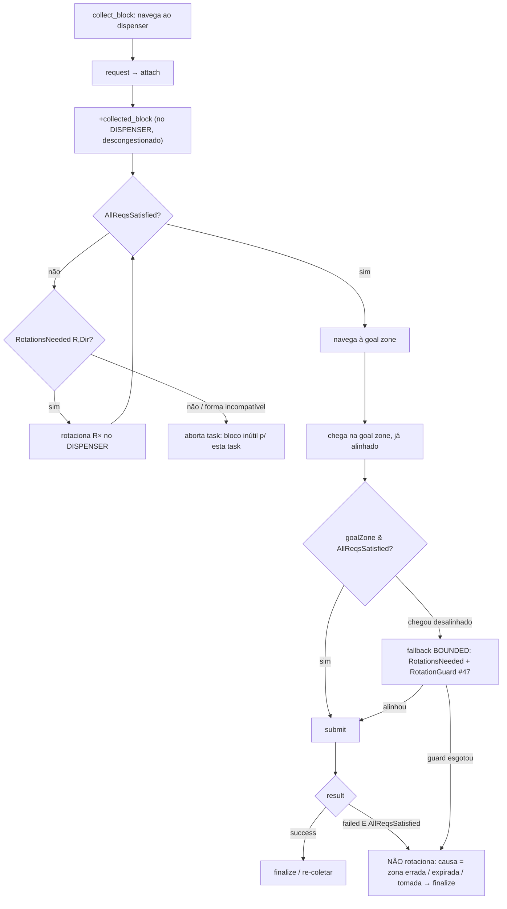

# feat: Objetividade do submit — pré-alinhar no dispenser + submit objetivo na zona

## Summary

Redesenho do caminho `coleta → navegar → submit` para que o agente **chegue na goal zone com
o bloco já alinhado** ao `treq` da task e submeta na entrada, em vez de descobrir o
desalinhamento na zona congestionada e tentar corrigir ali em loop. O princípio que governa o
desenho (do dono): **rotacionar na zona congestionada não funciona** — então a rotação de
alinhamento é **relocada para o dispenser** (descongestionado), logo após o `attach`. Na zona,
a decisão de submit passa a ser **objetiva** (dirigida por `hive.AllReqsSatisfied`): alinhado →
submit; falha **com** blocos alinhados → a causa não é rotação → finalizar. O loop cego
`rotate(cw)×4 + reposição×3` é **removido**. Mata #50 (loop de detach de norma) e #52 (loop de
rotação identidade) tratando-os como sintomas do mesmo design reativo. Reusa
`AllReqsSatisfied`, `RotationsNeeded`, `RotationGuard`, `DetachGuard` (Eixos 7a/7a', #47, #48).

(see origin: docs/brainstorms/2026-06-20-objetividade-submit-requirements.md)

---

## Problem Frame

O alinhamento do bloco acontece hoje de forma **reativa e no lugar errado**: o agente coleta,
navega, chega na goal zone, **descobre** o desalinhamento e tenta corrigir **dentro da zona**.
Dois problemas se somam: (1) a goal zone é **congestionada** — `rotate`/`move` ali falham ou são
bloqueados; (2) há **dois mecanismos de rotação brigando** — o caminho inteligente
(`RotationsNeeded`/`AllReqsSatisfied`, `connect_protocol.asl` l76-122) e um loop **cego** no
handler de falha de submit (`connect_protocol.asl` l363-396: `rotate(cw)×4` = identidade,
`reposição×3`), que não verifica se o bloco já casa `treq`.

Sintomas medidos (run #48, IsolationRolesConfig 300 steps):
- **#52** — `agentA15`: 36 submits da task2, 34 falharam; `att(0,1)` já casava `treq(0,1)` e mesmo
  assim rotacionou 4× (identidade). Causa real (zona errada / task expirada / já submetida) **não
  é rotação**.
- **#50** — `agentA12`: detach 62 / failed_target 61; handler de norma com `else→w` catch-all
  detacha oeste em célula vazia quando o bloco é não-cardinal, sem guard → loop ilimitado.
- **#51** — duplicata do #50 (a alegação "norma bloqueia submit" não se sustenta: o handler já
  tem `not pending_submit`). → fechar como dup.

> **Convenção de direções (verificada — `perception.asl:53-56` `dead_reckon_move`):**
> `n=(0,-1)`, `s=(0,+1)`, `e=(+1,0)`, `w=(-1,0)`, Y-down. O mapeamento offset→direção no código
> está correto; o bug do #50 é o catch-all, não direção trocada.

---

## Requirements

Rastreamento ao origin doc (R1-R7):

- **R1** — Pré-alinhar no dispenser: após `attach`, computar `RotationsNeeded` vs `treq` e
  rotacionar **no dispenser** antes de navegar. → U3.
- **R2** — Submit objetivo: na zona com `AllReqsSatisfied` → `submit` imediato. → U2.
- **R3** — Falha de submit diagnosticada: falha **com** `AllReqsSatisfied` → `finalize_task`
  (não rotaciona). Remover o loop `rotate×4 + reposição×3`. → U2.
- **R4** — Rotação-na-zona só como fallback bounded: permitida só quando `AllReqsSatisfied` é
  false na entrada, dirigida por `RotationsNeeded` e limitada por `RotationGuard` (#47); senão
  finaliza. → U2.
- **R5** — NORM/detach correto e bounded: handler de norma só sobre bloco cardinal
  (`|AX|+|AY|==1`); guard de falhas consecutivas (padrão `DetachGuard`). → U1.
- **R6** — Teste de objetividade: JUnit (`AllReqsSatisfied`/`RotationsNeeded`) + analyzer de
  rotações-na-zona + cenários. → U2, U3, U4.
- **R7** — Sem regressão em `01-adopt`, `06-single-block`, `06c-single-collect`, `07a-multi-req`,
  `07a-wrong-blocks`. → Validação.

---

## Key Technical Decisions

### KTD-1 — Pré-alinhamento ancorado em `collected_block` (resolve Q1)

O ponto de pré-alinhamento é logo após `+collected_block(Type)` em `collection.asl:14` — o
instante em que o bloco é anexado, com o agente **adjacente ao dispenser** (descongestionado) e a
task já conhecida (a coleta é task-driven via `solo_block_type`/`my_active_task`). Se a task/treq
ainda não for conhecida nesse instante (corrida perceptual), o pré-alinhamento é adiado para o
primeiro step em que a task for conhecida **e** o agente ainda não entrou na goal zone — nunca
dentro da congestão.

### KTD-2 — `RotationsNeeded` já cobre single-block (resolve Q2)

`RotationsNeeded.needed()` é agnóstico ao nº de blocos (delega a `AllReqsSatisfied.check`). Para 1
bloco a leste `(1,0)` e `treq` sul `(0,1)`: `rotateCW (1,0)→(0,1)` ⇒ R=1. Um bloco único é sempre
alinhável (o ciclo de rotação cobre os 4 cardinais). Nenhuma mudança em `RotationsNeeded.java`;
apenas cobertura de teste single-block (U3).

### KTD-3 — Fallback de zona bounded por `RotationGuard` (resolve Q3)

Quando o agente chega **desalinhado** na zona (pré-alinhamento não rodou / task tardia), a
rotação-na-zona é **dirigida por `RotationsNeeded`** (não cega) e limitada pelo `RotationGuard`
(#47, aborta após falhas acumuladas). Esgotado o guard ou `RotationsNeeded` falha (forma
incompatível) → `finalize_task`. Decisão do dono (AskUserQuestion): manter rede de segurança
mínima, não remover a rotação-na-zona inteiramente.

### KTD-4 — Reuso, não reinvenção

Estende infra existente: `AllReqsSatisfied` (matcher att↔treq), `RotationsNeeded` (rotações CW
ótimas), `RotationGuard` (#47, bound de rotação), `DetachGuard` (#48, padrão de guard de falhas
consecutivas a espelhar para o NORM-detach). O loop cego `submit_rotate_count`/
`submit_reposition_count` (`connect_protocol.asl` l363-396) é **deletado** — era o mecanismo
paralelo e incorreto.

---

## High-Level Technical Design

Fluxo-alvo (a rotação migra do bloco congestionado para o descongestionado):

A diferença central vs. hoje: o ramo de rotação `F→G` roda **no dispenser** (C, descongestionado);
o ramo `K-failed→M` **substitui** o loop cego `rotate×4+reposição×3`; o fallback `N` é a única
rotação remanescente na zona, agora bounded.

*Orientação direcional para revisão — não é especificação de implementação.*

---

## Implementation Units

Ordem recomendada: U1 → U2 → U4 (analyzer, para baseline) → U3 (pré-alinhamento, medido por U4).
U-IDs estáveis; dependências citadas por U-ID.

### U1. NORM/detach cardinal + bounded (#50)

- **Goal** — Eliminar o loop de `failed_target` do handler de norma: direção sempre válida +
  bound de falhas.
- **Requirements** — R5.
- **Dependencies** — nenhuma.
- **Files** — `src/agt/common/connect_protocol.asl` (handler de norma l37-47),
  `src/agt/common/perception.asl` (contador `norm_detach_fails` + reset, espelhando o padrão de
  `detach_stuck_fails` do #48), `src/java/hive/DetachGuard.java` (reusar `MAX_CONSECUTIVE_FAILS`,
  ou novo `NormDetachGuard` se o threshold divergir), `src/test/java/hive/DetachGuardTest.java`
  (ou `NormDetachGuardTest`).
- **Approach** — Restringir o contexto do handler a bloco cardinal:
  `& attached(AX,AY) & (math.abs(AX)+math.abs(AY)==1)` (mesmo padrão de l73) → `else→w` só vê
  `(-1,0)` → direção sempre correta → detach acha o bloco → loop termina sozinho. Adicionar guard
  de falhas consecutivas de NORM-detach (incrementa em `failed_target` de detach de norma; após
  o threshold `.abolish` + para de tentar) espelhando `DetachGuard` (#48). Sempre existe um bloco
  cardinal quando `NumAtt>0` (encadeamento exige adjacência), então a restrição nunca trava o
  detach legítimo.
- **Patterns to follow** — `check_stuck`/`detach_stuck_fails` (perception.asl l61-84, #48);
  `DetachGuard` constante + `DetachGuardTest`.
- **Test scenarios** — JUnit: guard aborta no threshold esperado (constante < 5, padrão #48). A
  direção cardinal é `.asl` (parse só em `gradle run`) → validada no sim (IsolationRoles:
  `failed_target` de detach < 5/agente vs 61 no #48).
- **Verification** — IsolationRoles 300 steps: `failed_target` de detach < 5/agente; nenhum agente
  loopa `[NORM] dir=w` em célula vazia.

### U2. Submit objetivo na zona + remover loop cego + fallback bounded (#52)

- **Goal** — Substituir a cascata reativa de falha de submit por decisão objetiva via
  `AllReqsSatisfied`, com fallback de rotação bounded.
- **Requirements** — R2, R3, R4, R6.
- **Dependencies** — nenhuma (pode landa antes do pré-alinhamento; U3 reduz a frequência do
  fallback, não o habilita).
- **Files** — `src/agt/common/connect_protocol.asl` (bloco SUBMIT l297-417: **deletar** os planos
  `submit_rotate_count` l363-372 e `submit_reposition_count` l374-396),
  `src/test/java/hive/AllReqsSatisfiedTest.java` (já tem `att(0,1)==treq(0,1)` — o teste de
  objetividade), `src/test/java/hive/RotationGuardTest.java`.
- **Approach** — Na falha de submit: (a) se `hive.AllReqsSatisfied(TaskName)` → a causa não é
  rotação → `.abolish` contadores + `!finalize_task` (R3); (b) se **não** `AllReqsSatisfied` →
  fallback bounded: `hive.RotationsNeeded(TaskName,R,Dir)` dirige a rotação, limitada por
  `RotationGuard` (#47); guard esgotado ou `RotationsNeeded` falha → `!finalize_task` (R4).
  Remover por completo o `rotate(cw)×4` cego e o `reposição n/e/s/w ×3`. O caminho feliz (l299-313,
  `pending_submit & goalZone(0,0) & AllReqsSatisfied` → submit) permanece.
- **Patterns to follow** — guard de pré-rotação `RotationGuard`/`rotate_pre_submit_fails` (#47,
  connect_protocol.asl l258-293); `AllReqsSatisfied` no contexto (l98, l121).
- **Test scenarios** — JUnit (`AllReqsSatisfiedTest`): `att(0,1)==treq(0,1)` ⇒ true (já existe —
  prova "não rotacionar"); `att` em posição errada ⇒ false (fallback). `RotationGuardTest`: aborta
  no threshold. Comportamento `.asl` validado no sim (U4/validação).
- **Verification** — IsolationRoles: nenhum agente entra em ciclo de 4 rotações com `att==treq`;
  submits bem-sucedidos sobem vs #48; `submit_fail` por rotação some.

### U3. Pré-alinhar no dispenser (R1, Fatia 2)

- **Goal** — O agente sai do dispenser já alinhado ao `treq` (chega na zona pronto para submit).
- **Requirements** — R1, R6.
- **Dependencies** — U2 (a decisão objetiva na zona já no lugar; o pré-alinhamento a torna o
  caminho comum). Reusa `RotationsNeeded` (existente).
- **Files** — `src/agt/common/collection.asl` (após `+collected_block(Type)` l14: gate de
  pré-alinhamento), `src/agt/common/connect_protocol.asl` (o loop `trying_rotate`/`RotationsNeeded`
  l76-122 passa a ser disparado **no dispenser**, não na zona),
  `src/test/java/hive/RotationsNeededTest.java` (caso single-block).
- **Approach** — Após `collected_block`, se a task é conhecida e `not AllReqsSatisfied`:
  `RotationsNeeded(Task,R,Dir)` → disparar a rotação **ali** (reusando o loop `trying_rotate`),
  e só então navegar à goal zone. Se `AllReqsSatisfied` já é true (bloco nasceu no offset certo)
  → navega direto. Se `RotationsNeeded` falha (forma incompatível) → abortar a task para este
  bloco. Resolve a corrida perceptual (KTD-1): se a task não é conhecida no `attach`, adiar o
  gate até conhecê-la, antes da zona.
- **Patterns to follow** — loop `trying_rotate` + `AllReqsSatisfied` no contexto
  (connect_protocol.asl l76-122); fluxo de coleta `collected_block` (collection.asl l10-14).
- **Test scenarios** — `RotationsNeededTest`: single-block leste `(1,0)` + treq sul `(0,1)` ⇒
  R=1,cw; single-block já no offset ⇒ `needed` retorna -1 (não rotaciona); forma incompatível ⇒
  -1 (aborta). `.asl` validado no sim via analyzer (U4): rotações **na zona** ≈ 0.
- **Verification** — 06c-single-collect: o agente coleta, alinha no dispenser, chega na zona e
  submete sem rotacionar lá; analyzer reporta rotações-na-zona ≈ 0.

### U4. Analyzer de rotações-na-zona (métrica de DoD)

- **Goal** — Métrica plugável que prova "submete na entrada, sem spin na zona".
- **Requirements** — R6.
- **Dependencies** — nenhuma (construir cedo para baseline antes de U2/U3).
- **Files** — `.claude/skills/run-hive/analyzers/submit_strategy.py` (novo),
  `.claude/skills/run-hive/analyzers/fixtures/` (fixture sintética),
  `.claude/skills/run-hive/analyzers/test_submit_strategy.py` (validação sim-free, padrão de
  `test_adoption.py`).
- **Approach** — Ler o replay e contar, por agente, ações `rotate` executadas **enquanto o agente
  está numa célula de goal zone** (vs. rotações no dispenser/rota). Expor `--json` e um `--check`
  (gate: rotações-na-zona <= max). Honrar `HIVE_REPLAY_ROOT`/`HIVE_RESULTS_ROOT` (sim isolada por
  porta), como os analyzers irmãos.
- **Patterns to follow** — `analyzers/adoption.py` (+`--check`/`--json`, fixture sintética +
  `test_adoption.py`); `analyzers/replay_analyze.py` (loaders de replay).
- **Test scenarios** — `test_submit_strategy.py` sobre fixture sintética: replay com rotação na
  zona ⇒ contagem > 0; replay com pré-alinhamento ⇒ ≈ 0; `--check` falha/passa nos limiares.
- **Verification** — `submit_strategy.py --check` PASSA no replay pós-U3 (rotações-na-zona ≈ 0) e
  FALHARIA no baseline pré-rework.

---

## Scope Boundaries

**Dentro:** pré-alinhamento no dispenser (U3/R1), submit objetivo + remoção do loop cego + fallback
bounded (U2/R2-R4), NORM cardinal + bounded (U1/R5), analyzer + testes (U4/R6), validação sem
regressão (R7).

### Deferred to Follow-Up Work

- **Escolher o lado de acesso ao dispenser** para minimizar rotações no dispenser (otimização
  sobre R1) — só se a medição mostrar que as rotações no dispenser custam.
- **Re-coletar/re-dispenser quando desalinhado na zona** (3ª opção do fork, rejeitada agora) —
  follow-up se o fallback bounded (U2) provar insuficiente por evidência.
- **Fechar #51 como duplicata do #50** + linkar este plano em #50/#52 — ação de
  housekeeping no handoff.

### Fora (parking lot, gated por evidência — origin)

- Coordenação de **reserva de célula na goal zone** entre agentes (track de contenção #40/#42);
  este rework assume o allocator/`claim_task` existente.
- Re-alinhamento dinâmico se a task escolhida mudar em voo (R4 cobre o fallback; otimizar a troca
  é follow-up).

---

## Risks & Dependencies

- **R-1 — `.asl` só é parseado em `gradle run`.** Erro de parse → agentes não sobem → score 0.
  Mitigação: `gradle classes` (Java) + smoke curto antes do run de 300 steps; revisar contexto/
  corpo dos planos editados.
- **R-2 — Mover o disparo da rotação para o dispenser pode interagir com a navegação** (o agente
  não deve navegar enquanto `trying_rotate>0`). Mitigação: gate explícito em `collection.asl`
  (não iniciar navegação até `AllReqsSatisfied` ou rotação concluída); validar em 06c.
- **R-3 — Alta variância entre runs** (STRATEGY.md). Mitigação: validar capacidade por **cenário
  determinístico** (06c, IsolationRoles seed fixo) + analyzer, não por score de um run só.
- **R-4 — Regressão em multi-bloco** (07a). Mitigação: `regression.sh` antes de mesclar; o
  pré-alinhamento reusa `RotationsNeeded` que já trata cadeias.
- **Dep** — Worktree nova precisa de `git submodule update --init massim_2022`. Branch-patch
  parada `feat/sc-50-norm-detach-submit-align` (commit `8257360`) é referência (não mesclar).

---

## Validation / DoD

- **JUnit (rápido, sem sim):** `~/tools/gradle-8.10/bin/gradle test` — `AllReqsSatisfiedTest`
  (objetividade, `att==treq`), `RotationsNeededTest` (single-block + incompatível),
  `DetachGuardTest`/`NormDetachGuardTest`, `test_submit_strategy.py`.
- **Cenário isolado:** `06c-single-collect` — coleta→submit de 1 bloco; analyzer
  `submit_strategy.py` reporta rotações-na-zona ≈ 0 e submit na entrada. Sim isolada
  `--port 12350 --monitor 8050`.
- **IsolationRoles 300 steps:** `failed_target` de detach < 5/agente (vs 61 no #48); submits ok
  sobem; nenhum loop de rotação identidade.
- **Sem regressão:** `regression.sh` cobrindo `01-adopt`, `06-single-block`, `06c`,
  `07a-multi-req`, `07a-wrong-blocks` antes de mesclar (mexe em core).

---

## Open Questions (deferred to implementation)

- **OQ-1** — Nomes exatos das crenças/contadores novos (`norm_detach_fails`, gate de
  pré-alinhamento) — definir ao tocar o código.
- **OQ-2** — Se o disparo de `trying_rotate` no dispenser deve **reusar** o plano l76-122 como
  está ou exigir um gate de contexto novo (ex.: `at_dispenser`/`not goalZone`) para não rodar na
  zona no caminho feliz — resolver na implementação de U3, validando em 06c.
- **OQ-3** — Threshold do `NormDetachGuard`: reusar `DetachGuard.MAX_CONSECUTIVE_FAILS` (=2) ou
  valor próprio — calibrar por evidência (IsolationRoles).

---

## Sources & Research

- **Origin:** docs/brainstorms/2026-06-20-objetividade-submit-requirements.md (problema, eixos,
  opções, recomendação espinha C, R1-R7, Q1-Q3).
- **Prior art (citar & melhorar):** Eixo 7a/7a' (#14, #18 — `AllReqsSatisfied`, `RotationsNeeded`);
  #47 (`RotationGuard`); #48 (`DetachGuard`); #26 (cenário 06c-single-collect). LI(A)RA / times
  MAPC 2022 — referência de coleta/submit descentralizado homogêneo (relatório).
- **STRATEGY.md:** mudar em isolamento, promover por evidência; validar via cenário curto +
  métricas estruturadas.
