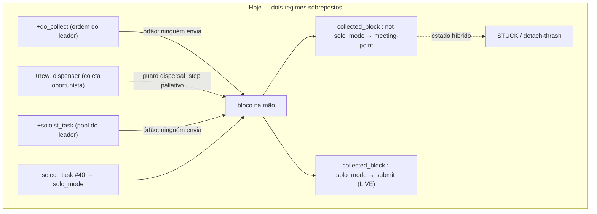
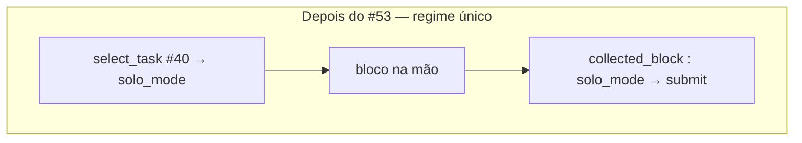

# refactor: desligar o regime squad-era (#53)

> **Fonte da verdade:** escopo/status desta tarefa vivem na **issue #53** (fork `MarceloNG`);
> ordem/visão no **board #24**. Este plano é o *como*. Ver [AGENTS.md](../../AGENTS.md) §Fonte da verdade.

## Resumo

O #38 achatou os *tipos* de agente (time flat, `hive_agent` único) mas **deixou os
*comportamentos* da era-squad vivos** no código. Resultado: **dois regimes de controle
sobrepostos** — o novo regime limpo (#40 allocator por valor + submit solo) coexiste com o
fantasma (coleta oportunista, meeting-point, `soloist_task` órfã, `SquadCoordinator`). A
sobreposição produz estados híbridos ("com bloco, sem `solo_mode`, sem destino válido") que são
a causa-raiz dos espirais STUCK→detach→thrash e, provavelmente, do FAIL de `06c-single-collect`.

Este plano **dissolve o regime fantasma** para deixar **um único regime** — não empilha mais um
guard reativo. Uma varredura completa (não só o corpo da issue) mostrou que o regime se espalha
por **5 arquivos `.asl` + um artefato Java + seu teste + docs**, e que `SquadCoordinator.java`
**não pode ser apagado** porque hospeda métodos *vivos* (`update_agent_pos`, `mark_busy`,
`mark_free`) — ele precisa ser **esculpido**, não removido.

**Não muda:** o allocator #40 (`select_task` mora em `TaskBoard.java`), o pipeline de submit solo
(#52), nem a adoção de role (escada `explorer` é escopo do #54). As primitivas `connect`
permanecem **inertes como scaffolding** para #21/#44 (decisão registrada abaixo).

---

## Problema (frame)

Caminhos de aquisição de bloco **hoje** (4 trilhas concorrentes):

Caminho **alvo** (1 trilha):

`do_collect` e `soloist_task` são **handlers órfãos** confirmados pela varredura: recebidos via
`[source(S)]` mas **nunca** emitidos por `.send` em lugar nenhum (o leader que os enviava morreu
no #38). A coleta oportunista (`+new_dispenser`) é a única trilha fantasma que ainda dispara — e
o #40 a neutraliza com um guard `dispersal_step` (paliativo "guard-sobre-fantasma").

### Mapa completo do regime squad-era (achado da varredura)

| Superfície | Linhas | Estado | Ação |
|---|---|---|---|
| `hive_agent.asl` — `do_collect`, `new_dispenser` oportunista, `collected_block:not solo_mode`, `soloist_task`×2 | 57-105, 109-144 | fantasma (2 órfãos) | **remover** |
| `navigation.asl` — chegada ao meeting-point (`signal_ready`) + assembler-meeting | 6-27 | fantasma | **remover** |
| `connect_protocol.asl` — rendezvous do assembler (`get_squad_collectors`, `navigating_to_meeting_for_connect`) | 648-663 | fantasma | **remover** |
| `connect_protocol.asl` — primitivas `connect`/`ready_to_connect` (FIXME → U9/#21) | 665-712 | inerte | **manter (marcar scaffolding)** |
| `communication.asl` — `abolish(navigating_to_meeting_point)` | 18 | limpeza de crença morta | **remover** |
| `SquadCoordinator.java` — métodos squad (16+) **vs** `update_agent_pos`/`mark_busy`/`mark_free` (VIVOS) | arquivo todo | **misto** | **esculpir (não apagar)** |
| `SquadCoordinatorTest.java` | 56 ln | testa métodos squad | **atualizar/aparar** |
| `srcDoc.md:259`, `organization.asl:4`, `connect_protocol.asl:700` | — | docs/comentários obsoletos | **atualizar** |
| `dispersal_step` (guard #40 sobre o fantasma) | role_adoption:123-128 | guard-sobre-fantasma | **tidy se órfão** |

---

## Requisitos (rastreamento → DoD da #53)

- **R1** — `hive_agent.asl` sem coleta oportunista, sem meeting-point, sem `soloist_task`; ramos
  de `collected_block` existem **só** para `solo_mode`.
- **R2** — fluxos de meeting-point removidos de `navigation.asl` e `connect_protocol.asl`; as
  primitivas `connect` ficam **inertes e marcadas** como scaffolding p/ #21/#44 (decisão do dono).
- **R3** — `SquadCoordinator.java` **esculpido**: métodos squad removidos; `update_agent_pos`,
  `mark_busy`, `mark_free` **intactos**; `gradle test` e build verdes.
- **R4** — `06c-single-collect` **PASSA sem um novo guard** (prova de que a remoção, não mais um
  paliativo, resolveu o híbrido).
- **R5** — `regression.sh` completo verde; evidência **antes/depois** registrada (skip/`failed_path`).
- **R6** — **zero erro de parse** `.asl` (agentes sobem); validado em `IsolationRolesConfig` (40×40)
  **e** num cenário dev permissivo — gotcha: parse error em `.asl` → score 0.
- **R7** — docs/comentários obsoletos atualizados.
- **Nota #51** — mantido **separado** (decisão); este plano apenas *documenta* que o handler
  NORM-detach `: ... & not solo_mode(_)` (perception.asl:308) fica **quase vestigial** após o #53
  (some a carga oportunista sem `solo_mode`), deixando só o caso estreito "bloco anexado → task
  liberada". Insumo p/ o #51 re-medir.

---

## Decisões técnicas (KTD)

1. **Esculpir, não apagar `SquadCoordinator.java`.** `update_agent_pos` (perception.asl:109,
   todo step) alimenta a occupancy/contenção (SharedMap); `mark_busy`/`mark_free` são chamados
   pelo allocator vivo (#40, role_adoption:114 e finalize:174). Apagar o artefato quebraria o
   regime novo. → carve cirúrgico preservando esses 3 métodos.
2. **Manter o nome `SquadCoordinator`/`squad_coordinator` por ora.** Renomear (→ ex.
   `AgentRegistry`) toca `makeArtifact`/`lookupArtifact`/classe/teste/dashboard/srcDoc — churn e
   risco de parse/score-0 desnecessários durante uma remoção. Rename = **follow-up** (Escopo
   diferido), não bloqueia o #53.
3. **`connect` inerte como scaffolding (decisão do dono).** Remover só o *wiring* squad
   (rendezvous, `get_squad_collectors`); preservar as mecânicas `connect`/`ready_to_connect` com
   um comentário-cabeçalho "INERTE — scaffolding p/ #21/#44; sem trigger vivo pós-#53". Coerente
   com a filosofia extensível do #54.
4. **#53 é remoção pura; #51 fica fora (decisão).** Sua tese é *dissolver o regime, não empilhar
   guard*. Misturar o guard `not pending_submit` do #51 contaminaria a verificação do R4 (o 06c
   passou pela remoção ou pelo guard novo?). #51 entra depois, sobre baseline re-medido.
5. **Medir antes de mexer (STRATEGY.md).** U1 captura baseline (06c FAIL + métricas) **antes** de
   qualquer remoção; U7 re-mede. A promoção é por evidência (R4/R5), não "no olho".
6. **Ordem segura: remover chamadores `.asl` → depois esculpir Java.** Assim o carve (U4) remove
   métodos já sem chamador, e o compilador Java é a rede de segurança.

---

## Unidades de implementação

### U1. Capturar baseline (medir antes)
- **Goal:** registrar o estado atual como âncora de evidência, antes de qualquer mudança.
- **Requisitos:** R4, R5 (linha de base).
- **Dependências:** nenhuma.
- **Files:** nenhum código; gravar saída em `docs/solutions/` ou anexar ao comentário da #53.
- **Approach:** rodar `regression.sh` e `06c-single-collect` no `HEAD` atual; anotar PASS/FAIL e
  métricas-chave (skip/move/`failed_path` por agente). É a foto "antes".
- **Execution note:** characterization-first — capturar comportamento atual antes de alterá-lo.
- **Test scenarios:** `Test expectation: none -- captura de baseline, sem mudança de comportamento.`
- **Verification:** existe um registro reproduzível do 06c FAIL e dos contadores atuais.

### U2. Remover handlers squad-era em `hive_agent.asl`
- **Goal:** colapsar a aquisição de bloco para a trilha única `solo_mode`.
- **Requisitos:** R1.
- **Dependências:** U1.
- **Files:** `src/agt/hive_agent.asl`.
- **Approach:** remover `+do_collect` (57-67), `+new_dispenser` oportunista (71-85),
  `+collected_block : not solo_mode` (89-105) e os dois `+soloist_task` (109-144). **Manter**
  `!setup_squad_coordinator` (27, 42-49) — o artefato ainda provê os métodos vivos. Após a
  remoção, `collected_block` tem **só** o ramo `solo_mode` (148-152). Conferir que nenhuma crença
  removida (`assigned_task_block`, `navigating_to_meeting_point`) é lida por plano remanescente
  vivo (as cláusulas `.abolish` em `finalize_task` podem ficar como limpeza inócua ou sair junto).
- **Patterns to follow:** o ramo vivo `+collected_block : solo_mode` (148-152) é o alvo único.
- **Test scenarios:** `Test expectation: none no nível da unidade (.asl não é unit-testável); o
  comportamento é validado por U7 (06c PASS + boot sem parse error).`
- **Verification:** `hive_agent.asl` sem `do_collect`/`new_dispenser` oportunista/`soloist_task`;
  `collected_block` só com `solo_mode`; arquivo ainda referencia apenas métodos vivos do artefato.

### U3. Remover fluxos de meeting-point em `navigation.asl` + `connect_protocol.asl`
- **Goal:** apagar o rendezvous squad e marcar as primitivas `connect` como inertes.
- **Requisitos:** R2.
- **Dependências:** U1.
- **Files:** `src/agt/common/navigation.asl`, `src/agt/common/connect_protocol.asl`,
  `src/agt/common/communication.asl`.
- **Approach:** remover em `navigation.asl` os 2 handlers de chegada ao meeting-point (6-27); em
  `connect_protocol.asl` remover o handler de rendezvous do assembler (648-663, que usa
  `navigating_to_meeting_for_connect` + `get_squad_collectors`). **Manter** 665-712
  (`connect`/`ready_to_connect`/`pending_connect`) e adicionar comentário-cabeçalho marcando-as
  INERTES (sem trigger vivo) — scaffolding p/ #21/#44. Remover `communication.asl:18`
  (`abolish(navigating_to_meeting_point)`), agora sem alvo.
- **Patterns to follow:** o comentário FIXME existente (connect_protocol:697-701) já aponta a U9
  — alinhar o novo cabeçalho a ele.
- **Test scenarios:** `Test expectation: none no nível da unidade; gated por U7 (boot sem parse
  error + regressão).`
- **Verification:** sem `navigating_to_meeting_point`/`navigating_to_meeting_for_connect` vivos;
  primitivas `connect` presentes e claramente marcadas inertes.

### U4. Esculpir `SquadCoordinator.java`
- **Goal:** remover os métodos/estado squad-era preservando os métodos vivos.
- **Requisitos:** R3.
- **Dependências:** U2, U3 (chamadores `.asl` dos métodos squad já removidos).
- **Files:** `src/env/env/SquadCoordinator.java`.
- **Approach:** **manter** `update_agent_pos` (216), `mark_busy` (206), `mark_free` (211) e o
  estado mínimo que eles realmente usam. **Remover** `setupDefaultSquads`, `get_my_squad`,
  `get_squad_collectors`, `get_squad_assembler`, `get_squad_leader`, `set/get_meeting_point`,
  `get_my_assignment`, `set/get_squad_task`, `signal_ready`, `all_ready`, `clear_ready`,
  `find_free_soloist`, `is_soloist_busy`, `claim/release_task_soloist` e os mapas órfãos
  (`agentSquad`, `squadMembers`, `squadRole`, `meetingPoints`, `collectorAssignments`,
  `squadActiveTask`, `taskSoloist`, `readyAgents`). Atenção: `mark_busy`/`mark_free` hoje gravam
  em `soloistBusy`, cujo único leitor (`find_free_soloist`) sai — decidir na implementação entre
  (a) manter um campo `busy` mínimo se algo vivo o lê, ou (b) torná-los no-op-seguro preservando a
  assinatura p/ não quebrar os chamadores. O compilador valida que nada mais referencia o que saiu.
- **Patterns to follow:** `TaskBoard.java` (artefato CArtAgO enxuto) como referência de tamanho.
- **Test scenarios:** cobertos por U5 (build + teste do artefato esculpido).
- **Verification:** `mvn`/`gradle` compila; `grep` não acha chamador dos métodos removidos.

### U5. Atualizar `SquadCoordinatorTest.java`
- **Goal:** manter a suíte verde após o carve.
- **Requisitos:** R3.
- **Dependências:** U4.
- **Files:** `src/test/java/env/SquadCoordinatorTest.java`.
- **Approach:** remover os testes dos métodos deletados; manter/ajustar cobertura para
  `update_agent_pos` e `mark_busy`/`mark_free` (conforme decisão (a)/(b) da U4).
- **Test scenarios:**
  - `update_agent_pos(ag, x, y)` registra e a posição é recuperável/consumível como antes.
  - `mark_busy`/`mark_free` não lançam e mantêm o contrato esperado pelos chamadores vivos.
  - (compile-time) nenhuma referência a método removido permanece no teste.
- **Verification:** `~/tools/gradle-8.10/bin/gradle test` verde (em ms).

### U6. Tidy de crenças residuais + docs obsoletas
- **Goal:** remover resíduo write-only e corrigir documentação enganosa.
- **Requisitos:** R1, R7.
- **Dependências:** U2, U3.
- **Files:** `src/agt/common/role_adoption.asl` (`dispersal_step`), `src/srcDoc.md:259`,
  `src/agt/common/organization.asl:4`, `src/agt/common/connect_protocol.asl:700`.
- **Approach:** verificar se `dispersal_step` ainda tem leitor vivo após U2 (o guard
  `+new_dispenser` era o consumidor) — se virou write-only, remover suas asserções/abolishes;
  se ainda serve à dispersão do #40, manter e comentar o porquê. Atualizar `srcDoc.md` (lista de
  métodos do artefato), o comentário de `organization.asl` (cita squad_leader/collector/assembler/
  sentinel — removidos no #38) e a referência a `squad_leader.asl` em `connect_protocol.asl:700`.
- **Test scenarios:** `Test expectation: none -- tidy/docs sem mudança de comportamento (gated por U7).`
- **Verification:** `grep` não acha `dispersal_step` write-only nem referências a arquivos/roles
  inexistentes; docs refletem o estado pós-#38/#53.

### U7. Verificar & re-medir (fechamento por evidência)
- **Goal:** provar o DoD da #53 com evidência antes/depois.
- **Requisitos:** R4, R5, R6.
- **Dependências:** U2, U3, U4, U5, U6.
- **Files:** nenhum código; resultados anexados ao comentário da #53 e/ou `docs/solutions/`.
- **Approach:** `gradle test` (verde) → `regression.sh` completo → `06c-single-collect` isolado.
  Confirmar **R4**: 06c PASSA **sem** novo guard. Confirmar **R6**: agentes sobem (sem parse
  error) em `IsolationRolesConfig` e num cenário dev permissivo. Registrar delta de skip/
  `failed_path` vs baseline U1. Sims com `--port 12353 --monitor 8053` (NN=53) p/ evitar colisão.
- **Execution note:** rodar a sim é caro/ruidoso — só aqui (end-to-end/score); a lógica Java já
  foi validada por U5 em ms.
- **Test scenarios:**
  - 06c-single-collect: **PASS** sem guard adicional (era FAIL no baseline U1).
  - regression.sh: todos os cenários no estado esperado (sem regressão vs baseline).
  - boot: 15 agentes conectam dentro da janela `launch` em `IsolationRolesConfig` (40×40) e no
    cenário dev — nenhum agente "não sobe" (prova de ausência de parse error).
  - métrica: skip-loop com bloco cai vs U1 (esperado pelo #49 N1, que tinha #53 como pré-req).
- **Verification:** R4+R5+R6 satisfeitos e documentados; se 06c ainda FAIL, o híbrido **não** era
  a causa única → reabrir diagnóstico (não empilhar guard às cegas).

---

## Escopo — fronteiras

**Dentro:** remover/esculpir o regime squad-era (tabela acima); manter `connect` inerte; tidy de
docs e crença residual; verificação por sim.

**Fora (não-objetivos):**
- Allocator #40, `select_task`/`TaskBoard`, pipeline de submit solo (#52) — **intocados**.
- Escada de role `default→explorer→worker` — é o **#54**.
- Greedy ciente de obstáculo / exploração por setor — **#49 N1/N2** (têm o #53 como pré-req).

**Diferido p/ follow-up:**
- **Renomear** `SquadCoordinator`→`AgentRegistry` (e `squad_coordinator`). Pós-#53, o nome é
  dívida (não coordena squads), mas o rename é churn com risco de parse/score-0; fazer isolado.
- **#51** (guard `not pending_submit` no NORM-detach) — issue própria, sobre baseline re-medido.
- **Remover** as primitivas `connect` inertes — só quando #21/#44 as substituir sobre frames U9.

---

## Riscos & dependências

| Risco | Impacto | Mitigação |
|---|---|---|
| Parse error em `.asl` ao remover handlers | agentes não sobem → **score 0** | só validável em `gradle run`; U7 roda smoke/regressão e checa boot em 2 configs antes de fechar |
| Apagar método vivo de `SquadCoordinator` por engano | quebra occupancy/#40 | KTD-1 fixa os 3 vivos; ordem U2/U3→U4 deixa o compilador como rede; U5 cobre |
| Ramo inerte mascarava um caminho dev (40×40) | regressão silenciosa | U7 valida `IsolationRolesConfig` **e** cenário dev (não só o oficial) |
| 06c continuar FAIL após remoção | diagnóstico do #53 incompleto | R4 é falsificável: se FAIL persiste, reabrir — **não** empilhar guard (anti-padrão STRATEGY.md) |
| `dispersal_step` ter leitor vivo escondido | dispersão do #40 quebra | U6 só remove se `grep` provar write-only; senão mantém + comenta |

**Dependências:** baseline U1 (medir antes); desbloqueia **#49 N1** (skip-loop por estado
híbrido) e dá previsibilidade ao caminho do board #24 (#53→#54→re-medir).

---

## Estratégia de testes

- **Java (U4/U5):** JUnit via `gradle test` — milissegundos, determinístico. Rede de segurança do carve.
- **`.asl` (U2/U3/U6):** não unit-testável (parse em runtime); validado por boot + regressão em U7.
- **End-to-end (U1/U7):** sim cara/ruidosa — só baseline e fechamento; verdade no replay/score, não no log.

---

## Fontes & referência

- **Issue #53** (`MarceloNG/PCS5703-MAS-HIVE`) — escopo/DoD (este plano expande o footprint além do corpo).
- **Board #24** §3 — sequência `#53→#54→re-medir`. **AGENTS.md** §Fonte da verdade.
- **#38** (`docs/plans/2026-06-19-009-refactor-flat-agent-retire-leader-plan.md`) — achatou tipos,
  deixou comportamentos: a origem do regime duplo.
- **#40** (`docs/plans/2026-06-19-010-feat-allocator-descentralizado-plan.md`) — o regime novo; o
  guard `dispersal_step` é o paliativo que este plano torna desnecessário.
- **Varredura (2026-06-20):** `hive_agent.asl`, `navigation.asl:6-27`, `connect_protocol.asl:648-712`,
  `SquadCoordinator.java`, `perception.asl:308` (superfície #51), `srcDoc.md:259`.
