# feat: Exploração peer-aware — nearestFrontierBiased ciente de colegas (#28)

## Summary

Corrige o zigzag entre agentes com mesmo heading adicionando peer-awareness à seleção de fronteira em `SharedMap.java`. `nearestFrontierBiased` passa a penalizar fronteiras onde um colega (occupancy fresco) está mais próximo do que o agente atual, divergindo trajetórias sem qualquer mudança em ASL.

---

## Problem Frame

`nearestFrontierBiased` escolhe a fronteira com menor `wrappedManhattan(agent, F)` no setor preferencial, **ignorando `occupancy`**. Dois agentes com mesmo `idx % 4` (mesmo heading) percorrem setores geográficos sobrepostos e competem pela mesma fronteira → zigzag e falhas de movimento repetidas.

O overlay de colega no A* (`TEAMMATE_PENALTY = 16`, linha 17) age apenas no passo seguinte — não no alvo de exploração. A raiz está em `pickFrontier` (linhas 317–336 de `src/env/env/SharedMap.java`).

---

## Requirements

| ID | Requisito |
|---|---|
| R1 | Dois agentes próximos com mesmo heading devem escolher fronteiras distintas (verificado por JUnit, sem sim) |
| R2 | Manter o heading-bias (setor preferencial) e o cul-de-sac filter existentes — sem regressão |
| R3 | Penalizar fronteiras com colega mais próximo — não excluir (evita starvar agentes com poucas fronteiras) |
| R4 | Usar somente `occupancy` já disponível — sem nova infra de comunicação entre agentes |
| R5 | Cenário A/B: baseline `max_stuck` documentado no campo `//` do JSON; `max_stuck ≤ 5` pós-fix (80 steps, 6 agentes) |

---

## Key Technical Decisions

**KT1 — Penalidade aditiva, não exclusão hard:** `score(agent, F) = wrappedManhattan(agent, F) + PEER_FRONTIER_PENALTY` quando algum peer está mais perto de F. Exclusão hard starvaria agentes com poucas fronteiras no setor.

**KT2 — Critério "peer closer" estrito (`<`, não `<=`):** `dist(peer, F) < dist(agent, F)`. Empate não gera penalidade — preserva comportamento original quando dois agentes estão equidistantes.

**KT3 — Somente occupancy fresco:** gate `pos[2] >= occupancyStep - 1` (mesmo critério do A*, linha 590). Posição velha não deve fantasmar a escolha de fronteira.

**KT4 — `PEER_FRONTIER_PENALTY = 3` (conservador):** valor inicial; grande o suficiente para divergir agentes a ±1 passo, pequeno o suficiente para não bloquear fronteiras próximas em exploração densa. Calibrável após A/B.

**KT5 — Sem toque em ASL:** toda a lógica fica em `SharedMap.java` (camada Java testável, escopo explícito da issue).

---

## High-Level Technical Design

Fluxo de scoring em `pickFrontier` pós-fix (cada fronteira F no setor):

```mermaid
flowchart TD
    A[para cada F em cachedFrontiers] --> B{inPreferredDirection?}
    B -- não, heading ≥ 0 --> A
    B -- sim ou heading = -1 --> C{avoidCulDeSac?}
    C -- sim e isCulDeSac --> A
    C -- não / não é beco --> D[base = wrappedManhattan\nagent, F]
    D --> E{algum peer:\ndist&#40;peer, F&#41; < base?}
    E -- sim --> F[score = base + PEER_FRONTIER_PENALTY]
    E -- não --> G[score = base]
    F --> H{score < bestScore?}
    G --> H
    H -- sim --> I[bestScore = score\nbx, by = F]
    H -- não --> A
    I --> A
```



Helper `peerPositions(selfName)` — filtra `occupancy` antes de chamar `pickFrontier`:

```
Para cada entry (key, pos) em occupancy:
  se key == selfName        → pula (self-exclusão)
  se pos[2] < occupancyStep - 1 → pula (stale)
  senão                    → adiciona {pos[0], pos[1]} à lista
```

---

## Scope Boundaries

### In scope
- `src/env/env/SharedMap.java`: nova constante, `peerPositions`, `peerAwareScore`, atualização de `pickFrontier`/`nearestFrontierBiased`
- `src/test/java/env/SharedMapFrontierPeerTest.java`: JUnit cobrindo a lógica peer-aware (TDD)
- `conf/scenarios/04b-explore-conflict.json` + `conf/scenarios/setup/04b-explore-conflict.txt`: cenário de medição A/B

### Out of scope
- Qualquer arquivo `.asl`
- `EISAccess.java`
- #16 (escape_move horário como fallback) — dependência desta issue, não escopo aqui
- Recalibração automática ou dinâmica de `PEER_FRONTIER_PENALTY`

### Deferred to follow-up work
- Ajuste dinâmico de `PEER_FRONTIER_PENALTY` em função da densidade local (follow-up após A/B mostrar dados)
- `escape_move` horário (#16) — fallback para quando heading-bias + peer-awareness ainda convergem em espaço confinado

---

## Implementation Units

### U1. Constante PEER_FRONTIER_PENALTY + helper peerPositions

**Goal:** Adicionar constante e método de suporte que extrai posições frescas de colegas de `occupancy`, excluindo self e entradas obsoletas.

**Requirements:** R3, R4

**Dependencies:** nenhuma

**Files:**
- `src/env/env/SharedMap.java` (modify)
- `src/test/java/env/SharedMapFrontierPeerTest.java` (create — testes de U1 entram aqui)

**Approach:** Nova constante `static final int PEER_FRONTIER_PENALTY = 3` declarada junto a `TEAMMATE_PENALTY` (linha 17). Novo método package-private `List<int[]> peerPositions(String selfName)`: itera `occupancy.entrySet()`, retorna `new int[]{pos[0], pos[1]}` apenas quando `!key.equals(selfName)` E `pos[2] >= occupancyStep - 1`. `java.util.*` já importado (linha 4).

**Patterns to follow:**
- `TEAMMATE_PENALTY` — declaração de constante no topo da classe
- Gate `p[2] >= occupancyStep - 1` em `astarCost` (linha 590) — critério de frescor
- `mapBase()` em `SharedMapHeadingTest` — padrão de setup de testes sem infra CArtAgO

**Execution note:** Escrever `SharedMapFrontierPeerTest` com testes de `peerPositions` ANTES de implementar o método (RED → implementar → GREEN).

**Test scenarios:**
- `occupancy` vazio + qualquer selfName → lista vazia
- 1 peer fresco (step = `occupancyStep`) → lista com 1 entrada `{x, y}`
- Self em occupancy com mesmo nome passado → self excluído, lista vazia
- Peer com `step = occupancyStep - 2` (stale: `2 < stepThreshold = occupancyStep - 1`) → excluído, lista vazia
- 3 entradas: 1 self, 1 fresca, 1 stale → lista com exatamente 1 entrada

**Verification:** `~/tools/gradle-8.10/bin/gradle test` com PASS nos testes de `peerPositions` no novo arquivo.

---

### U2. peerAwareScore + pickFrontier peer-aware

**Goal:** Aplicar penalidade de colega no scoring de fronteiras e fazer `nearestFrontierBiased` usar a nova lógica.

**Requirements:** R1, R2, R3, R4

**Dependencies:** U1

**Files:**
- `src/env/env/SharedMap.java` (modify)
- `src/test/java/env/SharedMapFrontierPeerTest.java` (extend)

**Approach:**
- Novo método package-private `int peerAwareScore(int agX, int agY, int fx, int fy, List<int[]> peers)`: calcula `base = wrappedManhattan(agX, agY, fx, fy)`; itera `peers` verificando `wrappedManhattan(p[0], p[1], fx, fy) < base`; se algum satisfaz, retorna `base + PEER_FRONTIER_PENALTY`; senão retorna `base`.
- Atualizar assinatura de `pickFrontier` para aceitar `List<int[]> peers` como último parâmetro.
- Dentro dos dois loops de `pickFrontier`, substituir `wrappedManhattan(f[0], f[1], agX, agY)` por `peerAwareScore(agX, agY, f[0], f[1], peers)`.
- Em `nearestFrontierBiased`: antes das chamadas a `pickFrontier`, chamar `List<int[]> peers = peerPositions(agentName)` e passar para ambas.

**Patterns to follow:**
- `pickFrontier` existente (linhas 317–336) — estrutura com loop duplo e `bestDist`; preservar
- `wrappedManhattan` (linha 71)

**Execution note:** Escrever testes do cenário núcleo ANTES de alterar `pickFrontier` (confirmar RED); implementar (GREEN); confirmar que `SharedMapHeadingTest` não regride.

**Technical design (direcional):**
```
// em nearestFrontierBiased, antes dos pickFrontier:
List<int[]> peers = peerPositions(agentName);
// pickFrontier usa peerAwareScore(agX, agY, f[0], f[1], peers) em vez de wrappedManhattan
```

**Test scenarios:**
- **Cenário núcleo:** `agentA0` em (5,10), `agentA4` em (6,10), heading N para ambos (idx%4=0); fronteiras X=(6,5) e Y=(4,5) em `cachedFrontiers`; occupancy com `agentA0→{5,10,0}` e `agentA4→{6,10,0}`, `occupancyStep=0`:
  - `nearestFrontierBiased(5, 10, "agentA0")` → `{4, 5}` (A4 mais próximo de X → X penalizado para A0; Y sem penalidade)
  - `nearestFrontierBiased(6, 10, "agentA4")` → `{6, 5}` (nenhum peer mais próximo de X → X sem penalidade para A4)
- **Peer equidistante:** `dist(peer, F) == dist(agent, F)` → sem penalidade (critério `<` estrito)
- **Peers vazia:** comportamento idêntico ao `pickFrontier` original (R2 — heading-bias intacto)
- **Múltiplos peers, 1 mais perto de F:** penalidade aplicada uma vez (não stacked)
- **Heading-bias preservado com peers:** agente heading N, 2 fronteiras (1 ao N sem peer mais próximo, 1 ao N com peer mais próximo) → escolhe a sem peer (mesma distância base, score diferente)

**Verification:** `gradle test` verde nos testes de cenário núcleo em `SharedMapFrontierPeerTest` + todos os testes de `SharedMapHeadingTest` sem regressão.

---

### U3. Cenário 04b-explore-conflict

**Goal:** Cenário reproduzível para A/B — documentar baseline `max_stuck` (sem fix) e verificar `max_stuck ≤ 5` pós-fix.

**Requirements:** R5

**Dependencies:** U2 (run pós-fix requer U2 aplicado)

**Files:**
- `conf/scenarios/04b-explore-conflict.json` (create)
- `conf/scenarios/setup/04b-explore-conflict.txt` (create)

**Approach:**
- Grid 20×20, 6 agentes (`entities: { standard: 6 }`), `absolutePosition: true`, `randomFail: 0`, `randomSeed: 17`, `steps: 80`
- Setup fixture: pares convergentes com mesmo heading — A1(E)+A5(E) posicionados na metade W do grid; A2(S)+A6(S) posicionados na metade N do grid; A3(W) e A4(N) como controles (headings únicos)
- Sem role-zones, dispensers ou tasks — exploração pura
- `assert` inicial: `{ "metric": "role_adoption", "min": 0 }` (trivialmente passa; A/B lido via replay analyzer)
- Campo `//` no JSON: documentar `max_stuck` do run pré-fix (baseline) e do run pós-fix; calibrar `failed_path_total` para assert definitivo

**Patterns to follow:**
- `conf/scenarios/02-navigate-open.json` — estrutura base com `absolutePosition`, `setup`, `assert`
- `conf/scenarios/setup/02-navigate-open.txt` — formato `move X Y agentNN` / `terrain X Y role`

**Test scenarios (A/B):**
- Run 1 (com marcelo SEM U2): executar via `run-hive.sh`, registrar `max_stuck` de cada agente no replay analysis
- Run 2 (com U2 aplicado): re-rodar; verificar `max_stuck ≤ 5` para todos os 6 agentes

**Verification:** Replay analysis pós-fix mostra coluna `Stuck@` com `-` para todos os 6 agentes. Campo `//` do JSON atualizado com ambos os valores (baseline e pós-fix).

---

## Open Questions

| # | Questão | Status |
|---|---|---|
| OQ1 | `PEER_FRONTIER_PENALTY = 3` é suficiente em cenários mais densos (15 agentes, 70×70)? | Defer para A/B run com OfficialRolesConfig pós U2+U3 |
| OQ2 | Self-exclusão em `peerPositions` depende do nome passado para `nearestFrontierBiased` coincidir com a chave em `occupancy` — verificar nomenclatura usada no ASL ao chamar `update_occupancy` e `get_nearest_frontier_biased` | Verificar em runtime; se divergirem, ajustar lógica de exclusão |

---

## Risks & Dependencies

| Risco | Mitigação |
|---|---|
| Subexploração: agentes evitam regiões boas porque um colega passou perto | `PEER_FRONTIER_PENALTY` conservador (3); A/B mede o efeito colateral; ajuste pós-dados |
| Interação com heading-bias: se setor preferencial tem poucos frontiers, penalidade elimina a única opção do setor | O fallback global (segundo loop em `pickFrontier`) é preservado — agente sempre tem uma frontier, ainda que penalizada |
| `absolutePosition:false` + DR drift: peer reporta posição imprecisa no occupancy | DR ainda é melhor que ignorar peers; impacto baixo para penalidade conservadora |

**Dependências de entrada:**
- #16 (escape_move horário) — recomendado como fallback complementar, mas esta issue é independente
- Squash merge de #49/#55 já em `marcelo` — confirmar que merge base está limpo antes de criar a branch

---

## Sources & Research

- Issue #28 (MarceloNG/PCS5703-MAS-HIVE) — escopo, DoD, abordagem e riscos
- `src/env/env/SharedMap.java` linhas 1–24 (campos), 287–336 (nearestFrontierBiased/pickFrontier), 528–531 (update_occupancy), 589–590 (gate de frescor no A*)
- `src/test/java/env/SharedMapHeadingTest.java` — padrão de setup de testes sem infra CArtAgO (mapBase, cachedFrontiers, occupancy diretos)
- `conf/scenarios/02-navigate-open.json` + `setup/02-navigate-open.txt` — padrão de fixture + absolutePosition
