# Documentação Completa — `src/`

## Código-Fonte do Sistema Multi-Agente Hive

O diretório `src/` contém todo o código-fonte do sistema multi-agente **Hive**, organizado segundo a convenção do **JaCaMo** (Jason + CArtAgO + MOISE). Ele é dividido em 4 subdiretórios, cada um com um papel distinto na arquitetura do sistema.

---

## Índice

1. [Estrutura do Diretório](#estrutura-do-diretório)
2. [Source Sets e Build](#source-sets-e-build)
3. [src/agt — Programas AgentSpeak](#srcagt--programas-agentspeak)
4. [src/env — Artefatos CArtAgO (Java)](#srcenv--artefatos-cartago-java)
5. [src/java — Ações Internas Jason (Java)](#srcjava--ações-internas-jason-java)
6. [src/org — Especificação Organizacional MOISE+](#srcorg--especificação-organizacional-moise)
7. [Diagramas de Arquitetura](#diagramas-de-arquitetura)

---

## Estrutura do Diretório

```
src/
├── agt/                           # Programas AgentSpeak (Jason)
│   ├── squad_leader.asl           # Agente líder de esquadrão
│   ├── collector.asl              # Agente coletor de blocos
│   ├── assembler.asl              # Agente montador/conector
│   ├── sentinel.asl               # Agente patrulheiro/solista
│   ├── dummy.asl                  # Agente mínimo de teste
│   └── common/                    # Módulos compartilhados
│       ├── perception.asl         # Processamento de percepções
│       ├── collection.asl         # Ciclo de coleta de blocos
│       ├── connect_protocol.asl   # Protocolo de connect + submit
│       ├── navigation.asl         # Navegação e exploração
│       ├── communication.asl      # Mensagens de sincronização
│       └── dashboard_hooks.asl    # Integração com dashboard
├── env/                           # Artefatos CArtAgO (Java)
│   ├── connection/                # Bridge EIS/MASSim
│   │   ├── EISAccess.java         # Artefato de conexão (por agente)
│   │   └── Translator.java        # Conversão IILang ↔ Jason AST
│   └── env/                       # Artefatos compartilhados
│       ├── SharedMap.java          # Mapa compartilhado do mundo
│       ├── TaskBoard.java          # Registro e leilão de tasks
│       ├── SquadCoordinator.java   # Coordenação de squads
│       └── HiveDashboard.java      # Dashboard WebSocket
├── java/                          # Ações internas Jason
│   └── hive/                      # Pacote de ações
│       ├── AdjacentDirection.java  # Verifica adjacência (wrap toroidal)
│       ├── ConnectCalculator.java  # Coordenadas relativas para connect
│       ├── DirectionCalculator.java # Direção greedy
│       ├── PathFinder.java         # A* pathfinding
│       └── PatternMatcher.java     # Verifica padrão de blocos
└── org/                           # Especificação organizacional
    └── hive_org.xml               # MOISE+ (roles, groups, schemes, norms)
```

**Total: 23 arquivos** (11 AgentSpeak + 6 Java artefatos + 5 Java ações internas + 1 XML organizacional)

---

## Source Sets e Build

A configuração no `build.gradle` mapeia os subdiretórios de `src/` para source sets do Gradle:

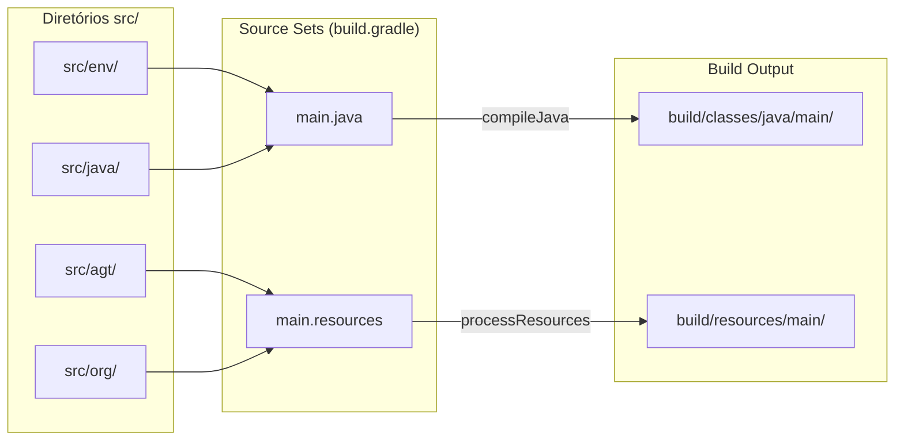

| Source Set | Diretórios | Compilação | Output |
|------------|-----------|------------|--------|
| `main.java` | `src/env`, `src/java` | javac (Java 21) | `build/classes/java/main/` |
| `main.resources` | `src/agt`, `src/org` | cópia direta | `build/resources/main/` |

---

## src/agt — Programas AgentSpeak

### Visão Geral

Os programas AgentSpeak definem o comportamento cognitivo dos 15 agentes Jason. Cada arquivo de role inclui módulos compartilhados via `{ include("common/...") }`.

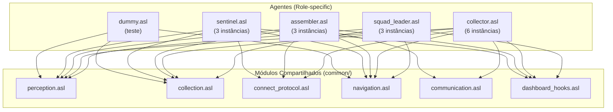

### Prioridade de `+step(N)` Handlers

A ordem de inclusão dos módulos determina qual handler intercepta o step primeiro:

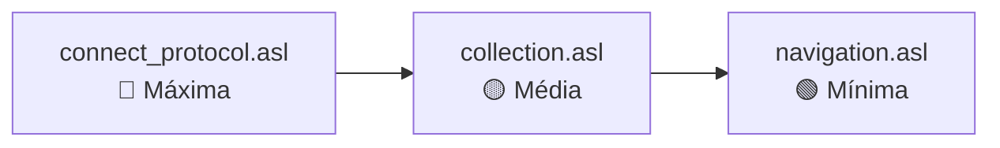

### Agentes por Role

| Role | Arquivo | Instâncias | Responsabilidades |
|------|---------|-----------|-------------------|
| Squad Leader | `squad_leader.asl` | 3 | Leilão de tasks, delegação, coordenação de squad |
| Collector | `collector.asl` | 6 | Coleta de blocos, soloist tasks, meeting point |
| Assembler | `assembler.asl` | 3 | Solo/multi-block tasks, connect, submit |
| Sentinel | `sentinel.asl` | 3 | Patrulha, soloist tasks |
| Dummy | `dummy.asl` | 0 | Agente mínimo para testes |

### Módulos Compartilhados

| Módulo | Linhas | Responsabilidade |
|--------|--------|------------------|
| `perception.asl` | 159 | Processar percepções EIS (posição, things, tasks, normas, energia) |
| `connect_protocol.asl` | 257 | Submit em goal zone, connect sincronizado, energia crítica |
| `collection.asl` | 130 | Ciclo request→attach, retry, desvio de obstáculos |
| `navigation.asl` | 139 | Greedy movement, exploração por fronteira, stuck detection |
| `communication.asl` | 29 | Mensagens assembler↔collector para connect |
| `dashboard_hooks.asl` | 92 | Reportar estado/eventos via WebSocket |

---

## src/env — Artefatos CArtAgO (Java)

### Visão Geral

Artefatos CArtAgO são objetos compartilhados do ambiente que os agentes Jason podem operar. Divididos em dois pacotes:

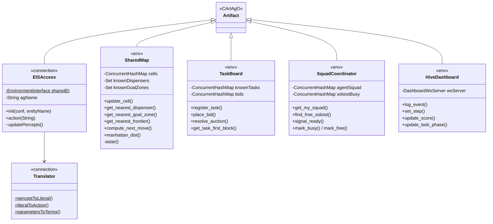

### Pacote `connection` — Bridge EIS/MASSim

| Classe | Linhas | Descrição |
|--------|--------|-----------|
| `EISAccess.java` | 197 | Artefato por agente; gerencia `EnvironmentInterface` singleton; converte percepções EIS → ObsProperties; executa ações |
| `Translator.java` | 100 | Utilitário de conversão bidirecional: IILang (Numeral, Identifier, Function, ParameterList) ↔ Jason AST (NumberTerm, Atom, Literal, ListTerm) |

**Padrão Singleton:** Uma única instância de `EnvironmentInterface` é compartilhada entre os 15 artefatos `EISAccess` (um por agente), gerenciando o pool de conexões TCP ao MASSim.

### Pacote `env` — Artefatos Compartilhados

| Classe | Linhas | Instância | Operações Principais |
|--------|--------|-----------|---------------------|
| `SharedMap.java` | 395 | `shared_map` (1) | `update_cell`, `get_nearest_dispenser`, `get_nearest_goal_zone`, `get_nearest_frontier`, `compute_next_move`, `mark_obstacle`, `decay_obstacles`, `manhattan_dist` |
| `TaskBoard.java` | 181 | `task_board` (1) | `register_task`, `signal_task_ready`, `place_bid`, `resolve_auction`, `complete_task`, `get_task_first_block`, `get_task_blocks` |
| `SquadCoordinator.java` | 51 | `squad_coordinator` (1) | `mark_busy`, `mark_free`, `update_agent_pos` — regime squad-era removido no #53 (registro leve; rename → `AgentRegistry` é follow-up) |
| `HiveDashboard.java` | 280 | `hive_dashboard` (1) | `log_event`, `set_step`, `update_score`, `update_task_phase`, `update_squad`, `register_map_dispenser` |

### Algoritmos Implementados em SharedMap

| Algoritmo | Método | Descrição |
|-----------|--------|-----------|
| A* (direção) | `astar()` | Pathfinding com até 8000 nós, fallback greedy se grid > 60 manhattan |
| A* (custo) | `astarCost()` | Versão custo-only com 3000 nós para ranking de destinos |
| Greedy | `greedy()` | Direção por maior componente do vetor (com wrap toroidal) |
| Frontier search | `get_nearest_frontier()` | Busca célula não-visitada adjacente a visitada mais próxima |
| Obstacle decay | `decay_obstacles()` | Remove obstáculos registrados há > 30 steps (a cada 5 steps) |
| Wrapped manhattan | `wrappedManhattan()` | Distância considerando grid toroidal |

---

## src/java — Ações Internas Jason (Java)

### Visão Geral

Ações internas são computações Java invocáveis diretamente no AgentSpeak via `pacote.Classe(args)`. Todas estendem `DefaultInternalAction`.

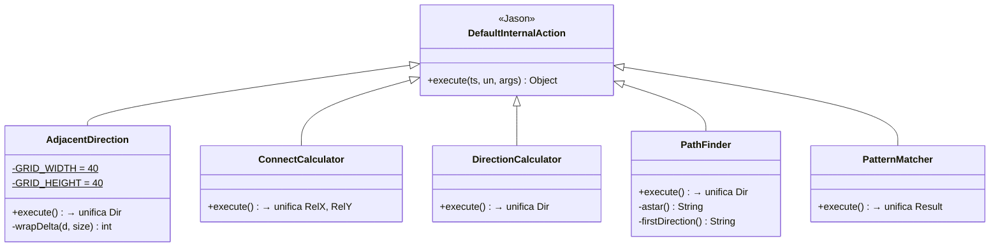

### Detalhamento

| Classe | Assinatura AgentSpeak | Parâmetros | Resultado |
|--------|----------------------|------------|-----------|
| `AdjacentDirection` | `hive.AdjacentDirection(MX, MY, TX, TY, Dir)` | Posição agente + alvo | `n/s/e/w/none` (se adjacente com wrap 40×40) |
| `ConnectCalculator` | `hive.ConnectCalculator(MX, MY, PX, PY, RelX, RelY)` | Posição agente + parceiro | Coordenadas relativas para `connect()` |
| `DirectionCalculator` | `hive.DirectionCalculator(FX, FY, TX, TY, Dir)` | From + To | `n/s/e/w/skip` (greedy, maior componente) |
| `PathFinder` | `hive.PathFinder(FX, FY, TX, TY, Dir)` | From + To | `n/s/e/w/skip` (A*, max 2000 iter, fallback greedy) |
| `PatternMatcher` | `hive.PatternMatcher(Reqs, Result)` | Lista de requirements | `true/false` (verifica `my_attached` na BeliefBase) |

### Uso nos Módulos AgentSpeak

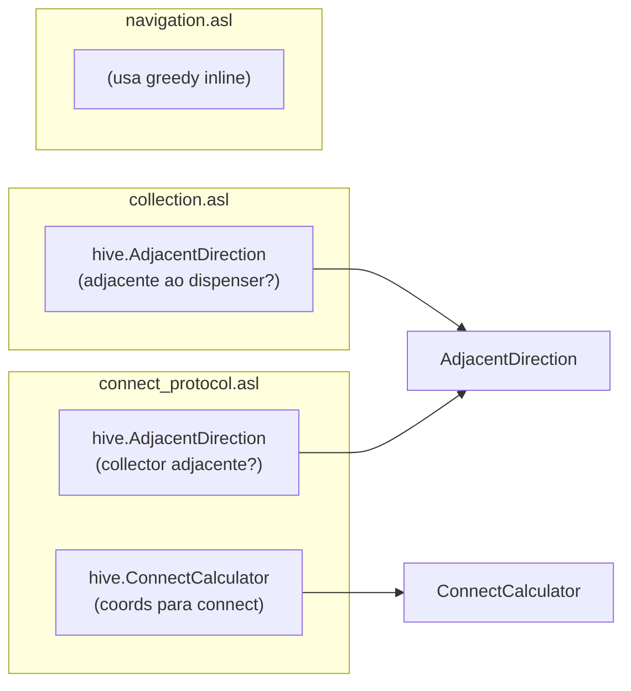

---

## src/org — Especificação Organizacional MOISE+

### Visão Geral

O arquivo `hive_org.xml` define a organização formal do sistema segundo o modelo MOISE+, com três dimensões:

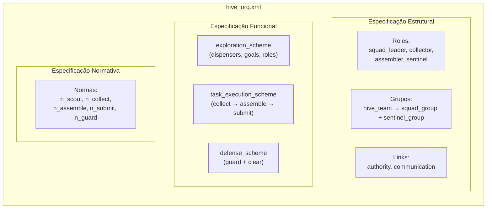

### Estrutura Organizacional

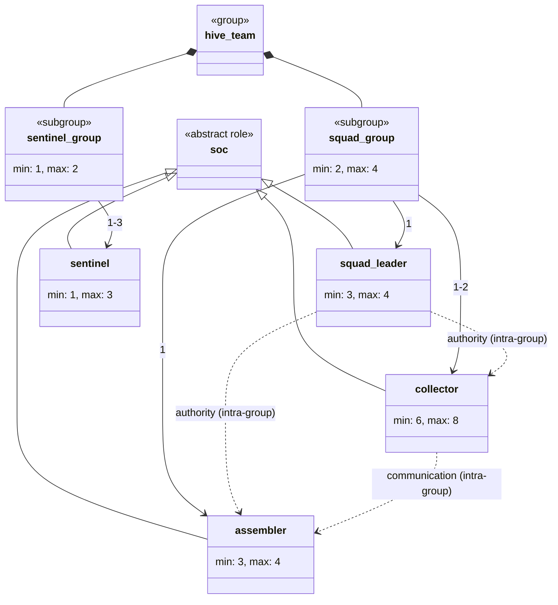

### Esquemas Funcionais

| Esquema | Goal Raiz | Sub-goals | Operador | Missões |
|---------|-----------|-----------|----------|---------|
| `exploration_scheme` | `map_explored` | `dispensers_found`, `goal_zones_found`, `role_zones_found` | parallel | `m_scout` |
| `task_execution_scheme` | `task_submitted` | `blocks_collected` → `blocks_assembled` → `pattern_submitted` | sequence | `m_collect`, `m_assemble`, `m_submit` |
| `defense_scheme` | `team_protected` | `goal_zones_guarded`, `threats_cleared` | parallel | `m_guard` |

### Normas (Obrigações)

| Norma | Role | Missão | Significado |
|-------|------|--------|-------------|
| `n_scout` | squad_leader | m_scout | Obrigação de explorar |
| `n_collect` | collector | m_collect | Obrigação de coletar blocos |
| `n_assemble` | assembler | m_assemble | Obrigação de montar blocos |
| `n_submit` | assembler | m_submit | Obrigação de submeter padrão |
| `n_guard` | sentinel | m_guard | Obrigação de proteger zonas |

---

## Diagramas de Arquitetura

### Visão Completa do Sistema

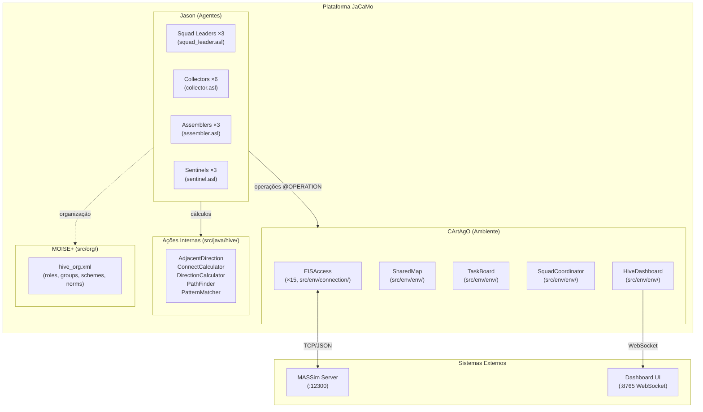

### Fluxo de Dados por Camada

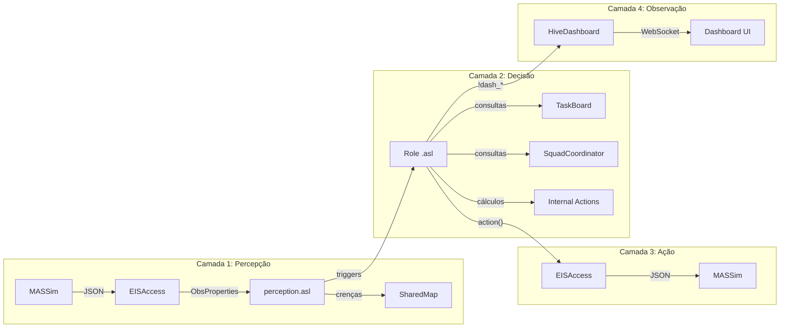

### Ciclo de Vida de um Step

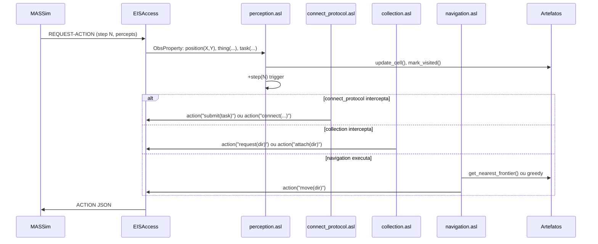

### Relação entre Squads e Agentes

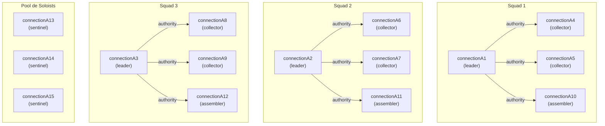

---

## Métricas do Código-Fonte

| Categoria | Arquivos | Linhas (aprox.) | Linguagem |
|-----------|----------|----------------|-----------|
| Agentes (roles) | 5 | ~670 | AgentSpeak |
| Módulos compartilhados | 6 | ~800 | AgentSpeak |
| Artefatos CArtAgO | 6 | ~1.450 | Java |
| Ações internas | 5 | ~190 | Java |
| Org. specification | 1 | ~120 | XML (MOISE+) |
| **Total** | **23** | **~3.230** | — |

---

## Resumo

| Aspecto | Detalhe |
|---------|---------|
| Diretório | `src/` (4 subdiretórios) |
| Paradigma | BDI (Belief-Desire-Intention) via Jason |
| Ambiente | CArtAgO (artefatos compartilhados) |
| Organização | MOISE+ (roles, groups, schemes, norms) |
| Agentes | 15 (4 roles distintos + 1 teste) |
| Artefatos | 5 tipos (EISAccess per-agent + 4 compartilhados) |
| Ações internas | 5 (geometria, pathfinding, pattern matching) |
| Algoritmos | A*, greedy navigation, frontier exploration, auction |
| Comunicação | Inter-agente (tell/achieve) + via artefatos (signals) |
| Integração | MASSim via EIS (TCP/JSON) + Dashboard via WebSocket |
